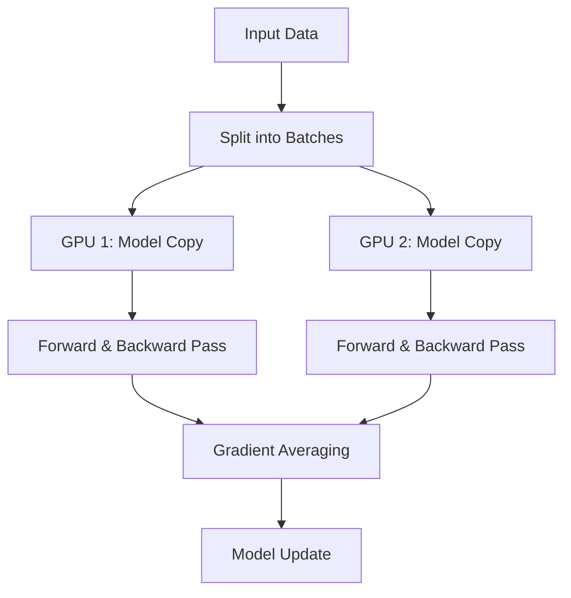
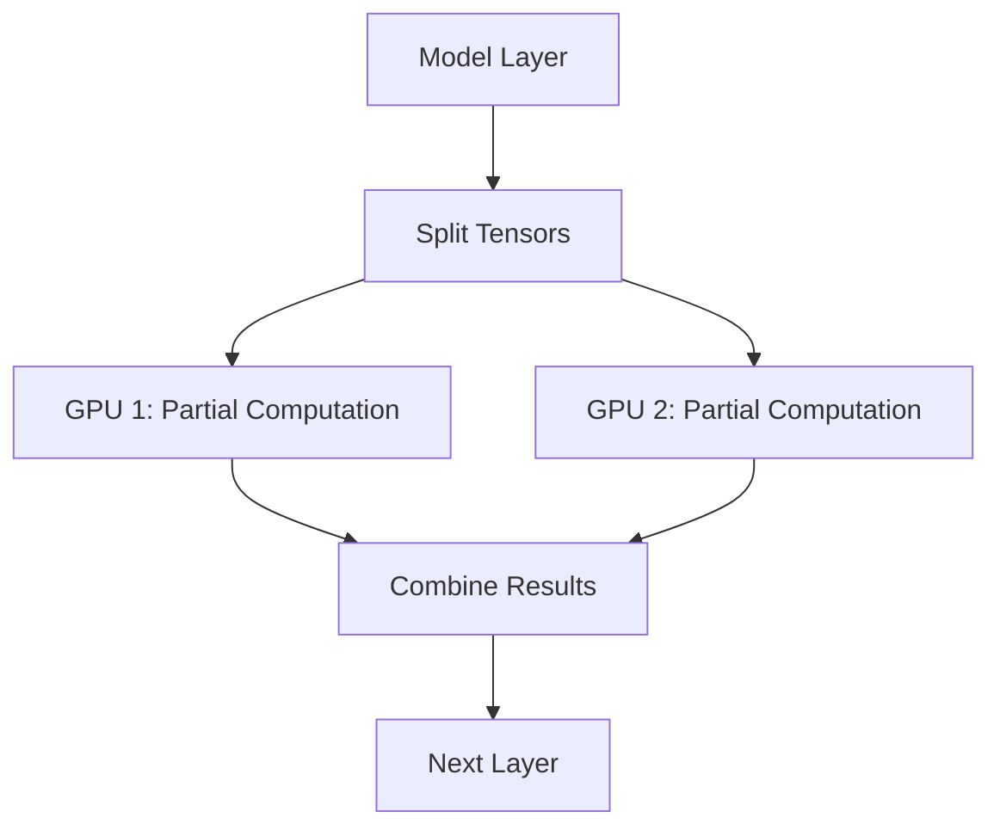
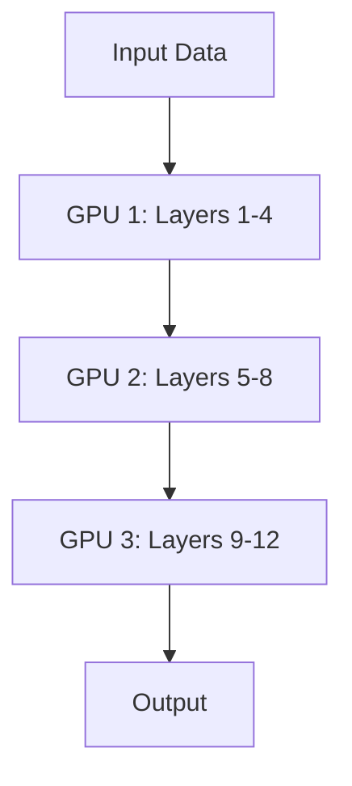
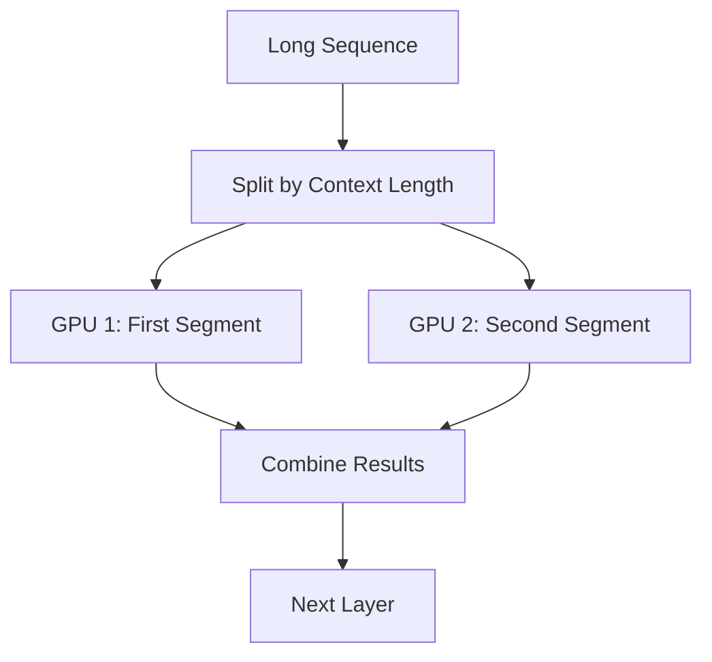

# Scaling Large Language Models: Multi-GPU and Multi-Node Strategies in 2025

As LLMs continue to grow in complexity and size, efficient training and inference require leveraging multiple GPUs and, often, multiple systems. This guide explores prevalent strategies and tools in 2025 that facilitate such scalability, incorporating insights from Hugging Face's [Ultra-Scale Playbook](https://huggingface.co/spaces/nanotron/ultrascale-playbook).

<!-- more -->

## 1. Parallelism Techniques

### Data Parallelism (DP)

Each GPU holds a full copy of the model and processes different data batches. Gradients are averaged across GPUs.

- **Use Case**: Suitable for models that fit into a single GPU's memory.
- **Tools**: [PyTorch's DistributedDataParallel](https://pytorch.org/docs/stable/notes/ddp.html), [Horovod](https://horovod.ai/).

**Mermaid Diagram:**



### Tensor Parallelism (TP)

Model tensors (e.g., weight matrices) are split across GPUs. Each GPU computes a portion of the operation.

- **Use Case**: Beneficial when model layers are too large for a single GPU.
- **Tools**: [Megatron-LM](https://github.com/NVIDIA/Megatron-LM), [NVIDIA's TensorRT-LLM](https://github.com/NVIDIA/TensorRT-LLM).

**Mermaid Diagram**



### Pipeline Parallelism (PP)

Model layers are divided among GPUs, and data flows sequentially through them.

- **Use Case**: Effective for very deep models.
- **Tools**: [DeepSpeed's pipeline parallelism](https://www.deepspeed.ai/tutorials/pipeline/), [Megatron-LM](https://github.com/NVIDIA/Megatron-LM).

**Mermaid Diagram**



### Context Parallelism (CP)

A newer parallelism technique that splits the sequence dimension across GPUs, allowing for processing longer sequences.

- **Use Case**: Training models with very long context windows.
- **Tools**: [Picotron](https://github.com/huggingface/picotron), [Nanotron](https://github.com/huggingface/nanotron).

**Mermaid Diagram**



### Fully Sharded Data Parallelism (FSDP)

Extends DP by sharding model states (parameters, gradients, optimizer states) across GPUs to reduce memory footprint.

- **Use Case**: Training very large models that don't fit into a single GPU's memory.
- **Tools**: [PyTorch's FSDP](https://pytorch.org/docs/stable/fsdp.html), [DeepSpeed's ZeRO](https://www.deepspeed.ai/tutorials/zero/).

### Mixture of Experts (MoE)

Only a subset of model parameters (experts) are active during a forward pass, reducing computation.

- **Use Case**: Efficiently scaling models with sparse activation.
- **Tools**: [DeepSpeed-MoE](https://www.deepspeed.ai/tutorials/mixture-of-experts/), [GShard](https://arxiv.org/abs/2006.16668).

### 4D Parallelism

Combines all four parallelism techniques (Data, Tensor, Pipeline, and Context) for maximum efficiency.

- **Use Case**: Training extremely large models with long context windows.
- **Tools**: [Picotron](https://github.com/huggingface/picotron), [Nanotron](https://github.com/huggingface/nanotron).

## 2. Training Strategies

### Single-Node, Multi-GPU

Ideal for workstations or servers with multiple GPUs connected via high-speed interconnects like [NVLink](https://www.nvidia.com/en-us/data-center/nvlink/).

- **Approach**: Combine DP with TP or PP to maximize GPU utilization.
- **Example**:

```sh
deepspeed train.py --deepspeed_config ds_config.json
```

- **Documentation**: [DeepSpeed Getting Started](https://www.deepspeed.ai/getting-started/#running-deepspeed)
- **Tools**: DeepSpeed, PyTorch FSDP.

### Multi-Node, Multi-GPU

Suitable for large-scale training across multiple machines.

- **Approach**: Integrate DP, TP, and PP as needed.
- **Example**:

```sh
deepspeed --hostfile hostfile train.py --deepspeed_config ds_config.json
```

- **Documentation**: [DeepSpeed Multi-Node Training](https://www.deepspeed.ai/tutorials/multi-node/)
- **Tools**: DeepSpeed, Megatron-LM, Horovod.

### 4D Parallelism Training

For training extremely large models with long context windows across multiple nodes.

- **Approach**: Utilize all four parallelism techniques (DP, TP, PP, CP) simultaneously.
- **Example**:

```sh
# Using Picotron
python create_config.py --out_dir tmp --exp_name llama-7B --dp 4 --tp 2 --pp 2 --cp 2 --model_name meta-llama/Llama-2-7b-hf --grad_acc_steps 32 --mbs 4 --seq_len 8192 --hf_token <HF_TOKEN>
torchrun --nproc_per_node 8 train.py --config tmp/llama-7B/config.json
```

- **Documentation**: [Picotron GitHub](https://github.com/huggingface/picotron)
- **Tools**: Picotron, Nanotron.

## 3. Inference Strategies

### TensorRT-LLM

NVIDIA's library optimized for high-performance inference with support for TP and quantization.

- **Use Case**: Low-latency, high-throughput inference.
- **Example**:

```sh
trtllm-build --model_dir llama --tp_size 4
```

- **Documentation**: [TensorRT-LLM Build Command](https://github.com/NVIDIA/TensorRT-LLM/blob/main/docs/build.md)
- **Link**: [TensorRT-LLM](https://github.com/NVIDIA/TensorRT-LLM)

### vLLM

An inference engine designed for LLMs with features like [paged attention](https://arxiv.org/abs/2309.06180) and efficient memory management.

- **Use Case**: Serving large models with high throughput.
- **Example**:

```sh
python -m vllm.entrypoints.api_server --model mistral --tp 4
```

- **Documentation**: [vLLM Server Launch](https://docs.vllm.ai/en/latest/getting_started/quickstart.html#starting-the-server)
- **Link**: [vLLM](https://github.com/vllm-project/vllm)

### DeepSpeed Inference

Extends DeepSpeed to support efficient inference with features like [ZeRO-Offload](https://www.deepspeed.ai/tutorials/zero-offload/).

- **Use Case**: Inference for models that don't fit entirely in GPU memory.
- **Example**:

```sh
deepspeed --num_gpus 4 inference.py --dtype bf16
```

- **Documentation**: [DeepSpeed Inference](https://www.deepspeed.ai/inference/)
- **Link**: [DeepSpeed](https://github.com/microsoft/DeepSpeed)

### Hugging Face Text Generation Inference (TGI)

A production-ready inference server for LLMs with features like model sharding and streaming.

- **Use Case**: Deploying LLMs with minimal setup.
- **Example**:

```sh
text-generation-launcher --model meta-llama/Llama-3-8B --num-shards 4
```

- **Documentation**: [TGI Server Launch](https://github.com/huggingface/text-generation-inference#launch-server)
- **Link**: [TGI](https://github.com/huggingface/text-generation-inference)

### 4. Recommended Tools and Libraries

| Tool/Library            | Description                                                                         | Link                                                    |
| ----------------------- | ----------------------------------------------------------------------------------- | ------------------------------------------------------- |
| DeepSpeed               | Optimizes training and inference for large models                                   | [DeepSpeed](https://github.com/microsoft/DeepSpeed)     |
| Megatron-LM             | Framework for training large transformer models with TP and PP                      | [Megatron-LM](https://github.com/NVIDIA/Megatron-LM)    |
| ColossalAI              | Provides a unified interface for various parallelism strategies                     | [ColossalAI](https://github.com/hpcaitech/ColossalAI)   |
| Horovod                 | Distributed training framework supporting multiple backends                         | [Horovod](https://github.com/horovod/horovod)           |
| Hugging Face Accelerate | Simplifies training and inference across devices                                    | [Accelerate](https://github.com/huggingface/accelerate) |
| TensorRT-LLM            | High-performance inference library by NVIDIA                                        | [TensorRT-LLM](https://github.com/NVIDIA/TensorRT-LLM)  |
| vLLM                    | Efficient LLM inference engine                                                      | [vLLM](https://github.com/vllm-project/vllm)            |
| Picotron                | Minimalistic 4D-parallelism distributed training framework for educational purposes | [Picotron](https://github.com/huggingface/picotron)     |
| Nanotron                | Minimalistic large language model 3D-parallelism training framework                 | [Nanotron](https://github.com/huggingface/nanotron)     |

### 5. Choosing the Right Strategy

| Scenario                                        | Recommended Approach                                      |
| ----------------------------------------------- | --------------------------------------------------------- |
| Training on a single machine with multiple GPUs | Combine DP with TP or PP using DeepSpeed or PyTorch FSDP. |
| Training across multiple machines               | Utilize DeepSpeed with a combination of DP, TP, and PP.   |
| Training with very long context windows         | Use Picotron or Nanotron with Context Parallelism.        |
| Training extremely large models                 | Leverage 4D parallelism with Picotron or Nanotron.        |
| Inference with latency constraints              | Deploy using TensorRT-LLM or vLLM.                        |
| Inference for very large models                 | Use DeepSpeed Inference with ZeRO-Offload.                |
| Quick deployment of models                      | Leverage Hugging Face TGI.                                |

### Cheatsheet from HuggingFace Folks


⸻

By adopting these strategies and tools, you can effectively scale LLM training and inference across multiple GPUs and systems, ensuring optimal performance and resource utilization. 
