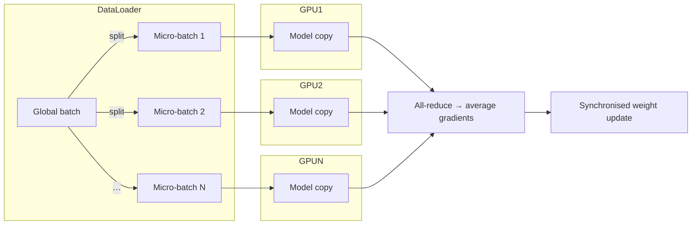
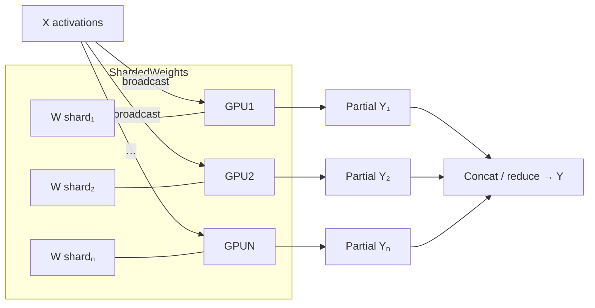
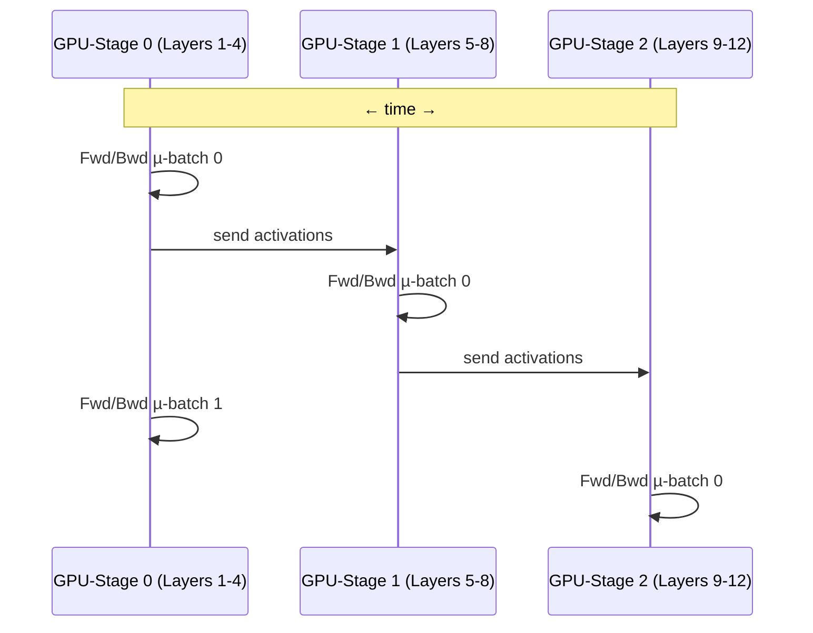
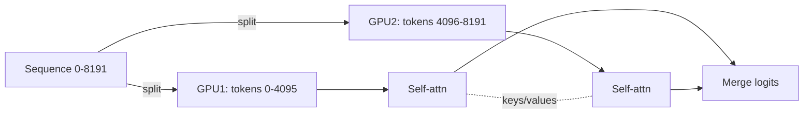
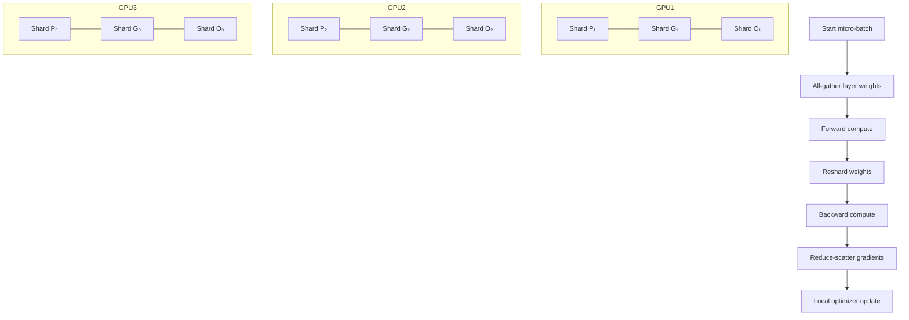
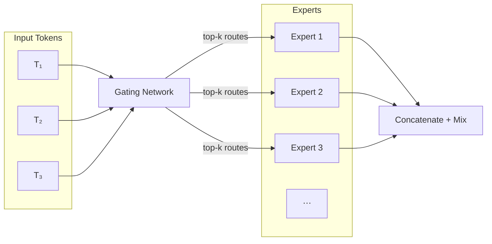
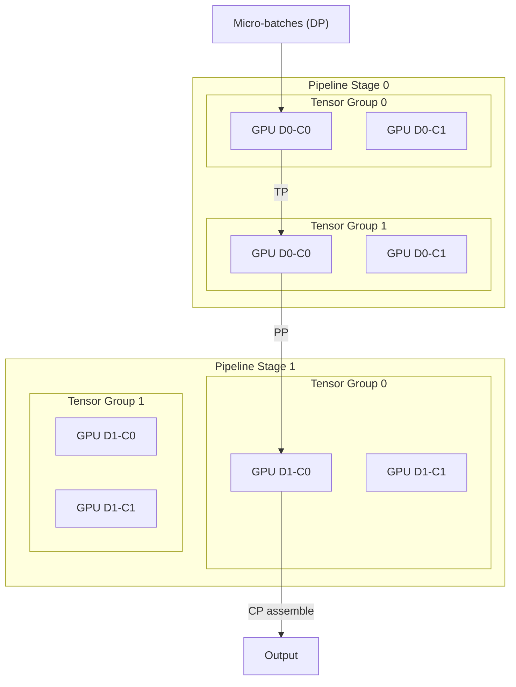

# Scaling Large Language Models: Multi-GPU and Multi-Node Strategies in 2025

As LLMs continue to grow in complexity and size, efficient training and inference require leveraging multiple GPUs and, often, multiple systems. This guide explores prevalent strategies and tools in 2025 that facilitate such scalability, incorporating insights from Hugging Face's [Ultra-Scale Playbook](https://huggingface.co/spaces/nanotron/ultrascale-playbook).

<!-- more -->

## 1. Parallelism Techniques

### Data Parallelism (DP)

In classic data‑parallel training **every GPU keeps a full copy of the model**.
A large batch is split into _N_ micro‑batches; each rank runs forward + backward on its piece and then gradients are **all‑reduced (averaged)** so that all replicas stay in sync before the optimizer step.

**Key ideas**

- **Simplicity first** – almost zero code changes; works everywhere.
- **Redundant memory** – O(total params) on every GPU, so model size is bounded by a single card.
- **Communication cost** – one gradient all‑reduce per step (~2 × parameter size).
- **Throughput scaling** – global batch = per‑GPU batch × *N*; watch out for generalization when scaling batch too far.

**Mermaid Diagram**



- **Tools**: [PyTorch DDP](https://pytorch.org/docs/stable/notes/ddp.html), [Horovod](https://horovod.ai/).

---

### Tensor Parallelism (TP)

TP **slices individual weight tensors across GPUs** so each rank stores only a shard (e.g., specific columns or rows). During the forward pass each rank computes its partial matrix multiplication; intermediate activations are **all‑gathered or reduced** to produce the layer output.

**Key ideas**

- **Shards compute & memory** – enables layers larger than a single GPU.
- **Layer‑wise collectives** – all‑reduce/all‑gather inside every TP layer adds latency; frameworks overlap comms with compute.
- **Orthogonal to DP** – combine TP × DP for higher scale (Megatron uses a 2‑D «TP × DP» grid).
- **Best for dense GEMM‑heavy blocks** – attention & FFN matrices.

**Mermaid Diagram**



- **Tools**: [Megatron‑LM](https://github.com/NVIDIA/Megatron-LM), [TensorRT‑LLM](https://github.com/NVIDIA/TensorRT-LLM), [ColossalAI](https://github.com/hpcaitech/ColossalAI).

---

### Pipeline Parallelism (PP)

PP **distributes consecutive blocks of layers to different GPUs** (pipeline stages).
Micro‑batches flow through stages like an assembly line, so computation and communication overlap.

**Key ideas**

- **Memory relief** – each rank stores only its slice of the network depth.
- **Bubble latency** – first and last few micro‑batches see idle time; mitigate with enough micro‑batches or sophisticated scheduling.
- **Inter‑stage activations** – tensors must be transferred between GPUs at stage boundaries.
- **Composable with DP/TP** – e.g., 2 × TP inside each stage × 4 × PP across depth.

**Mermaid Diagram**



- **Tools**: [DeepSpeed PP](https://www.deepspeed.ai/tutorials/pipeline/), [Megatron‑LM](https://github.com/NVIDIA/Megatron-LM), [GPipe](https://arxiv.org/abs/1811.06965).

---

### Context Parallelism (CP)

CP (a.k.a. **sequence parallelism**) splits the **sequence length / token dimension** across GPUs so each rank handles a contiguous block of tokens, enabling context windows far beyond single‑GPU memory.

**Key ideas**

- **Long‑context enabler** – reach 32 k, 64 k+ tokens.
- **Attention communication** – GPUs exchange keys/values (all‑gather) for cross‑token attention each layer.
- **Pairs well with TP & PP** – CP handles tokens while others handle model axes.
- **Early‑stage technique** – currently in research code (Picotron / Nanotron).

**Mermaid Diagram**



- **Tools**: [Picotron](https://github.com/huggingface/picotron), [Nanotron](https://github.com/huggingface/nanotron).

---

### Fully Sharded Data Parallelism (FSDP)

FSDP, conceptually equivalent to ZeRO Stage 3, shards all model states - parameters, gradients and optimizer states - across the GPUs in a data-parallel group. Each GPU therefore keeps only `1 / N` of the model in memory, gathers the parameters of the current layer just-in-time, computes, and immediately reshards them before moving on. Gradients are reduce-scattered so every rank finishes the backward pass owning only its shard, and optimizer updates are applied locally.

**Key ideas**

- **Memory scaling**: O(total params / NGPU) - enables multi-billion-parameter models to fit on 24 GB cards.
- **Zero redundancy**: No GPU ever holds a full copy of the model; identical to DeepSpeed ZeRO-3.
- **Overlap compute & communication**: PyTorch overlaps the all-gather with computation to hide latency.
- **Granularity control**: You can wrap the whole model or nest FSDP wrappers on sub-modules for finer control.

**Mermaid Diagram**



> **Note**: In the diagram above, P represents Parameters (model weights), G represents Gradients, and O represents Optimizer states. These are the three main components of model state that are sharded across GPUs in FSDP.

- **Use Case**: Training very large models (> 10 B parameters) that do not fit on a single GPU.
- **Tools**: [PyTorch FSDP](https://pytorch.org/docs/stable/fsdp.html), [DeepSpeed ZeRO-3](https://www.deepspeed.ai/tutorials/zero/).

### Mixture of Experts (MoE)

MoE layers contain dozens (or even hundreds) of parallel **experts** (small feed‑forward sub‑networks).
For every token a lightweight **gating network** selects the top‑_k_ experts, so only that subset runs.
This decouples **model capacity** (total parameters) from **per‑token compute/FLOPs**.

**Key ideas**

- **Sparse activation** – With _k = 2_ out of 64 experts each token touches ~3 % of the parameters, yet the model still "sees" the full capacity during training.
- **Conditional computation** – Tokens route to different experts, letting each specialize (e.g., code vs poetry).
- **Load‑balancing loss** – Extra loss term keeps expert usage uniform to avoid stragglers.
- **Scale to trillions** – Total parameters scale linearly with #experts, compute stays roughly constant.

**Mermaid Diagram**



- **Use Case**: Scaling to 100 B–1 T+ parameters without proportional compute cost.
- **Tools**: [DeepSpeed‑MoE](https://www.deepspeed.ai/tutorials/mixture-of-experts/), [GShard / Switch Transformer](https://arxiv.org/abs/2001.04451).

---

### 4D Parallelism

"4D" composes **Data (D)**, **Tensor (T)**, **Pipeline (P)**, and **Context (C)** parallelism so every axis of the workload can be distributed.
Picture the GPUs as a 4‑D lattice: _N = D×T×P×C_ ranks.

**Key ideas**

- **Extreme scale** – Easily maps 10³–10⁴ GPUs for 100 B‑parameter, 8 k‑context models.
- **Topology aware** – Tune each dimension to match intra‑node (NVLink), inter‑node (IB), and rack‑level bandwidth.
- **Memory & compute balance** – TP shards big matrices, CP splits long sequences, PP handles depth, DP feeds throughput.

**Mermaid Diagram**



- **Use Case**: Training > 100 B‑parameter models with multi‑node clusters and long context windows.
- **Tools**: [Picotron](https://github.com/huggingface/picotron), [Nanotron](https://github.com/huggingface/nanotron).

## 2. Training Strategies (2025 update)

> **Rule of thumb** – pick the simplest scheme that fits in memory **and** saturates your interconnect.
> Start with a shard‑aware data‑parallel variant (FSDP/ZeRO‑3).
> Add **Tensor ↔ Pipeline ↔ Context** axes only when the model or the sequence length forces you.

| Hardware scope                                  | Fastest link | Go‑to recipe                                    | When to switch                      |
| ----------------------------------------------- | ------------ | ----------------------------------------------- | ----------------------------------- |
| **1 node** (2‑8 GPUs, NVLink / PCIe Gen5)       | 200‑900 GB/s | **FSDP + small TP** via `torchrun` or DeepSpeed | Model > 1 × GPU                     |
| **2‑16 nodes** (≤128 GPUs, NVLink + InfiniBand) | 25‑200 GB/s  | **"TP inside, DP across" + optional PP**        | Model > 1 × node                    |
| **>16 nodes** (hundreds–thousands GPUs)         | ≤25 GB/s     | **4‑D grid (DP×TP×PP×CP)**                      | 70 B + params **and** 32 k + tokens |

### 2.1 Single‑Node, Multi‑GPU

Combine zeRO‑style **Fully‑Sharded Data Parallelism (FSDP)** with a low‑degree **Tensor Parallelism** group that stays inside the node.

```bash
# Four H100s, ZeRO‑3 memory footprint
torchrun --standalone --nproc_per_node 4 train.py \
  --fsdp full_shard --mixed_precision bf16 \
  --gradient_accumulation_steps 8 --batch_size 4
```

- FSDP shards params + grads + optimizer states ⇒ memory grows ~1/_n_.
- TP protects matmul kernels from weight‑gather latency; keep `tp<=2` on PCIe, up to `tp<=4` on NVLink.
- Use `fsdp.forward_prefetch=True` and overlap weight gathering with compute.

### 2.2 Multi‑Node, Multi‑GPU

Start with **Tensor Parallelism inside a node** and **Data Parallelism across nodes**; introduce **Pipeline Parallelism** when the model no longer fits on one node.

```bash
# 4 nodes × 8 GPUs
torchrun --nnodes 4 --nproc_per_node 8 \
  --rdzv_backend=c10d --rdzv_endpoint node0:29500 \
  train.py --tp 2 --dp 4
```

- Keep TP collectives inside the node to avoid slow inter‑node all‑reduces.
- Tune **micro‑batch = 4 × PP degree** as recommended by the Ultra‑Scale Playbook to limit the pipeline bubble.

### 2.3 4‑D Parallelism

When **weights** and **sequence length** both exceed a node, use every axis (DP × TP × PP × CP).

```bash
# Generates config & launches Picotron across 4 nodes (32 GPUs)
python create_config.py \
  --out_dir cfg --dp 4 --tp 2 --pp 2 --cp 2 \
  --model_name meta-llama/Llama-3-70B --seq_len 32768

torchrun --nnodes 4 --nproc_per_node 8 picotron/train.py --config cfg/config.json
```

Guidelines:

- **TP** groups stay inside nodes; **PP/CP** may span nodes.
- Increase **DP** first when you need a larger global batch; it is the cheapest axis communication‑wise.
- Expect ~75 % scaling efficiency up to 512 GPUs on InfiniBand clusters (HF benchmarks, Feb 2025).

---

## 3. Inference Strategies

> **Pick the engine that solves your current bottleneck**
>
> - Latency‑critical? → **TensorRT‑LLM**.
> - Memory‑bound? → **DeepSpeed Inference** with ZeRO‑Offload.
> - Throughput‑at‑scale? → **vLLM** or **HF TGI**.

### 3.1 Engine‑at‑a‑glance

| Engine                  | Best for                     | Parallelism          | Quantisation    | Observability  | OSS licence     |
| ----------------------- | ---------------------------- | -------------------- | --------------- | -------------- | --------------- |
| **TensorRT‑LLM**        | < 2 ms/token, GPU‑rich nodes | TP (in‑node)         | INT8, FP8       | Triton metrics | NVIDIA ‑ custom |
| **vLLM**                | Batched QPS, long contexts   | TP + paged attention | AWQ, GPTQ, FP8  | Prometheus     | Apache‑2.0      |
| **DeepSpeed Inference** | Models > GPU RAM             | ZeRO‑Offload         | INT8 (bnb)      | JSON logs      | MIT             |
| **HF TGI**              | Ops‑friendly REST / gRPC     | TP shards            | INT8, GPTQ, AWQ | Prom‑ready     | Apache‑2.0      |

### 3.2 Launch cheat‑sheet (H100 80 GB, seq = 4 k)

```bash
# TensorRT‑LLM 9.1
trtllm-build --model_dir llama-3-8b --tp_size 4 --enable_fp8
trtllm-server --engine_dir llama-3-8b/tp_4 --port 8000
```

```bash
# vLLM 0.4.x
python -m vllm.entrypoints.openai.api_server \
  --model mistral-8x22b-instruct \
  --tensor-parallel-size 8 --max-model-len 16384
```

```bash
# DeepSpeed Inference (ZeRO‑Offload)
deepspeed --num_gpus 4 inference.py \
  --dtype bf16 --replace-with-kernel-inject \
  --max_tokens 4096
```

```bash
# Hugging Face TGI 1.4
text-generation-launcher \
  --model meta-llama/Llama-3-8B --num-shards 4 \
  --dtype auto --port 8080
```

### 3.3 Tuning tips

- **KV cache matters** – test `--gpu-memory-utilization` (vLLM) or ring‑KV fusion (TensorRT‑LLM 10+) before quantising.
- **Thread placement** – set `CUDA_DEVICE_MAX_CONNECTIONS=4` and pin worker threads with `--affinity=granularity=fine,compact,1,0` for Triton backends.
- **Network** – for multi‑node TP shards, enable **NCCL_IB_SL=1** and use **UCX_P2P_SRQ=cyclic** to avoid head‑of‑line stalls.

### 3.4 Performance snapshot (H100‑80 GB, tp = 4, seq = 4 k)

| Engine             | Prefill tokens/s | Generate tokens/s | Notes                      |
| ------------------ | ---------------- | ----------------- | -------------------------- |
| TensorRT‑LLM 9.1   | 23 k             | **730**           | FP8 kernels, fused RMSNorm |
| vLLM 0.4           | 21 k             | 660               | paged attention            |
| HF TGI 1.4         | 19 k             | 610               | compiled backend           |
| DeepSpeed Inf 0.13 | 7 k              | 260               | ZeRO‑Offload to host       |

(Measurements from **Ultra‑Scale Playbook** and internal HF benchmarks, Feb‑Apr 2025.)

### Hugging Face Text Generation Inference (TGI)

A production-ready inference server for LLMs with features like model sharding and streaming.

- **Use Case**: Deploying LLMs with minimal setup.
- **Example**:

```sh
text-generation-launcher --model meta-llama/Llama-3-8B --num-shards 4
```

- **Documentation**: [TGI Server Launch](https://github.com/huggingface/text-generation-inference#launch-server)
- **Link**: [TGI](https://github.com/huggingface/text-generation-inference)

### 4. Recommended Tools and Libraries

| Tool/Library            | Description                                                                         | Link                                                    |
| ----------------------- | ----------------------------------------------------------------------------------- | ------------------------------------------------------- |
| DeepSpeed               | Optimizes training and inference for large models                                   | [DeepSpeed](https://github.com/microsoft/DeepSpeed)     |
| Megatron-LM             | Framework for training large transformer models with TP and PP                      | [Megatron-LM](https://github.com/NVIDIA/Megatron-LM)    |
| ColossalAI              | Provides a unified interface for various parallelism strategies                     | [ColossalAI](https://github.com/hpcaitech/ColossalAI)   |
| Horovod                 | Distributed training framework supporting multiple backends                         | [Horovod](https://github.com/horovod/horovod)           |
| Hugging Face Accelerate | Simplifies training and inference across devices                                    | [Accelerate](https://github.com/huggingface/accelerate) |
| TensorRT-LLM            | High-performance inference library by NVIDIA                                        | [TensorRT-LLM](https://github.com/NVIDIA/TensorRT-LLM)  |
| vLLM                    | Efficient LLM inference engine                                                      | [vLLM](https://github.com/vllm-project/vllm)            |
| Picotron                | Minimalistic 4D-parallelism distributed training framework for educational purposes | [Picotron](https://github.com/huggingface/picotron)     |
| Nanotron                | Minimalistic large language model 3D-parallelism training framework                 | [Nanotron](https://github.com/huggingface/nanotron)     |

### 5. Choosing the Right Strategy

| Scenario                                        | Recommended Approach                                      |
| ----------------------------------------------- | --------------------------------------------------------- |
| Training on a single machine with multiple GPUs | Combine DP with TP or PP using DeepSpeed or PyTorch FSDP. |
| Training across multiple machines               | Utilize DeepSpeed with a combination of DP, TP, and PP.   |
| Training with very long context windows         | Use Picotron or Nanotron with Context Parallelism.        |
| Training extremely large models                 | Leverage 4D parallelism with Picotron or Nanotron.        |
| Inference with latency constraints              | Deploy using TensorRT-LLM or vLLM.                        |
| Inference for very large models                 | Use DeepSpeed Inference with ZeRO-Offload.                |
| Quick deployment of models                      | Leverage Hugging Face TGI.                                |

### Cheatsheet from HuggingFace Folks


⸻

By adopting these strategies and tools, you can effectively scale LLM training and inference across multiple GPUs and systems, ensuring optimal performance and resource utilization. 
