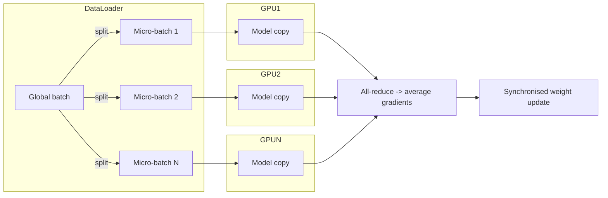
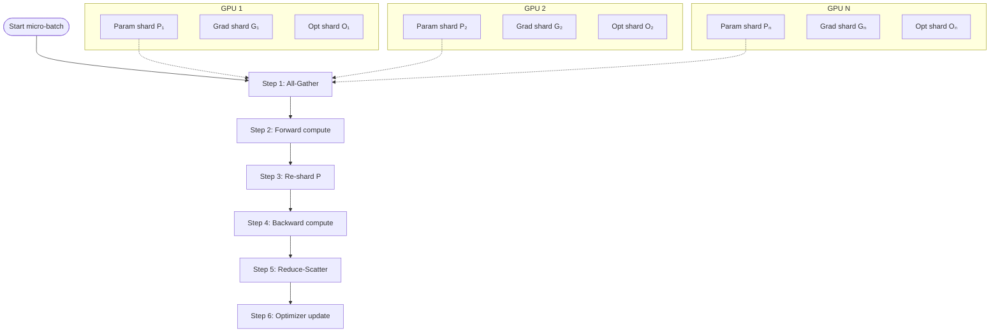
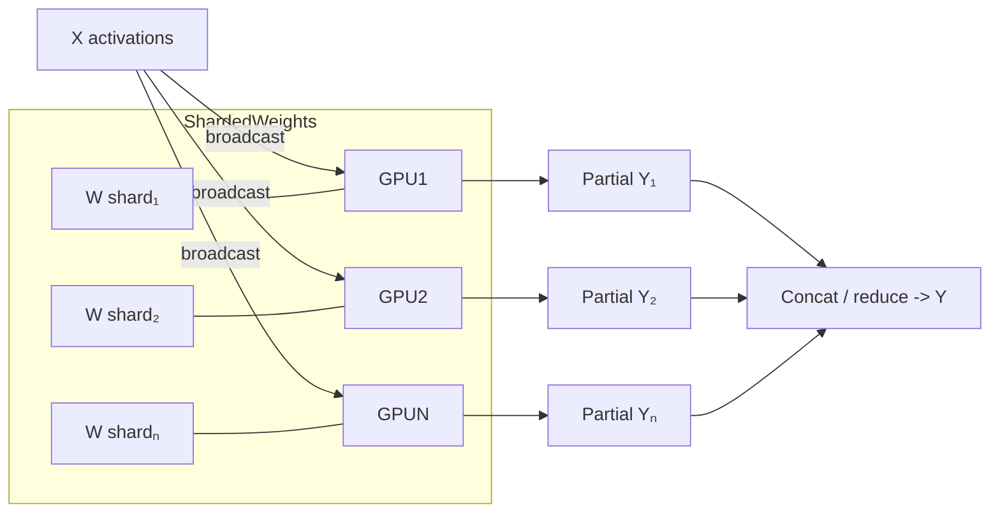
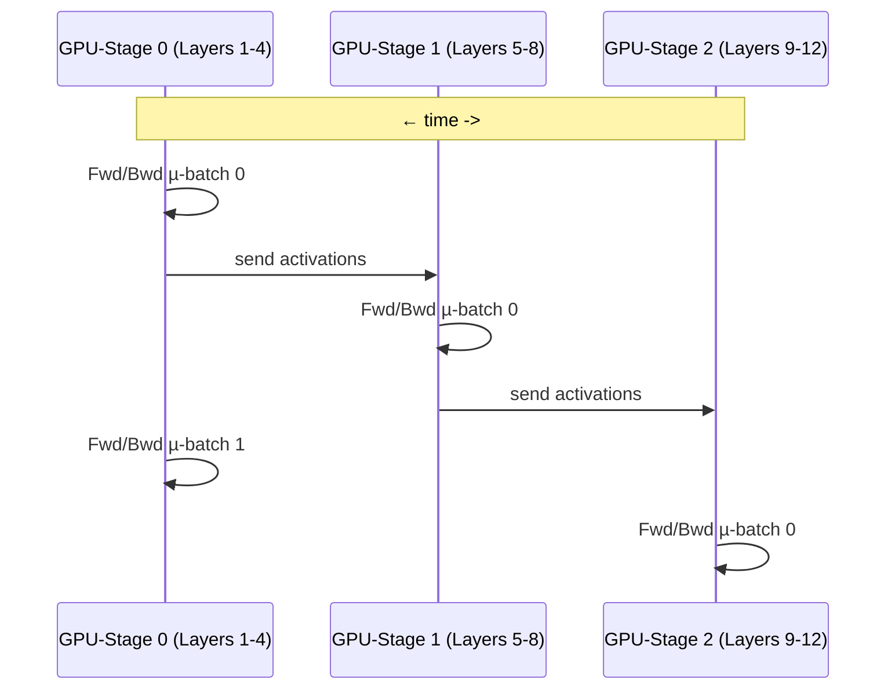
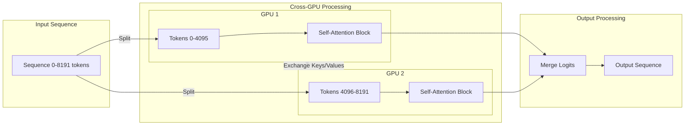
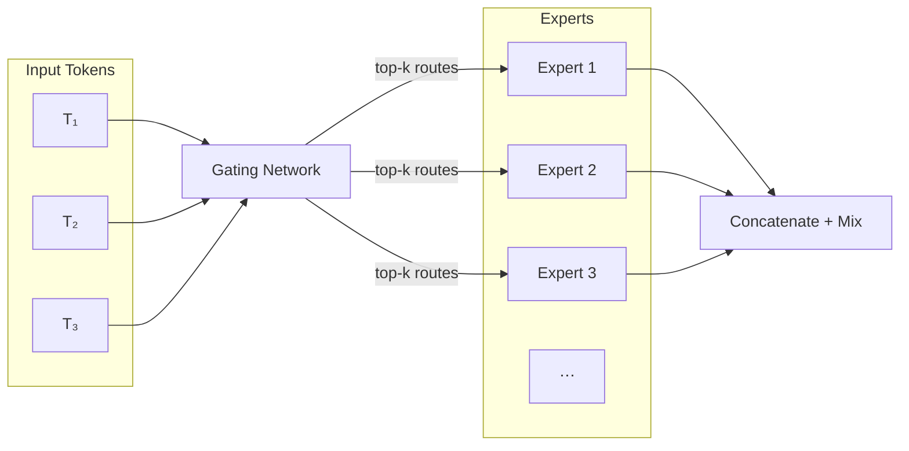
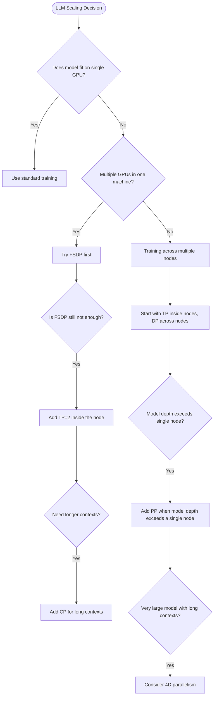

# Scaling Large Language Models - Practical Multi-GPU and Multi-Node Strategies for 2025

The race to build bigger, better language models continues at breakneck speed. Today's state-of-the-art models require massive computing resources that no single GPU can handle. Whether you're training a custom LLM or deploying one for inference, understanding how to distribute this workload is essential.

This guide walks through practical strategies for scaling LLMs across multiple GPUs and nodes, incorporating insights from Hugging Face's [Ultra-Scale Playbook](https://huggingface.co/spaces/nanotron/ultrascale-playbook).

<!-- more -->

## Why Scaling Matters

Before diving into techniques, let's understand why this matters:

- **Model size**: A 70B parameter model requires ~140GB just to store in FP16 - far beyond any single GPU
- **Training time**: Even with 8 A100s, training a 13B model from scratch takes weeks
- **Context length**: Processing long contexts (32k+ tokens) often exceeds single-GPU memory
- **Inference speed**: Distributing inference can reduce latency for demanding applications

Let's explore how to overcome these challenges.

## 1. Parallelism Techniques Explained Simply

### 1.1 Data Parallelism (DP)

Think of this as multiple workers all having the same instruction manual (model), but each working on different examples.

**How it works:**

- Each GPU gets an identical copy of the model
- Each processes different data samples
- Results are combined by averaging gradients

**When to use it:**

- Your model fits on a single GPU
- You want to process more data in parallel
- You need a simple solution with minimal code changes

**Tools**: [PyTorch DDP](https://pytorch.org/docs/stable/notes/ddp.html), [Horovod](https://horovod.ai/).

### 1.2 Fully Sharded Data Parallelism (FSDP)

FSDP is like DP but more memory-efficient - imagine each worker only keeping part of the instruction manual and borrowing pages from colleagues when needed.

**How it works:**

- Model parameters, gradients, and optimizer states are split across GPUs
- During computation, GPUs gather needed parameters from others
- After backward pass, each GPU only updates its part

**Real-world impact:**

- Training very large models (> 10 B parameters) that do not fit on a single GPU.

**Tools**: [PyTorch FSDP](https://pytorch.org/docs/stable/fsdp.html), [DeepSpeed ZeRO-3](https://www.deepspeed.ai/tutorials/zero/).

### 1.3 Tensor Parallelism (TP)

Tensor parallelism splits individual layers across GPUs - like dividing a massive spreadsheet calculation across multiple people.

**How it works:**

- Individual weight matrices are split across GPUs
- Each GPU computes part of each layer's output
- Results are combined before moving to the next layer

**Best for:**

- Massive attention layers and FFNs
- When FSDP alone isn't enough
- Works well inside a node with fast GPU-GPU connections

**Tools**: [Megatron-LM](https://github.com/NVIDIA/Megatron-LM), [TensorRT-LLM](https://github.com/NVIDIA/TensorRT-LLM), [ColossalAI](https://github.com/hpcaitech/ColossalAI).

### 1.4 Pipeline Parallelism (PP)

Pipeline parallelism splits the model across its depth - like an assembly line where each station handles different layers.

**How it works:**

- Different layers run on different GPUs
- Data flows through the pipeline in micro-batches
- Each GPU only stores its assigned layers

**When to use:**

- Very deep models
- When you need to scale beyond a single node
- Combined with other techniques for maximum scaling

**Tools**: [DeepSpeed PP](https://www.deepspeed.ai/tutorials/pipeline/), [Megatron-LM](https://github.com/NVIDIA/Megatron-LM), [GPipe](https://arxiv.org/abs/1811.06965).

### 1.5 Context Parallelism (CP)

For handling extremely long sequences - imagine different people each reading different paragraphs of a book, then sharing key information.

**How it works:**

- Sequence/context length is split across GPUs
- Each GPU processes a chunk of the input sequence
- GPUs exchange information for cross-attention

**Real-world use case:**

- Enables processing 100K+ tokens on consumer hardware
- Critical for document QA, code generation, and long-context reasoning
- Becoming essential as context windows expand

**Tools**: [Picotron](https://github.com/huggingface/picotron), [Nanotron](https://github.com/huggingface/nanotron).

### 1.6 Expert Parallelism (or Mixture of Experts)

MoE models act like specialized consultants - rather than activating the entire model for every input, each token gets routed to only the "experts" it needs.

**How it works:**

- Multiple specialized sub-networks (experts) exist within the model
- A routing mechanism determines which experts to use for each token
- Only a small subset of parameters is used for any given token

**Why it matters:**

- Scales to massive models (1T+ parameters) without proportional compute costs
- Allows more efficient use of parameters
- Models like Mixtral and Grok use this approach

**Tools**: [Picotron](https://github.com/huggingface/picotron), [Nanotron](https://github.com/huggingface/nanotron).

## 2. Practical Training Strategies

For most practitioners, here's what I recommend based on your hardware:

### 2.1 Single Machine (2-8 GPUs)

**Best approach:** FSDP + small TP

- Start with pure FSDP using PyTorch or DeepSpeed
- If your model has huge layers, add TP=2 inside the node
- Use `accelerate` or `torchrun` for the simplest setup

**Real-world tip:** On consumer hardware with PCIe connections, stick to TP≤2. On servers with NVLink, you can go up to TP=4 efficiently.

### 2.2 Small Cluster (2-16 nodes, ≤128 GPUs)

**Best approach:** "TP inside, DP across" + optional PP

- Keep TP groups within each node (utilizing fast NVLink)
- Use DP or FSDP across nodes
- Add PP when model depth exceeds single-node capacity

**Pro tip:** When using PP, set micro-batch size to 4x your PP degree to minimize pipeline bubbles.

### 2.3 Large Cluster (hundreds+ GPUs)

**Best approach:** 4D parallelism (DPxTPxPPxCP)

- Necessary for 70B+ models with 32k+ context windows
- Requires careful mapping to hardware topology
- Expect ~75% scaling efficiency with good InfiniBand networking

**Real-world example:** Training a 70B model with 32k context might use:

- TP=8 (within each node)
- PP=4 (across nodes)
- CP=4 (for long sequence handling)
- DP=4 (for throughput)
- Total: 512 GPUs organized in a 4D grid

## 3. Practical Tools Worth Learning

| Tool                    | When to Use It                                        | Learning Curve |
| ----------------------- | ----------------------------------------------------- | -------------- |
| PyTorch FSDP            | Training medium-large models (1-20B) on a single node | ★★☆☆☆          |
| DeepSpeed ZeRO          | Multi-node training with simple setup                 | ★★★☆☆          |
| Megatron-LM             | Production training of very large models              | ★★★★☆          |
| vLLM                    | Fast inference with attention caching                 | ★★☆☆☆          |
| TensorRT-LLM            | Production inference with NVIDIA GPUs                 | ★★★★☆          |
| Hugging Face Accelerate | Simple distributed training with minimal code changes | ★☆☆☆☆          |
| Nanotron                | Research and education on 3D parallelism              | ★★★☆☆          |

## 4. Making the Right Choice: A Simple Decision Tree

1. **Does your model fit on a single GPU?**
    - Yes -> Use standard training
    - No -> Continue to question 2

2. **Do you have multiple GPUs in one machine?**
    - Yes -> Try FSDP first
    - No -> Skip to question 4

3. **Is FSDP still not enough?**
    - Add TP=2 inside the node
    - If still insufficient, add CP for long contexts

4. **Training across multiple nodes?**
    - Start with "TP inside nodes, DP across nodes"
    - Add PP when model depth exceeds a single node
    - For very large models with long contexts, consider 4D parallelism

**Diagram for visualization**

## 5. The Ultra-Scale Cheatsheet

This visual guide from HuggingFace's team summarizes the key decision points:

## Conclusion

Scaling LLMs is both an art and a science. While these techniques may seem complex at first, they follow logical patterns based on hardware constraints and model structure. Start simple with FSDP and add more dimensions of parallelism only as needed.
