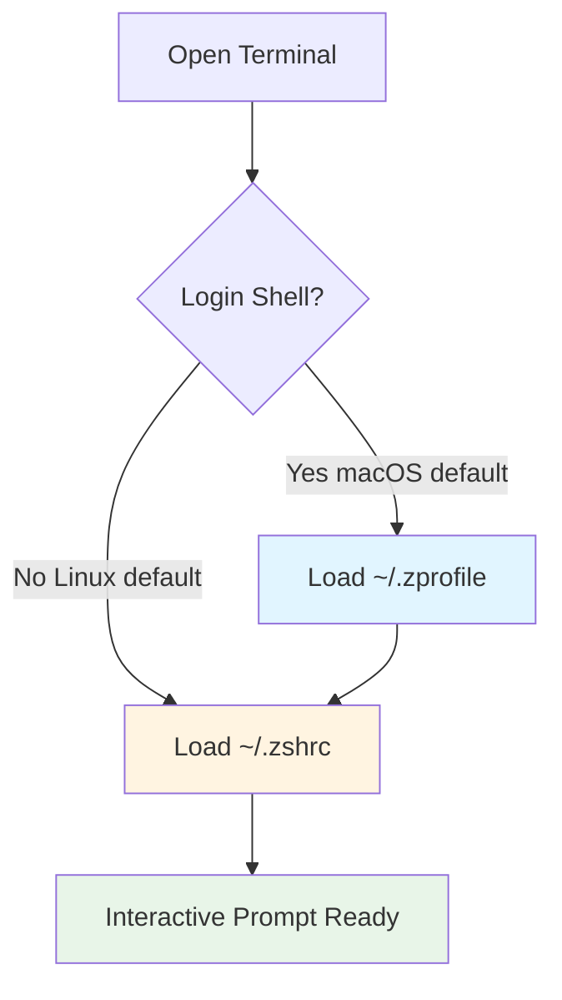
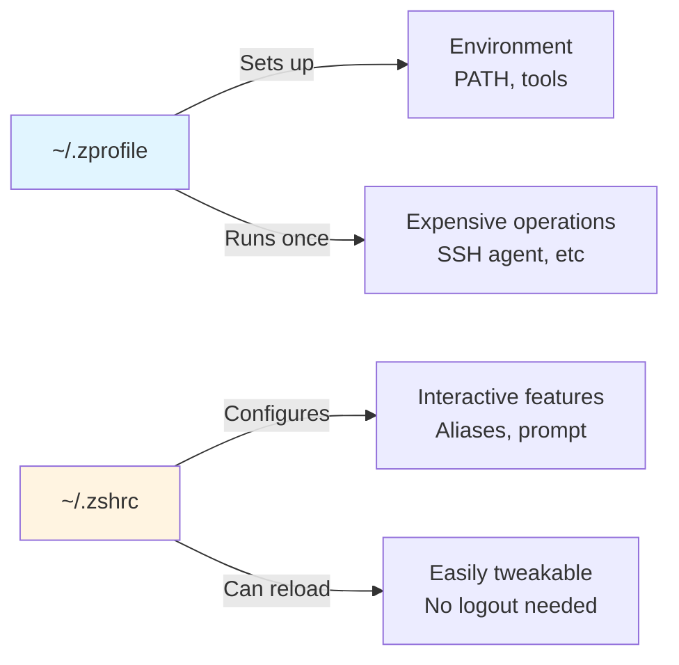

# Quick-Guide on ~/.zprofile vs ~/.zshrc 🚀

## TL;DR ⚡

- **`~/.zprofile`** → runs once when you start a login shell (think "environment setup") 🔧
- **`~/.zshrc`** → runs every time you open an interactive shell (think "daily experience") 🎮

Use both strategically: put your PATH and environment variables in **`~/.zprofile`**, and your aliases, functions, and prompt customizations in **`~/.zshrc`** ✨

<!-- more -->

## Understanding Shell Startup 🐚

When you open a terminal, zsh can start in two different modes. Understanding which mode you're in helps you decide where to put your configuration.

### Login Shell

A **login shell** runs when you first authenticate. Think of it as the "front door" to your system:

- Opening a new terminal window on macOS (Terminal.app, iTerm2)
- SSH-ing into a remote machine (`ssh user@host`)
- Running `zsh -l` explicitly

Login shells read `~/.zprofile` first, then `~/.zshrc`.

### Interactive Shell

An **interactive shell** is simply any shell where you can type commands and see output:

- Every command prompt you see
- New shells spawned from an existing shell

Interactive shells only read `~/.zshrc`.

> **Key insight:** On macOS, every new terminal tab/window is a login shell, so both files run. On Linux desktop terminals, you often get non-login shells, so only `~/.zshrc` runs.



---

## What Goes Where 📁

The rule of thumb: **initialization in `~/.zprofile`, interaction in `~/.zshrc`**.

### Put in `~/.zprofile` 🔐

Configuration that needs to happen **once per session** and must be available to all child processes:

- **Environment variables** like `PATH`, `EDITOR`, `LANG`
  ```sh
  export PATH="$HOME/.local/bin:$PATH"
  export EDITOR="vim"
  ```

- **Version managers** that modify your environment
  ```sh
  eval "$(pyenv init -)"
  eval "$(fnm env)"
  ```

- **System-level setup**
  ```sh
  ulimit -n 4096
  eval "$(ssh-agent -s)"
  ```

- **Anything that's expensive to run** or that you want to happen once per login

### Put in `~/.zshrc` 🔄

Configuration that affects your **interactive experience** and can be reloaded easily:

- **Aliases and functions**
  ```sh
  alias gs='git status'
  alias ll='ls -lah'
  ```

- **Prompt customization**
  ```sh
  autoload -Uz promptinit
  promptinit
  ```

- **Shell options and behaviors**
  ```sh
  setopt autocd
  setopt histignorealldups
  ```

- **Key bindings and completions**
  ```sh
  bindkey -e
  autoload -Uz compinit && compinit
  ```

- **Anything you want to tweak and reload** with `source ~/.zshrc`



---

## Platform Differences 💻

### macOS (Terminal, iTerm2)

New terminal tabs/windows start as **login shells** by default:

1. Loads `~/.zprofile` → environment setup
2. Loads `~/.zshrc` → interactive config
3. Both files run every time you open a new tab

This is convenient—everything just works. But be mindful: slow code in either file will delay your prompt.

### Linux (GNOME Terminal, Kitty, Alacritty)

Desktop terminals usually start as **non-login shells**:

1. Only loads `~/.zshrc`
2. `~/.zprofile` is skipped

**Solution:** If you have important environment setup in `~/.zprofile`, add this line at the top of your `~/.zshrc`:

```sh
# Load login configuration
[[ -f ~/.zprofile ]] && source ~/.zprofile
```

Or move your PATH setup directly into `~/.zshrc` if you're primarily on Linux.

---

## Practical Rules of Thumb 📝

### 1. Session vs. Prompt ⏱️

Ask yourself: "Does this need to run once per login, or every time I see a prompt?"

- Once per login → `~/.zprofile`
- Every prompt → `~/.zshrc`

### 2. Environment First 🛣️

If child processes (GUI apps, scripts) need to see it, put it in `~/.zprofile`:

```sh
# ~/.zprofile
export PATH="$HOME/.local/bin:$PATH"
export GOPATH="$HOME/go"
```

### 3. Easy Iteration 🔄

Put experimental tweaks in `~/.zshrc` so you can test them with:

```sh
source ~/.zshrc
```

No need to close your terminal or log out.

### 4. Performance Matters ⚡

Slow operations in `~/.zshrc` will make every new shell sluggish. Profile your startup time:

```sh
time zsh -i -c exit
```

If it's slow, move expensive operations to `~/.zprofile` or optimize them.

### 5. Remote Scripts 🌐

When writing scripts that need your environment, use a login shell:

```sh
#!/usr/bin/env zsh -l
```

This ensures `~/.zprofile` runs and your PATH is set up correctly.

---

## Minimal Template 📋

Here's a clean starting point that separates concerns:

```sh
# ~/.zprofile
# ============================================
# Environment setup - runs once per login
# ============================================

# Set PATH
export PATH="$HOME/.local/bin:/opt/homebrew/bin:$PATH"

# Default editor
export EDITOR="vim"

# Version managers
eval "$(fnm env)"        # Node
eval "$(pyenv init -)"   # Python

# System limits
ulimit -n 4096
```

```sh
# ~/.zshrc
# ============================================
# Interactive configuration - runs every prompt
# ============================================

# Prompt
autoload -Uz promptinit
promptinit
prompt pure

# Aliases
alias gs='git status'
alias gp='git pull'
alias ll='ls -lah'

# Shell options
setopt autocd
setopt histignorealldups

# Completions
autoload -Uz compinit && compinit

# Key bindings (Emacs-style)
bindkey -e
```

---

## Quick Reference 🎯

| Scenario | File | Why |
|:---------|:-----|:----|
| Set PATH for all programs | `~/.zprofile` | Needs to be available to child processes |
| Define `alias ll='ls -lah'` | `~/.zshrc` | Interactive convenience, reload anytime |
| Initialize pyenv/nvm | `~/.zprofile` | Expensive, needs to run once |
| Customize prompt with colors | `~/.zshrc` | Visual/interactive feature |
| Set `EDITOR=vim` | `~/.zprofile` | Environment variable for other programs |
| Add shell completions | `~/.zshrc` | Interactive feature |
| Start ssh-agent | `~/.zprofile` | Once per session is enough |
| Create shell functions | `~/.zshrc` | Interactive convenience, iterate easily |

---

## Debugging Your Setup 🔍

Not sure which file is running? Add these debug lines:

```sh
# In ~/.zprofile
echo "Loading ~/.zprofile"

# In ~/.zshrc
echo "Loading ~/.zshrc"
```

Open a new terminal and see what prints. Remove the debug lines once you understand your setup.

You can also check if you're in a login shell:

```sh
echo $0
# Prints "-zsh" for login shell
# Prints "zsh" for non-login shell
```

---

## Summary ✨

- **`~/.zprofile`**: Environment setup, PATH, version managers—things that need to happen once per session
- **`~/.zshrc`**: Aliases, prompt, shell options—things that make your daily shell experience pleasant
- macOS starts login shells by default (both files run)
- Linux often starts non-login shells (only `~/.zshrc` runs)
- Keep it clean, keep it fast, and you'll have a reliable shell environment across machines
