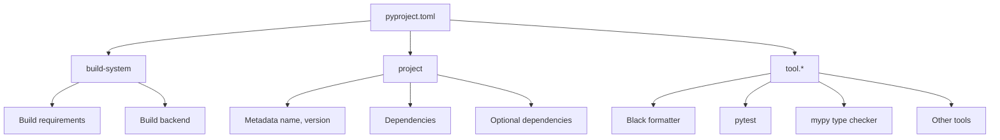
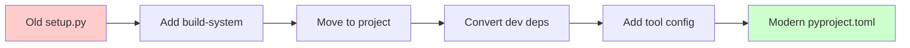

# Quick-Guide on `pyproject.toml`

## TL;DR

Think of `pyproject.toml` as the **`package.json` for Python**. It's a single configuration file that holds your project's metadata, dependencies, and tool settings. Whether you use `.venv`, `pyenv`, or `uv`, this one file simplifies development and makes collaboration smoother.

<!-- more -->

## What is `pyproject.toml`?

`pyproject.toml` is a standardized configuration file that lives at the root of your Python project. It uses the TOML format (think INI files but better) and is backed by official Python Enhancement Proposals (PEPs).

The file evolved in two key stages:

- **[PEP 518](https://peps.python.org/pep-0518/)** (2016) introduced the `[build-system]` table so build tools could declare their requirements in a standard way.
- **[PEP 621](https://peps.python.org/pep-0621/)** (2020) added the `[project]` table for core package metadata—name, version, dependencies, and more.

Today, most Python developer tools (Black, isort, pytest, Ruff, mypy) read their configuration from `[tool.*]` sections in this file, making it the central hub for your entire project setup.



## Why should you care?

**One file to rule them all**
Before `pyproject.toml`, you'd juggle `setup.py`, `setup.cfg`, `requirements.txt`, `MANIFEST.in`, and various dotfiles. Now everything lives in one place.

**Backend-agnostic builds**
When you run `pip install .`, pip reads `pyproject.toml` and automatically installs whatever build tools your project needs (setuptools, flit, hatchling, etc.).

**Universal tool configuration**
Linters, formatters, test runners, and type checkers all know to look here for their settings. Your IDE, CI pipeline, and teammates all read from the same source of truth.

## Does it replace `requirements.txt`?

**In modern workflows, yes.** Tools like [Poetry](https://python-poetry.org/), [PDM](https://pdm-project.org/), [Hatch](https://hatch.pypa.io/), and [uv](https://github.com/astral-sh/uv) store dependencies directly in the `[project]` section and generate lockfiles for reproducibility.

You only need `requirements.txt` if:

- You're working with legacy deployment systems that expect it
- You have simple CI scripts that haven't been updated
- You need to share a flat dependency list with someone not using modern tools

Most modern tools can export a `requirements.txt` from your `pyproject.toml` when needed (e.g., `uv export > requirements.txt`).

## Anatomy of a `pyproject.toml`

Here's what a typical file looks like with the three main sections:

```toml
# 1. Build system - tells pip/build how to package your project
[build-system]
requires = ["setuptools>=69", "wheel"]
build-backend = "setuptools.build_meta"

# 2. Project metadata and dependencies
[project]
name = "awesome-app"
version = "0.1.0"
description = "Short demo of pyproject.toml"
readme = "README.md"
requires-python = ">=3.12"
dependencies = [
  "fastapi>=0.111",
  "uvicorn[standard]>=0.30",
]

# Optional dependencies (e.g., for development)
[project.optional-dependencies]
dev = ["pytest", "black", "ruff"]

# 3. Tool configuration
[tool.black]
line-length = 100
target-version = ["py312"]

[tool.isort]
profile = "black"
```

### Breaking it down

**`[build-system]`** - Required if you want to package/distribute your project. Tells pip and build tools (like `python -m build`) which backend to use.

**`[project]`** - Your package metadata. This is where dependencies live instead of `requirements.txt`. The `optional-dependencies` section is perfect for dev tools that users don't need.

**`[tool.*]`** - Configuration for any tool that supports it. Each tool gets its own namespace (e.g., `[tool.pytest.ini_options]`, `[tool.mypy]`).

## Virtual environments and `pyproject.toml`

Important: `pyproject.toml` **declares what to install**, but it doesn't create virtual environments. You still need a separate tool for that.

| Tool         | Create venv                   | Install from `pyproject.toml`         |
| ------------ | ----------------------------- | ------------------------------------- |
| Plain Python | `python -m venv .venv`        | `pip install -e .` (manual)           |
| pyenv        | `pyenv virtualenv 3.12.2 env` | `pip install -e .` (after activating) |
| uv           | `uv venv` or automatic        | `uv sync` (fast and automatic)        |

The modern approach with `uv` is seamless—it reads `pyproject.toml`, manages the venv, and keeps everything in sync with one command.

## Common real-world uses

Here's how teams actually use `pyproject.toml` day-to-day:

### Packaging and distribution

**Section:** `[project]` + `[build-system]`
**Tools:** `build`, `twine`, `uv`

Build a wheel with `python -m build`, then publish with `twine upload dist/*` or `uv publish`. All metadata comes from your `[project]` section—no separate `setup.py` needed.

### Dependency management

**Section:** `[project.dependencies]` + lockfile
**Tools:** Poetry, PDM, uv

Modern tools read your dependencies from `[project]`, resolve them, and create a lockfile. Running `uv sync` gives you reproducible installs across machines in seconds.

### Code formatting

**Section:** `[tool.black]`, `[tool.ruff]`
**Tools:** [Black](https://black.readthedocs.io/), [Ruff](https://docs.astral.sh/ruff/)

Your formatter settings live in the repo. CI, pre-commit hooks, and IDE plugins all read the same config—no more "works on my machine" formatting issues.

### Testing

**Section:** `[tool.pytest.ini_options]`
**Tool:** [pytest](https://docs.pytest.org/)

Configure test discovery, markers, and coverage settings. Replaces the old `pytest.ini` or `setup.cfg` approach.

### Type checking

**Section:** `[tool.mypy]`
**Tool:** [mypy](https://mypy-lang.org/)

Optional but handy if you want all config in one place instead of maintaining a separate `mypy.ini`.

## Typical workflows

### Starting a new project with `uv`

This is the smoothest path for new projects:

```bash
uv init my_app          # creates folder with pyproject.toml and .venv
cd my_app
uv add requests fastapi # adds to [project.dependencies] and installs
uv run pytest           # runs tests in the venv
uv build                # builds wheel/sdist for distribution
```

Everything stays in sync automatically—no manual venv management needed.

### Migrating an existing project

If you have a legacy Python project, here's how to modernize it:



**Step-by-step:**

1. **Add `[build-system]`** - Start with setuptools if you're not sure: `requires = ["setuptools>=61", "wheel"]`
2. **Move to `[project]`** - Transfer name, version, dependencies from `setup.py` or `setup.cfg`
3. **Convert dev dependencies** - Put them in `[project.optional-dependencies].dev`
4. **Configure tools** - Add `[tool.*]` sections for Black, pytest, mypy, etc.
5. **Handle `requirements.txt`** - Either drop it or generate it from lockfile for legacy systems

After migration, you can delete `setup.py`, `setup.cfg`, and most config dotfiles.

## Quick reference

Need to do something specific? Here are common patterns:

### Use a different build backend

**Flit** (simpler than setuptools):

```toml
[build-system]
requires = ["flit_core>=3.2"]
build-backend = "flit_core.buildapi"
```

**Hatchling** (modern and fast):

```toml
[build-system]
requires = ["hatchling"]
build-backend = "hatchling.build"
```

### Pin Python version

```toml
[project]
requires-python = ">=3.12"
```

This ensures users (and deployment systems) know your minimum Python version.

### Configure Black

```toml
[tool.black]
line-length = 88
target-version = ["py312"]
```

### Set up test dependencies

```toml
[project.optional-dependencies]
test = ["pytest>=8.0", "coverage>=7.0"]
dev = ["pytest>=8.0", "black", "ruff", "mypy"]
```

Install with `pip install -e ".[test]"` or `uv sync --extra test`.

### Export for legacy systems

```bash
uv export > requirements.txt          # everything
uv export --only-deps > requirements.txt  # without project itself
```

---

**Bottom line:** `pyproject.toml` brings Python's project setup into the modern era. Whether you're packaging a library, managing dependencies, or configuring tools, this one file is your command center. Start with `uv` for the smoothest experience, or integrate it into your existing workflow gradually.

---
