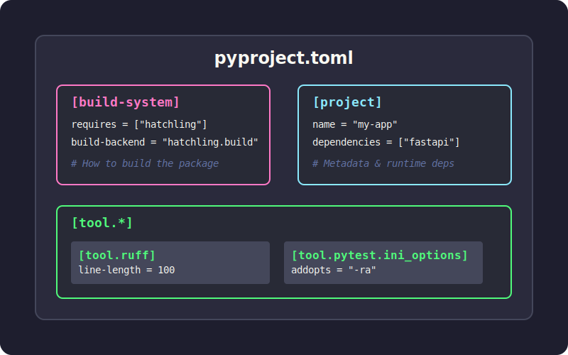
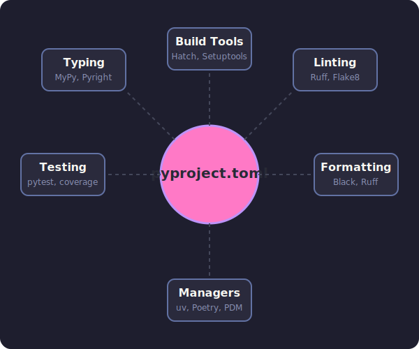

# The Ultimate Guide to `pyproject.toml`

## TL;DR

Think of `pyproject.toml` as the **`package.json` for Python**. It's a single configuration file that holds your project's metadata, dependencies, and tool settings. Whether you use `.venv`, `pyenv`, or `uv`, this one file simplifies development and makes collaboration smoother.

<!-- more -->

## What is `pyproject.toml`?

`pyproject.toml` is a standardized configuration file that lives at the root of your Python project. It uses the TOML format (think INI files but better) and is backed by official Python Enhancement Proposals (PEPs).

The file evolved in two key stages:

- **[PEP 518](https://peps.python.org/pep-0518/)** (2016) introduced the `[build-system]` table so build tools could declare their requirements in a standard way.
- **[PEP 621](https://peps.python.org/pep-0621/)** (2020) added the `[project]` table for core package metadata—name, version, dependencies, and more.

Today, most Python developer tools (Black, isort, pytest, Ruff, mypy) read their configuration from `[tool.*]` sections in this file, making it the central hub for your entire project setup.



## Why should you care?

### 1. One file to rule them all

Before `pyproject.toml`, you'd juggle `setup.py`, `setup.cfg`, `requirements.txt`, `MANIFEST.in`, and various dotfiles (`.flake8`, `.coveragerc`). Now everything lives in one place.

### 2. Backend-agnostic builds

When you run `pip install .`, pip reads `pyproject.toml` and automatically installs whatever build tools your project needs (setuptools, flit, hatchling, etc.). You are no longer tied to `setuptools`.

### 3. Universal tool configuration

Linters, formatters, test runners, and type checkers all know to look here for their settings. Your IDE, CI pipeline, and teammates all read from the same source of truth.



## Anatomy of a `pyproject.toml`

Here's what a typical file looks like with the three main sections:

```toml
# 1. Build system - tells pip/build how to package your project
[build-system]
requires = ["hatchling"]
build-backend = "hatchling.build"

# 2. Project metadata and dependencies
[project]
name = "awesome-app"
version = "0.1.0"
description = "Short demo of pyproject.toml"
readme = "README.md"
requires-python = ">=3.12"
dependencies = [
  "fastapi>=0.111",
  "uvicorn[standard]>=0.30",
]

# Expose CLI commands
[project.scripts]
awesome-cli = "awesome_app.cli:main"

# Optional dependencies (e.g., for development)
[project.optional-dependencies]
dev = ["pytest", "ruff", "mypy"]

# 3. Tool configuration
[tool.ruff]
line-length = 100
target-version = "py312"

[tool.pytest.ini_options]
addopts = "-ra -q"
testpaths = ["tests"]
```

### Breaking it down

#### `[build-system]`

Required if you want to package/distribute your project. Tells pip and build tools (like `python -m build`) which backend to use.

#### `[project]`

Your package metadata. This is where dependencies live instead of `requirements.txt`.

- **`dependencies`**: The runtime requirements for your package.
- **`optional-dependencies`**: Groups of extra dependencies (e.g., `dev`, `test`, `docs`).
- **`scripts`**: Creates executable commands. In the example above, installing the package creates an `awesome-cli` command that runs the `main` function in `awesome_app/cli.py`.

#### `[tool.*]`

Configuration for any tool that supports it. Each tool gets its own namespace (e.g., `[tool.pytest.ini_options]`, `[tool.mypy]`).

## Does it replace `requirements.txt`?

**In modern workflows, yes.** Tools like [Poetry](https://python-poetry.org/), [PDM](https://pdm-project.org/), [Hatch](https://hatch.pypa.io/), and [uv](https://github.com/astral-sh/uv) store dependencies directly in the `[project]` section and generate lockfiles for reproducibility.

You only need `requirements.txt` if:

- You're working with legacy deployment systems that expect it.
- You have simple CI scripts that haven't been updated.

Most modern tools can export a `requirements.txt` from your `pyproject.toml` when needed:

```bash
uv export > requirements.txt
```

## Choosing a Build Backend

One of the confusing parts of `pyproject.toml` is choosing a build backend. Here is a quick comparison:

| Backend        | Best For         | Pros                                     | Cons                                  |
| :------------- | :--------------- | :--------------------------------------- | :------------------------------------ |
| **Hatchling**  | Modern standard  | Fast, extensible, supports plugins       | Newer, less legacy support            |
| **Flit**       | Simple packages  | Extremely simple, zero config            | Not for complex builds (C extensions) |
| **Setuptools** | Legacy / Complex | Supports everything (C extensions, etc.) | Slower, complex configuration         |
| **Poetry**     | Poetry users     | Integrated with Poetry ecosystem         | Locked into Poetry workflow           |

**Recommendation:** Use **Hatchling** for new pure-Python projects. It's the default for `uv` and is becoming the industry standard.

## Migrating an existing project

If you have a legacy Python project, here's how to modernize it:


**Step-by-step:**

1. **Add `[build-system]`** - Start with setuptools if you're not sure: `requires = ["setuptools>=61", "wheel"]`.
2. **Move to `[project]`** - Transfer name, version, dependencies from `setup.py` or `setup.cfg`.
3. **Convert dev dependencies** - Put them in `[project.optional-dependencies].dev`.
4. **Configure tools** - Add `[tool.*]` sections for Black, pytest, mypy, etc.
5. **Handle `requirements.txt`** - Either drop it or generate it from lockfile for legacy systems.

After migration, you can delete `setup.py`, `setup.cfg`, and most config dotfiles.

## Advanced Features

### CLI Entry Points

Instead of the old `console_scripts` in `setup.py`, use `[project.scripts]`:

```toml
[project.scripts]
my-tool = "my_package.main:run"
```

When a user installs your package, they can type `my-tool` in their terminal.

### Workspaces (Monorepos)

Tools like `uv` and `hatch` support workspaces, allowing you to manage multiple packages in a single repo.

```toml
[tool.uv.workspace]
members = ["packages/*"]
```

This allows you to develop multiple interdependent packages and install them all into a single virtual environment for testing.

## Typical Workflows with `uv`

### Starting a new project

```bash
uv init my_app          # creates folder with pyproject.toml and .venv
cd my_app
uv add requests fastapi # adds to [project.dependencies] and installs
uv run pytest           # runs tests in the venv
```

### Running scripts

You can define scripts in `pyproject.toml` (if using a task runner like `poe` or `hatch`) or just use `uv run`:

```bash
uv run python main.py
```

## Best Practices

1.  **Don't pin exact versions in libraries**: Use ranges (e.g., `requests>=2.30`) so your library doesn't conflict with others.
2.  **Do pin versions in applications**: Use a lockfile (`uv.lock` or `poetry.lock`) to ensure reproducible builds.
3.  **Group dev dependencies**: Keep testing, linting, and docs dependencies in separate optional groups (e.g., `dev`, `test`, `docs`).
4.  **Keep it clean**: Don't dump every possible config option in there. Stick to project-wide defaults.

---

**Bottom line:** `pyproject.toml` brings Python's project setup into the modern era. Whether you're packaging a library, managing dependencies, or configuring tools, this one file is your command center. Start with `uv` for the smoothest experience, or integrate it into your existing workflow gradually.
