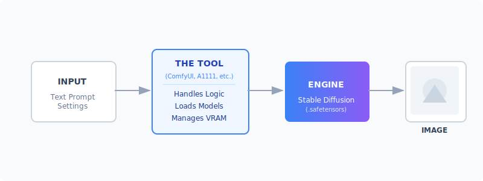
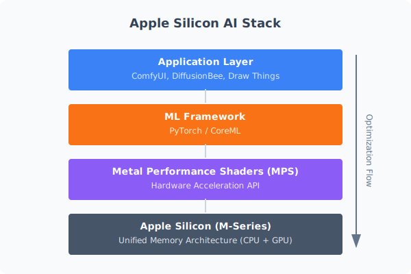
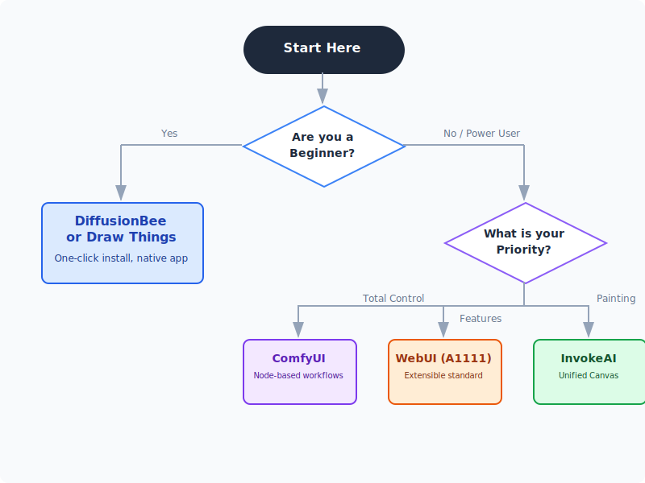

# Quick-guide on Local Stable-Diffusion Toolkits for macOS

Running generative AI models locally is a game-changer. It means **zero cloud costs**, **no censorship**, **total privacy**, and **unlimited experimentation**. Whether you're generating character portraits, architectural concepts, or just having fun, your Mac is more than capable of handling the workload thanks to Apple Silicon.

But with so many tools available, where do you start?

Below is a practical guide to the best macOS-ready interfaces. Each tool wraps the same powerful Stable Diffusion models but offers a completely different experience—from "Apple-like" simplicity to "developer-grade" control.

<!-- more -->

## How these tools work

At their core, all these applications do the same thing: they provide a user interface (UI) for the Stable Diffusion models. They handle the complex "plumbing"—loading heavy model weights, managing memory, and talking to your Mac's GPU.

Because they all share the same underlying architecture, you can usually share **model files** (`.safetensors`) between them. Download a model once, and try it in different apps to see which workflow suits you.

### The Apple Silicon Advantage

Why is the Mac so good for this? It comes down to **Unified Memory**. Unlike a PC with a separate graphics card (where you might have only 8GB or 12GB of VRAM), your Mac's GPU has access to your _entire_ system RAM.

This means a MacBook Pro with 32GB or 64GB of RAM can load massive models (like SDXL or Flux) that would bring a typical gaming PC to its knees.

---

## 1. Draw Things: The Powerhouse App

- **Download:** [App Store Link](https://apps.apple.com/de/app/draw-things-offline-ai-art/id6444050820?l=en-GB)
- **What it is:** A native iOS/macOS app that feels like a professional design tool. It's surprisingly powerful, supporting ControlNet, Inpainting, and LoRAs right out of the box.
- **Best for:** Users who want a **native app experience** (no terminal!) but don't want to sacrifice advanced features.
- **Pros:**
    - **Native Performance:** Highly optimized for Apple Silicon.
    - **Feature Rich:** Supports Inpainting, Outpainting, ControlNet, and scriptable workflows.
    - **Offline First:** Runs completely offline after downloading models.
- **Cons:**
    - UI can be a bit dense on smaller screens (it's designed to scale from iPhone to Mac).

## 2. DiffusionBee: The "One-Click" Wonder

- **Download:** [diffusionbee.com](https://diffusionbee.com/download)
- **What it is:** The simplest way to run Stable Diffusion on a Mac. It strips away all the jargon. You don't "load a checkpoint"; you just select a style.
- **Best for:** Absolute beginners who just want to make cool images _now_.
- **Pros:**
    - **Zero Setup:** Download the DMG, drag to Applications, run.
    - **Clean UI:** Very "Apple-like" design.
    - **Built-in Tools:** Includes simple upscaling and background removal.
- **Cons:**
    - **Limited Control:** You can't easily tweak advanced sampler settings or complex node pipelines.
    - **Slower Updates:** New features (like the latest ControlNet models) take longer to arrive.

## 3. ComfyUI: The Node-Based Lab

- **Download:** [comfy.org](https://www.comfy.org/download)
- **What it is:** A visual programming environment. Instead of sliders, you connect "nodes" with wires to build your image generation pipeline.
- **Best for:** Power users, technical artists, and anyone who wants to understand _exactly_ how the image is being made.
- **Pros:**
    - **Ultimate Control:** Build custom workflows for specific tasks (e.g., "Generate image -> Upscale -> Face Restore").
    - **Speed:** Often faster than other UIs because it executes only what's needed.
    - **Ecosystem:** Thousands of custom nodes created by the community.
- **Cons:**
    - **Steep Learning Curve:** It looks like a bowl of spaghetti until you learn to read it.
    - **Setup:** Requires some comfort with Python/Terminal (though installers exist).

## 4. Stable Diffusion WebUI (AUTOMATIC1111)

- **Install Guide:** [Installation on Apple Silicon](https://github.com/AUTOMATIC1111/stable-diffusion-webui/wiki/Installation-on-Apple-Silicon)
- **What it is:** The "Swiss Army Knife" of Stable Diffusion. It runs in your browser and has a tab for everything.
- **Best for:** Enthusiasts who want to use the latest community extensions immediately.
- **Pros:**
    - **Extensions:** If a new AI technique is released today, A1111 will have an extension for it tomorrow.
    - **Tutorials:** The vast majority of YouTube tutorials use this interface.
- **Cons:**
    - **Clunky UI:** It's functional but chaotic.
    - **Heavy:** Can be slower and more memory-hungry than ComfyUI or Draw Things.

## 5. Fooocus: Midjourney on Your Mac

- **Repo:** [github.com/lllyasviel/Fooocus](https://github.com/lllyasviel/Fooocus)
- **What it is:** An interface designed to mimic the ease of Midjourney. It automates all the technical choices (samplers, steps, refiners) so you can focus on the prompt.
- **Best for:** High-quality results with minimal tweaking.
- **Pros:**
    - **Smart Defaults:** It "just works" and produces beautiful images.
    - **Minimalist:** No overwhelming sliders.
- **Cons:**
    - **Less Customization:** Harder to force it to do something specific if it fights you.
    - **Performance:** Often optimized for NVIDIA GPUs first, so Mac performance can vary.

---

## Comparison Table

| Tool             | Install Difficulty | Interface Style     | Best For                           |
| :--------------- | :----------------- | :------------------ | :--------------------------------- |
| **Draw Things**  | ★☆☆☆☆ (App Store)  | Native App (Pro)    | **The Sweet Spot** (Power + Ease)  |
| **DiffusionBee** | ★☆☆☆☆ (DMG)        | Native App (Simple) | **Beginners** & Casual Use         |
| **ComfyUI**      | ★★★☆☆ (Python)     | Node Graph          | **Complex Workflows** & Automation |
| **A1111 WebUI**  | ★★★★☆ (Terminal)   | Browser Dashboard   | **Extensions** & Community Support |
| **Fooocus**      | ★★★☆☆ (Python)     | Minimalist          | **Midjourney-style** Prompting     |

---

## Decision Flowchart

Not sure which one to pick? Follow this path:

---

## Essential Tips for Mac Users

### 1. System Requirements

- **RAM is King:**
    - **8GB:** Doable for basic 512x512 images, but expect slowness and crashes with newer models (SDXL).
    - **16GB:** The comfortable minimum. You can run most things, including SDXL.
    - **32GB+:** The dream. You can keep multiple models loaded and multitask while generating.
- **Storage:** AI models are huge (2GB - 6GB each). Get an external SSD if your Mac is low on space.

### 2. Where to get Models

The software is just the engine; you need fuel (models).

- **[Civitai](https://civitai.com):** The largest community for models. Look for "Checkpoints" that are compatible with SD 1.5 or SDXL.
- **[Hugging Face](https://huggingface.co):** The "GitHub of AI". More technical, but the official source for base models from Stability AI.
- **File Types:** Always look for `.safetensors` files. Avoid `.ckpt` files if possible, as they can theoretically contain malicious code (though rare).

### 3. Start Simple

Don't try to install ComfyUI on day one. Start with **DiffusionBee** or **Draw Things**. Get a feel for how prompting works. Once you hit a wall ("I wish I could control the pose of this character..."), _then_ look into ControlNet and more advanced tools.
