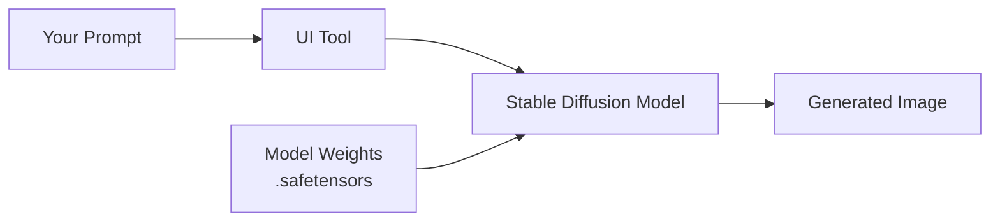
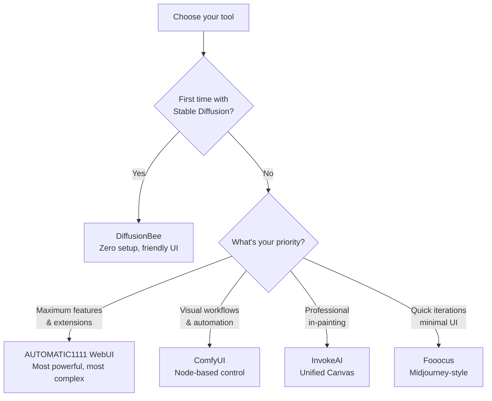

# Quick-guide on Local Stable-Diffusion Toolkits for macOS

Running generative-AI models on-device means zero cloud costs, no upload limits, and full control of your checkpoints. Whether you're generating portraits, concept art, or iterating on product designs, keeping everything local gives you privacy and unlimited generations.

Below is a practical guide to five of the most popular macOS-ready front-ends. Each tool wraps the same underlying Stable Diffusion models but offers different trade-offs between simplicity and power.

<!-- more -->

## How these tools work

All five tools are essentially **user interfaces** that sit on top of Stable Diffusion model weights. They handle the PyTorch plumbing, model loading, and image generation pipeline so you can focus on prompting and tweaking parameters.

Because they all consume the same `.safetensors` or `.ckpt` checkpoint files, you can download a model once and use it across any tool. The key differences are in **interface design**, **workflow complexity**, and **how well they leverage Apple Silicon**.

## 1. ComfyUI

- **Download:** [https://www.comfy.org/download](https://www.comfy.org/download)
- **What it is:** A **node-based** visual programming interface. Think of it as a flowchart where each box is a step in your image generation pipeline - load a model here, apply a LoRA there, add ControlNet for pose guidance, chain samplers for refinement.
- **Best for:** Power users who want full control over multi-stage workflows, video generation, or experimental techniques.
- **Pros**
    - Visual graph makes complex pipelines transparent and reusable.
    - Native MPS support runs smoothly on M1/M2/M3 chips.
    - Massive ecosystem of custom nodes for advanced features.
- **Cons**
    - Requires comfort with node-based interfaces (not beginner-friendly).
    - Initial setup involves Python and Homebrew dependencies.

---

## 2. Stable Diffusion WebUI (AUTOMATIC1111)

- **Download / install guide:** [Installation on Apple Silicon](https://github.com/AUTOMATIC1111/stable-diffusion-webui/wiki/Installation-on-Apple-Silicon)
- **What it is:** The **community standard** web interface. Runs in your browser and exposes every parameter Stable Diffusion offers. If there's a new technique or model format, someone has probably built an extension for it.
- **Best for:** Enthusiasts who want maximum flexibility and don't mind tinkering with extensions.
- **Pros**
    - Thousands of extensions - ControlNet, Regional Prompter, DreamBooth training, and more.
    - Active community means rapid updates and support.
    - Familiar tabbed interface once you get past setup.
- **Cons**
    - Installation is manual and terminal-heavy (Git, Python, dependencies).
    - The UI can feel overwhelming with dozens of sliders and checkboxes.

---

## 3. DiffusionBee

- **Download:** [https://diffusionbee.com/download](https://diffusionbee.com/download)
- **What it is:** A **native macOS app** with a friendly, no-code interface. Download, double-click, start generating. Models are pre-bundled and managed through the UI.
- **Best for:** First-time users or anyone who wants to avoid terminal commands entirely.
- **Pros**
    - Zero setup - works out of the box like any Mac app.
    - Includes bonus tools like upscaling and background removal.
    - Clean, uncluttered interface with sensible defaults.
- **Cons**
    - Limited control over advanced parameters and workflows.
    - Closed-source binary means slower adoption of cutting-edge features.

---

## 4. InvokeAI

- **Download / quick-start:** [InvokeAI Quick Start](https://github.com/invoke-ai/InvokeAI/blob/main/docs/installation/quick_start.md)
- **What it is:** A professional-grade interface that balances ease of use with production features. Includes a "Unified Canvas" for iterative painting and masking workflows.
- **Best for:** Designers and artists who need robust in-painting, out-painting, and batch generation.
- **Pros**
    - Unified Canvas makes iterative refinement intuitive.
    - Built-in workflow and batch scripting for repeated tasks.
    - Both web UI and CLI for automation.
- **Cons**
    - Installation uses Conda, which creates a large (~4 GB) environment.
    - Benefits from 16 GB+ RAM for smooth performance.

---

## 5. Fooocus

- **Repo:** [https://github.com/lllyasviel/Fooocus](https://github.com/lllyasviel/Fooocus)
- **What it is:** A **Midjourney-inspired** interface that hides complexity. Type your prompt, hit generate, and let the tool handle model selection, samplers, and quality settings automatically.
- **Best for:** Quick ideation sessions when you just want results without tweaking parameters.
- **Pros**
    - Ultra-minimal UI - one prompt box, no distractions.
    - Auto-downloads models, LoRAs, and VAE files as needed.
    - Good default aesthetic without tuning.
- **Cons**
    - Less granular control than other options.
    - Slower generation on Apple Silicon (optimized more for CUDA GPUs).

---

## Side-by-side comparison

| Tool               | Install effort          | Interface style          | Apple Silicon speed* | Sweet spot                          |
|--------------------|--------------------------|--------------------------|----------------------|-------------------------------------|
| **ComfyUI**         | Medium (Python, Homebrew) | Visual node graph        | ★★★★☆                | Complex workflows, video, advanced control |
| **A1111 WebUI**     | High (manual CLI)         | Web tabs + extensions    | ★★★☆☆                | Maximum features, extension ecosystem |
| **DiffusionBee**    | **One-click DMG**         | Native Mac app           | ★★★☆☆                | Beginners, no-setup experience |
| **InvokeAI**        | Medium-high (Conda)       | Web UI + Canvas          | ★★★☆☆                | Professional in-painting, batch work |
| **Fooocus**         | Medium (Python zip)       | Minimal prompt interface | ★★☆☆☆                | Quick iterations, Midjourney-style ease |

\*Speed ratings are relative to each other on Apple Silicon. All five use PyTorch MPS backend (no NVIDIA GPU required).

---

## Decision flowchart

## Which one should you pick?

**Start here:**

- **New to Stable Diffusion?** → **DiffusionBee** gets you generating in minutes with zero terminal commands.
- **Need every feature and extension?** → **AUTOMATIC1111 WebUI** is the most battle-tested and extensible.
- **Love visual programming or multi-step workflows?** → **ComfyUI** gives you full pipeline control with node graphs.
- **Doing professional design work with lots of masking?** → **InvokeAI** has the best canvas-based workflow.
- **Want Midjourney-like simplicity without the subscription?** → **Fooocus** strips away complexity.

**The good news:** Because all five tools load the same `.safetensors` checkpoint files, you can download a model once and experiment with different interfaces. Start simple, then graduate to more powerful tools as your needs grow.

Happy prompting!
