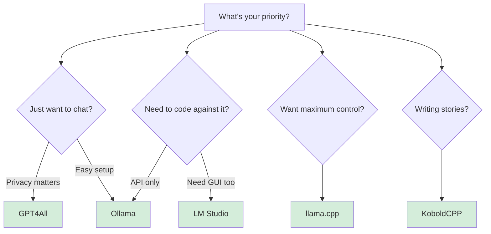

# Quick-guide on Running LLMs Locally on macOS

Running large language models locally on your Mac means faster responses, complete privacy, and no API bills. But which tool should you pick?

This guide breaks down the five most popular options - from dead-simple menu bar apps to full-control command-line tools. Each comes with download links, what makes it special, and honest trade-offs.

<!-- more -->

## Why Run LLMs Locally?

Before diving into tools, here's what you get:

- **Privacy** - your prompts never leave your machine
- **Speed** - no network latency, instant responses on Apple Silicon
- **Cost** - zero API fees after the initial download
- **Offline work** - plane rides, coffee shops, anywhere

The catch? You need decent hardware (8GB+ RAM, ideally Apple Silicon) and models take 2-20GB of disk space depending on size.


## 1. Ollama - The "Just Works" Option

**Download:** [https://ollama.com/download/mac](https://ollama.com/download/mac)

Think of Ollama as the Spotify of local LLMs. It wraps `llama.cpp` in a native menu-bar app with a clean CLI. Type `ollama run llama3` and it downloads, optimizes, and runs the model automatically. Full Apple Metal GPU support out of the box.

**Example workflow:**

```bash
# Install model
ollama run llama3

# Use in your code
curl http://localhost:11434/api/generate -d '{
  "model": "llama3",
  "prompt": "Why is the sky blue?"
}'
```

**What's great:**

- Drag-and-drop `.dmg` installer - no terminal gymnastics
- Both GUI and CLI (`ollama run mistral`, `ollama list`)
- Curated model library with automatic quantization
- Models just work with Metal acceleration

**Trade-offs:**

- Core is closed-source (model library and examples are open)
- Less control over fine-tuning parameters
- Takes ~3GB disk space on first launch
- Requires macOS 11+

---

## 2. LM Studio - GUI + Developer SDK

**Download:** [https://lmstudio.ai](https://lmstudio.ai)

LM Studio gives you the best of both worlds: a polished model browser GUI plus an MIT-licensed SDK for Python and JavaScript. It's the only tool here that supports both GGUF and Apple's MLX format natively, making it ideal for Apple Silicon.

The interface feels like browsing an app store - search for "Llama 3", click download, and start chatting. Behind the scenes, it spins up a local OpenAI-compatible server you can code against.

**Example workflow:**

```python
from lmstudio import LMStudio

client = LMStudio()
response = client.complete(
    model="llama-3-8b",
    prompt="Explain recursion simply"
)
```

**What's great:**

- Beautiful model browser with search and filters
- MIT-licensed Python and JavaScript SDK included
- Runs both GGUF and MLX models for maximum Apple GPU speed
- Built-in RAG - chat with your PDFs and documents
- Local OpenAI-compatible API server

**Trade-offs:**

- GUI application is closed-source
- Larger download at ~750MB
- Intel Macs need Rosetta 2
- Less control than raw `llama.cpp` for advanced users

---

## 3. llama.cpp - Maximum Control

**Repo:** [https://github.com/ggml-org/llama.cpp](https://github.com/ggml-org/llama.cpp)

This is the engine under the hood of Ollama, LM Studio, and dozens of other tools. If you want bleeding-edge features, full control over quantization, or need to embed an LLM in your own app, go straight to the source.

It's bare metal - you compile it once (or install via Homebrew), download GGUF model files manually, and run everything from the command line. No GUI, no hand-holding, but complete flexibility.

**Example workflow:**

```bash
# Install via Homebrew
brew install llama.cpp

# Download a model (manual)
huggingface-cli download TheBloke/Llama-2-7B-GGUF llama-2-7b.Q4_K_M.gguf

# Run inference
llama-cli -m llama-2-7b.Q4_K_M.gguf \
  -p "Write a haiku about code" \
  -n 128 \
  --temp 0.7 \
  --top-p 0.9
```

**What's great:**

- Bleeding-edge features land here first (daily updates)
- Complete control - every CLI flag, every parameter
- Tiny footprint (< 30MB compiled)
- MIT license - use it anywhere, commercially or not
- C API and Python bindings for embedding in apps

**Trade-offs:**

- Steep learning curve - you need to understand GGUF formats and quantization
- Manual model downloads from HuggingFace
- No GUI whatsoever
- Breaking changes happen on the main branch

---

## 4. GPT4All Desktop - Privacy-First Chat

**Download:** [https://gpt4all.io](https://gpt4all.io)

GPT4All is built by Nomic with one mission: keep your conversations completely private. It's a Qt-based desktop app that feels like ChatGPT but runs 100% offline. Click a model (Llama 3, Mistral, DeepSeek), download, and start chatting - no sign-up, no cloud, no tracking.

The standout feature is "LocalDocs" - point it at a folder of PDFs or text files and chat with your documents using RAG (retrieval-augmented generation).

**What's great:**

- True privacy - nothing ever leaves your computer
- One-click model downloads with clean interface
- LocalDocs RAG built right in - no setup needed
- OpenAI-compatible API server for coding against it
- MIT license with growing plugin ecosystem
- Cross-platform (Mac, Windows, Linux)

**Trade-offs:**

- GUI-only, no headless or server mode
- Uses more RAM than Ollama or LM Studio
- Fewer advanced tuning options for GPU or quantization
- Model selection is curated (smaller than Ollama's library)

---

## 5. KoboldCPP - For Storytellers & Role-Play

**Repo:** [https://github.com/LostRuins/koboldcpp](https://github.com/LostRuins/koboldcpp)

KoboldCPP is a `llama.cpp` fork designed for creative writers and interactive fiction. It's a single executable - download, `chmod +x`, and run. The web interface includes features like memory, world info, and scene management that storytelling AI needs.

If you're writing novels, running RPG campaigns, or doing creative role-play scenarios, this tool speaks your language.

**Example workflow:**

```bash
# Download universal binary for M-series Macs
wget https://github.com/LostRuins/koboldcpp/releases/latest/download/koboldcpp-mac.zip

# Run it
chmod +x koboldcpp
./koboldcpp --model llama-3-8b.gguf --port 5001

# Opens web UI at localhost:5001
```

**What's great:**

- Single executable - no dependencies, build tools, or package managers
- Web UI purpose-built for long-form creative writing
- Memory and lorebook features for consistent storytelling
- Supports mixed-precision GGUF with full GPU acceleration
- Works great on M-series Macs

**Trade-offs:**

- Niche UI - not ideal for general Q&A or coding tasks
- AGPL-3 license (copyleft) restricts commercial use
- Smaller maintainer team means slower updates
- Less feature parity with upstream `llama.cpp`

---

## Quick Comparison

Here's how these tools stack up at a glance:

| Tool          | Interface      | Setup               | GPU Support | License             | Best For                            |
| ------------- | -------------- | ------------------- | ----------- | ------------------- | ----------------------------------- |
| **Ollama**    | Menu bar + CLI | 1-click `.dmg`      | Metal       | Proprietary core    | Easiest path from zero to running   |
| **LM Studio** | GUI + SDK      | 1-click `.dmg`      | Metal + MLX | MIT SDK, closed GUI | Developers who want GUI and API     |
| **llama.cpp** | CLI / C API    | Homebrew or compile | Metal       | MIT                 | Maximum control and customization   |
| **GPT4All**   | Desktop app    | 1-click `.pkg`      | Metal       | MIT                 | Privacy-focused ChatGPT alternative |
| **KoboldCPP** | Web UI         | Single binary       | Metal       | AGPL-3              | Creative writing and storytelling   |

## How to Choose in 60 Seconds



**Quick decision tree:**

- **"I just want it to work"** → Pick **Ollama**
- **"I need a GUI and want to write code"** → Go **LM Studio**
- **"I want complete control over everything"** → Use **llama.cpp**
- **"Privacy is non-negotiable"** → Install **GPT4All**
- **"I'm writing novels or running RPG campaigns"** → Grab **KoboldCPP**

## Final Thoughts

All five tools run smoothly on Apple Silicon and keep your data local. You can't really make a wrong choice here - they all solve the same core problem (running LLMs offline) but optimize for different workflows.

Start with Ollama if you're unsure. It takes 5 minutes to install and you'll know immediately if local LLMs fit your needs. You can always switch later.

The important part? You own the inference, the models, and the data. No API limits, no usage tracking, no monthly bills. Just you and your Mac's GPU doing the work.
