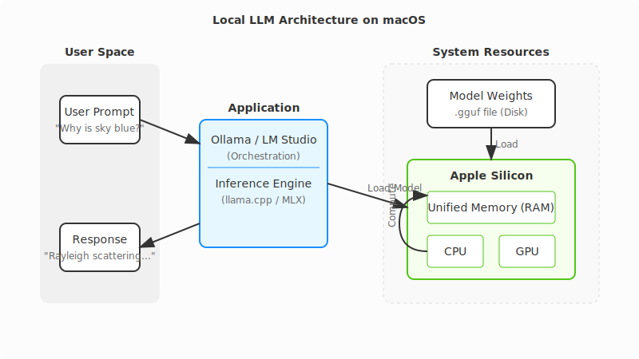
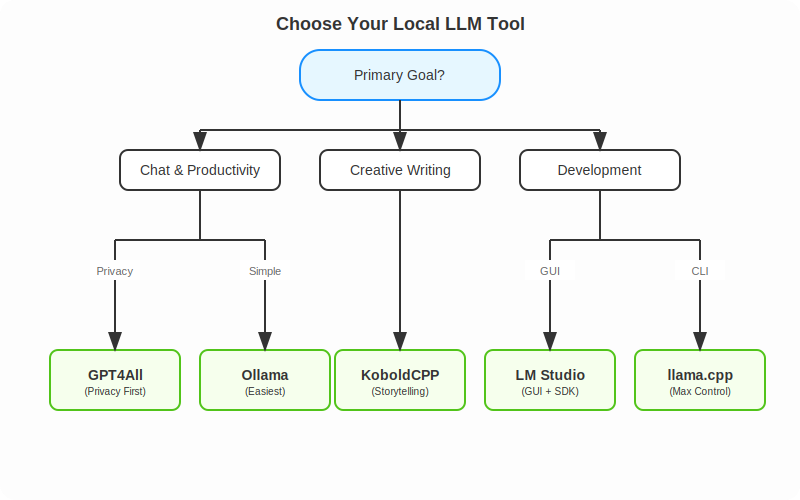

# Quick-guide on Running LLMs Locally on macOS

Running Large Language Models (LLMs) locally on your Mac is a game-changer. It means **faster responses**, **complete privacy**, and **zero API bills**. But with so many tools popping up every week, which one should you choose?

This guide breaks down the top options—from dead-simple menu bar apps to full-control command-line tools. We'll cover what makes each special, their trade-offs, and how to get started.

<!-- more -->

## Why Run Locally?

Before we dive into the tools, let's look at the benefits:

- **🔒 Privacy**: Your data and prompts never leave your machine. Perfect for sensitive work.
- **⚡ Speed**: No network latency. On Apple Silicon, responses can be faster than cloud APIs.
- **💰 Cost**: One-time download. No monthly subscriptions or token fees.
- **✈️ Offline**: Work from a plane, a cabin, or a coffee shop with spotty Wi-Fi.

### Key Concepts for Beginners

If you're new to local LLMs, here are three terms you'll see often:

1. **Inference**: The act of "running" the model to generate text.
2. **Quantization (GGUF)**: A technique to shrink model sizes with minimal quality loss. You'll see filenames like `llama-3-8b-Q4_K_M.gguf`. The `Q4` means "4-bit quantization"—it uses less RAM than the full 16-bit model.
3. **Apple Silicon (Metal)**: Apple's M1/M2/M3 chips have "Unified Memory," allowing the CPU and GPU to share RAM. This makes Macs uniquely powerful for running huge models that would require expensive dedicated GPUs on a PC.

### Prerequisites

- **Hardware**: A Mac with Apple Silicon (M1, M2, M3, or M4) is highly recommended. Intel Macs work but will be significantly slower.
- **RAM**:
    - **8GB**: Can run small models (Mistral 7B, Llama 3 8B) comfortably.
    - **16GB+**: Recommended for larger models and multitasking.
- **Disk Space**: Models take up space! Plan for ~10-20GB for a good starter library.



---

## 1. Ollama - The "Just Works" Option

**Download:** [ollama.com](https://ollama.com/download/mac)

Think of Ollama as the "Docker for LLMs." It wraps the complex engine (`llama.cpp`) in a sleek, native package. You install it, run one command, and you're chatting. It handles all the messy details like model downloading and hardware acceleration automatically.

### Best For

- **Beginners** who want to get started in 5 minutes.
- **Developers** who want a simple CLI tool.

### Example Workflow

```bash
# 1. Download and run Llama 3 (it auto-downloads if needed)
ollama run llama3

# 2. Use it in your code via the local API
curl http://localhost:11434/api/generate -d '{
  "model": "llama3",
  "prompt": "Explain quantum computing to a 5-year-old",
  "stream": false
}'
```

### Pros & Cons

| ✅ Pros                                  | ❌ Cons                                          |
| :--------------------------------------- | :----------------------------------------------- |
| Easiest setup (Drag-and-drop `.dmg`)     | Core application is closed-source                |
| Great CLI (`ollama list`, `ollama pull`) | Less granular control over generation parameters |
| Huge library of pre-configured models    |                                                  |

---

## 2. LM Studio - The Visual Explorer

**Download:** [lmstudio.ai](https://lmstudio.ai)

LM Studio is for those who prefer a beautiful Graphical User Interface (GUI) over a terminal. It features a built-in "App Store" style browser for models, letting you search HuggingFace directly. It also supports Apple's native MLX format, which can be faster on some Macs.

### Best For

- **Visual learners** who want to explore and test different models.
- **Developers** needing an OpenAI-compatible local server.

### Example Workflow

LM Studio has a great Python SDK, but it also provides a local server that mimics OpenAI's API, meaning you can use standard libraries:

```python
# Using the official LM Studio SDK
from lmstudio import LMStudio

client = LMStudio()
response = client.complete(
    model="llama-3-8b",
    prompt="Write a haiku about debugging."
)
print(response.content)
```

### Pros & Cons

| ✅ Pros                                     | ❌ Cons                  |
| :------------------------------------------ | :----------------------- |
| Beautiful, easy-to-use interface            | GUI is closed-source     |
| Native support for both GGUF and MLX models | Larger download (~750MB) |
| Built-in RAG (Chat with your PDFs)          |                          |

---

## 3. llama.cpp - The Power User's Tool

**Repo:** [github.com/ggml-org/llama.cpp](https://github.com/ggml-org/llama.cpp)

This is the engine that powers almost everyone else. If you want **maximum performance**, **bleeding-edge features**, or to embed an LLM into your own C++ application, this is the source. It's bare-metal, lightweight, and incredibly powerful.

### Best For

- **Engineers** and **Power Users**.
- Running on older or constrained hardware.

### Example Workflow

```bash
# 1. Install via Homebrew
brew install llama.cpp

# 2. Download a model manually (e.g., from HuggingFace)
huggingface-cli download TheBloke/Llama-3-8B-Instruct-GGUF --local-dir .

# 3. Run inference with full control
llama-cli -m llama-3-8b-instruct.Q4_K_M.gguf \
  -p "Write a python script to sort a list" \
  -n 512 \
  --temp 0.7 \
  --ctx-size 4096
```

### Pros & Cons

| ✅ Pros                               | ❌ Cons                         |
| :------------------------------------ | :------------------------------ |
| Ultimate control over every parameter | Steep learning curve (CLI only) |
| MIT Licensed (Open Source)            | Manual model management         |
| Extremely lightweight (<30MB)         |                                 |

---

## 4. GPT4All - Privacy-First & RAG

**Download:** [gpt4all.io](https://gpt4all.io)

GPT4All focuses heavily on **privacy** and **documents**. Its standout feature is "LocalDocs," which lets you point the app at a folder of PDFs, notes, or code, and chat with them instantly. It runs completely offline with no telemetry.

### Best For

- **Privacy advocates**.
- Users who want to **chat with their own documents** (RAG) easily.

### Pros & Cons

| ✅ Pros                               | ❌ Cons                            |
| :------------------------------------ | :--------------------------------- |
| "LocalDocs" RAG is excellent and easy | GUI-only (no headless mode)        |
| Completely offline & private          | Heavier resource usage than Ollama |
| Cross-platform (Mac, Windows, Linux)  |                                    |

---

## 5. KoboldCPP - For Storytellers

**Repo:** [github.com/LostRuins/koboldcpp](https://github.com/LostRuins/koboldcpp)

A fork of `llama.cpp` tailored for **creative writing** and **Role-Playing Games (RPGs)**. It features a web interface designed for long-form text generation, with tools to manage "World Info," character memory, and story consistency.

### Best For

- **Writers**, **Novelists**, and **RPG players**.

### Example Workflow

```bash
# 1. Download the single binary
wget https://github.com/LostRuins/koboldcpp/releases/latest/download/koboldcpp-mac.zip

# 2. Run it (launches a web server)
./koboldcpp --model llama-3-8b.gguf --port 5001 --smartcontext
```

### Pros & Cons

| ✅ Pros                                  | ❌ Cons                                       |
| :--------------------------------------- | :-------------------------------------------- |
| Best-in-class tools for creative writing | Niche UI (not great for coding/chat)          |
| Single file executable (no installation) | AGPL license (restrictive for commercial use) |

---

## Honorable Mention: MLX-LM

If you are a Python developer specifically targeting Apple Silicon, check out **[MLX-LM](https://github.com/ml-explore/mlx-examples/tree/main/llms)** by Apple. It's a framework optimized specifically for the M-series chips. While less "user-friendly" than Ollama, it's often the fastest way to run models if you're comfortable with Python.

---

## Summary: Which Tool is Right for You?

Here is a quick decision tree to help you decide:



### Quick Comparison Table

| Tool          | Interface      | Difficulty    | Best Feature               |
| :------------ | :------------- | :------------ | :------------------------- |
| **Ollama**    | CLI / Menu Bar | ⭐ (Easy)     | "Just Works" experience    |
| **LM Studio** | GUI            | ⭐ (Easy)     | Model discovery & UI       |
| **GPT4All**   | GUI            | ⭐ (Easy)     | Chat with local docs (RAG) |
| **KoboldCPP** | Web UI         | ⭐⭐ (Medium) | Creative writing tools     |
| **llama.cpp** | CLI            | ⭐⭐⭐ (Hard) | Raw performance & control  |

## Final Thoughts

You can't really go wrong with any of these. They all run locally, they all respect your privacy, and they all leverage the incredible power of Apple Silicon.

- **Start with Ollama** if you just want to see what the fuss is about.
- **Try LM Studio** if you want to browse models visually.
- **Dive into llama.cpp** if you want to understand how it all works under the hood.
