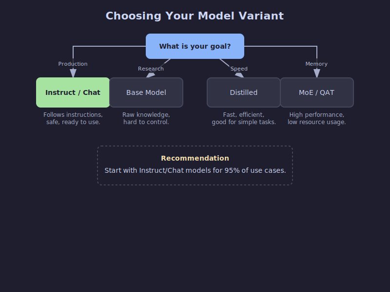
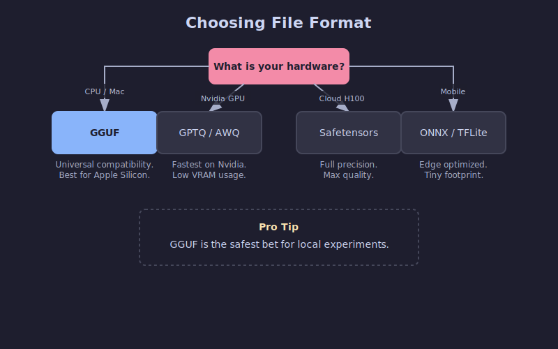
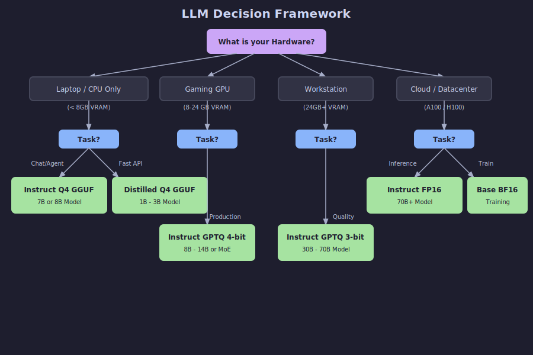

# Choosing the Right Open-Source LLM Variant & File Format

---

## Why do open-source LLMs have so many confusing names?

You've probably seen model names like `Llama-3.1-8B-Instruct.Q4_K_M.gguf` or `Mistral-7B-v0.3-A3B.awq` and wondered what all those suffixes mean. It looks like a secret code, but the short answer is: **they tell you two critical things.**

Open-source LLMs vary along **two independent dimensions**:

1. **Model variant** – the suffix in the name (`-Instruct`, `-Distill`, `-A3B`, etc.) describes _how_ the model was trained and _what_ it's optimized for.
2. **File format** – the extension (`.gguf`, `.gptq`, `.awq`, etc.) describes _how_ the weights are stored and _where_ they run best (CPU, GPU, mobile, etc.).

Think of it like this: the **model variant is the recipe**, and the **file format is the container**. You can put the same soup (recipe) into a thermos, a bowl, or a takeout box (container) depending on where you plan to eat it.

Understanding both dimensions helps you avoid downloading 20 GB of the wrong model at midnight and then spending hours debugging CUDA errors.

<!-- more -->

---

## Model variants explained (the recipe)

This is about the _brain_ of the model. How was it taught?

### Base models

**What it is:** The raw, pre-trained model straight from the training run. Think of it as the unfiltered brain that learned language patterns from massive text datasets (the entire internet) but hasn't been taught to follow instructions. It just predicts the next word.

**When to use it:**

- You're planning to **fine-tune** it for your specific domain.
- You're doing research and need the "pure" foundation.
- You want maximum creative freedom (no safety guardrails).

**Trade-offs:** Won't reliably follow instructions. If you ask "What is the capital of France?", it might reply "and what is the capital of Germany?" because it thinks it's completing a list of questions.

### Instruct / Chat models

**What it is:** A base model that went through additional training (Supervised Fine-Tuning + RLHF) to understand and follow human instructions. This is what most people actually want when they say "I want an LLM."

**When to use it:**

- Building chatbots, AI agents, or RAG applications.
- Function calling and tool use.
- Day-to-day coding assistance.
- **95% of production use cases.**

**Trade-offs:** Slightly larger and slower than base models due to the extra training layers. May be less "creative" due to alignment training that makes it more predictable and helpful.

### Reasoning / CoT Models (New!)

**What it is:** A new breed of models (like DeepSeek-R1 or o1-derivatives) trained with "Chain of Thought" (CoT) reinforcement learning. They "think" before they speak, generating internal reasoning tokens to solve complex logic, math, or coding problems before outputting the final answer.

**When to use it:**

- Complex coding tasks and debugging.
- Math problems and logic puzzles.
- When you need the model to double-check its work and avoid hallucinations.

**Trade-offs:** **Slower inference**. They generate many "thought" tokens that you might not see but still have to wait for. They can also be overly verbose for simple "hello world" tasks.

### Distilled models

**What it is:** A smaller "student" model trained to mimic the behavior of a larger "teacher" model. Think of it as compressed knowledge—you get 70-80% of the performance at 30-50% of the size.

**When to use it:**

- Mobile or edge devices with limited resources.
- Cost-sensitive SaaS where every millisecond counts.
- High-throughput scenarios where you need to serve many requests.

**Trade-offs:** Some loss in complex reasoning ability, but excellent efficiency. The token-per-watt ratio is hard to beat.

### MoE (Mixture-of-Experts): A3B, A22B, etc.

**What it is:** A clever architecture where the model has many "expert" sub-networks, but only activates a subset for each token. "A3B" means "3 billion parameters active" out of a much larger total (often 30B+).

**When to use it:**

- You want "big model" smarts but only have 12-24 GB VRAM.
- You need the reasoning power of a 30B model but with 7B inference costs.
- You're running locally and want the best performance-per-memory ratio.

**Trade-offs:** Takes more disk space (you're storing all the experts). Not every inference framework supports MoE routing yet—check compatibility first.

> **Rule of thumb:**
>
> - Start with an **Instruct** model—it's what most people need.
> - Hit memory or latency limits? Try a **Distilled** or **MoE** variant.
> - Need to solve a complex riddle? Try a **Reasoning** model.

---

## File formats explained (the container)

Now that you know _what_ kind of model you want, you need to pick _how_ it's packaged. File formats determine where your model runs best and how much memory it needs.

### Quantization 101: Why do we shrink models?

Before we talk formats, let's talk **Quantization**.
Standard models use 16-bit numbers (FP16) for every weight. That's precise but huge.
Quantization reduces these to 8-bit, 4-bit, or even 2-bit numbers.

- **FP16**: 2 bytes per parameter. (13B model ≈ 26 GB)
- **4-bit**: 0.5 bytes per parameter. (13B model ≈ 6.5 GB)

You lose a tiny bit of "intelligence" but gain massive speed and memory savings.

### GGUF (`.gguf`)

**What it is:** The successor to GGML and now the **de-facto standard for local inference**. A single file that contains the model weights, metadata, and even the prompt template.

**Best for:**

- **Apple Silicon (M1/M2/M3)**: It works natively with Metal acceleration.
- **CPU Inference**: If you don't have a dedicated GPU.
- **Easy Setup**: Works with `llama.cpp`, Ollama, and LM Studio.

**Why it's great:** One file, works everywhere. Supports multiple quantization levels.

#### Decoding GGUF Names (Q3_K_M, Q5_K_M, etc.)

You'll often see a long list of files like `Q3_K_M`, `Q4_K_S`, `Q5_K_M`. These aren't random; they are specific "K-quant" formats.

**How to read `Q3_K_M`:**

- **Q3**: Average **3-bit** quantization for the weights.
- **K**: Uses the **K-quant** scheme (a newer, smarter quantization method that uses non-uniform precision).
- **M**: **Medium** block size. This refers to the internal layout (`S` = Small, `L` = Large).

**Which one should you pick?**

- **Q3_K_M (The "Budget" Choice)**: Use when you are tight on memory. It has a noticeable quality drop but allows you to run larger models on weaker hardware.
- **Q4_K_M (The "Standard")**: The sweet spot. Best balance of speed, size, and perplexity. Indistinguishable from uncompressed for most tasks.
- **Q5_K_M (The "Premium")**: Use if you have VRAM to spare. Quality is very close to FP16 / Q8 while still being quite compact.

> **Pro Tip:** It is often better to run a **larger model at lower quantization** (e.g., Llama-70B at Q3) than a **smaller model at high quantization** (e.g., Llama-8B at Q8). Intelligence scales with parameter count more than precision.

### GPTQ (`.safetensors` + `config.json`)

**What it is:** Post-training quantization optimized specifically for **Nvidia GPUs**. It uses second-order information to minimize accuracy loss when compressing.

**Best for:**

- **Production Servers**: Running on Linux with Nvidia GPUs (CUDA).
- **High Throughput**: Very fast inference at 4-bit.
- **ExLlamaV2**: Can be run with the ExLlamaV2 loader for extreme speed.

**Watch out for:** Requires a GPU. Won't run efficiently on CPU or Mac.

### AWQ (`.safetensors`)

**What it is:** Activation-Aware Weight Quantization. It analyzes which weights matter most during inference and preserves their precision better than naive quantization.

**Best for:**

- **Accuracy**: Often matches FP16 accuracy more closely than GPTQ at 4-bit.
- **vLLM**: Supported natively by the vLLM serving engine.

**Why it's great:** It's "smarter" quantization. If you care about squeezing every drop of quality out of a 4-bit model, AWQ is often the winner.

### PyTorch / Safetensors (FP16/BF16)

**What it is:** Full-precision weights with no quantization. The original format most models are released in.

**Best for:**

- **Cloud inference** with powerful GPUs (A100, H100).
- **Fine-tuning** and continued training.
- When accuracy is paramount and memory isn't a constraint.

**Trade-offs:** Largest memory and disk footprint. A 70B model in FP16 needs ~140 GB VRAM!

> **Tip:** When in doubt, start with **GGUF Q4_K_M**. It's the Swiss Army knife of LLM formats—runs on 8GB VRAM GPUs, modern CPUs, and everything in between. You can always optimize later.

---

## How to actually run these? (Serving Engines)

You have the file. Now what? You need an engine to run it.

1.  **Ollama**: The easiest CLI tool.

    - _Uses_: GGUF.
    - _Good for_: Mac, Linux, Windows, Local development.
    - _Command_: `ollama run llama3`

2.  **LM Studio**: A beautiful GUI application.

    - _Uses_: GGUF.
    - _Good for_: Beginners, testing models visually, Mac/Windows.

3.  **vLLM**: The production standard.

    - _Uses_: AWQ, GPTQ, Safetensors (FP16).
    - _Good for_: High-performance servers, deploying APIs, Linux/Docker.
    - _Note_: Doesn't support GGUF well (yet).

4.  **Llama.cpp**: The engine behind Ollama.
    - _Uses_: GGUF.
    - _Good for_: Low-level integration, running on Raspberry Pis, Android, etc.

---

## Putting it all together: a decision framework

Here's a practical flowchart to help you choose. Start with your constraints (hardware and use case), then pick the appropriate combination.

### Quick recommendations by scenario

**Scenario 1: Building a chatbot on a MacBook Pro (16GB RAM)**

- **Model:** Instruct (Llama-3-8B or Mistral-7B)
- **Format:** GGUF Q4_K_M
- **Why:** Runs smoothly on CPU/Metal, fits in memory, one-file simplicity.

**Scenario 2: RAG system on a server with RTX 4090 (24GB VRAM)**

- **Model:** Instruct or MoE (Mixtral 8x7B or Qwen-14B)
- **Format:** EXL2 (via ExLlamaV2) or AWQ 4-bit
- **Why:** Maximizes the 24GB VRAM. EXL2 is blazing fast on Nvidia cards.

**Scenario 3: Fine-tuning for domain-specific use on cloud GPU**

- **Model:** Base
- **Format:** FP16 Safetensors
- **Why:** You need full precision for training. Start with the unaligned base model.

**Scenario 4: High-throughput API with cost constraints**

- **Model:** Distilled (DeepSeek-Distill or similar)
- **Format:** AWQ 4-bit running on vLLM
- **Why:** vLLM + AWQ offers incredible throughput (tokens/sec) per dollar.

---

## Common pitfalls and misconceptions

### "All 4-bit models are the same quality"

**Not true.** A QAT 4-bit model (trained in 4-bit) often beats an 8-bit post-training quantized model. The _method_ matters. AWQ typically preserves more accuracy than naive GPTQ.

### "MoE models work with any inference engine"

**Not yet.** `llama.cpp` handles MoE routing well. Support in other engines varies. Always check compatibility before downloading a 50GB MoE model.

### "Distilled models are just smaller versions"

**Nope.** A distilled 7B model can outperform a vanilla 13B model because it learned from a much larger teacher (often 70B+). It's compressed _knowledge_, not just compressed _parameters_.

### "I should quantize my QAT model further to save space"

**Don't.** QAT models were already trained in low-bit precision. Quantizing them again usually degrades quality significantly. Use them as-is.

### "Bigger is always better"

**Context matters.** A well-tuned 8B Instruct model often outperforms a poorly-aligned 70B base model for specific tasks. Match the model variant to your use case—size isn't everything.

---

## TL;DR - Just tell me what to download

> **If you just want something that works:**
>
> 1.  Download a **`<model-name>-Instruct.Q4_K_M.gguf`** file from Hugging Face.
> 2.  Run it with **Ollama** or **LM Studio**.
> 3.  If it's too slow → try a smaller model or Distilled variant.
> 4.  If you're out of memory → try a Q3_K_M quantization.
> 5.  If quality isn't good enough → move up to Q5_K_M or switch to a larger model.
>
> Start simple, optimize only when needed. The defaults are good enough for 90% of use cases.
