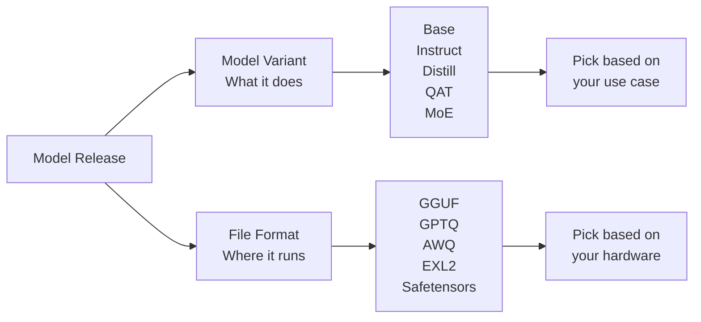
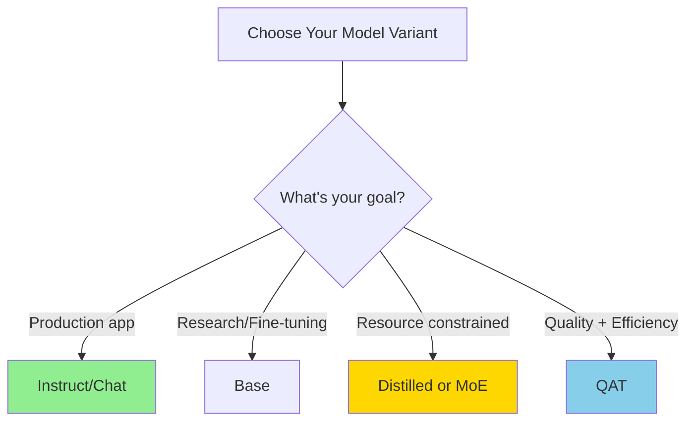
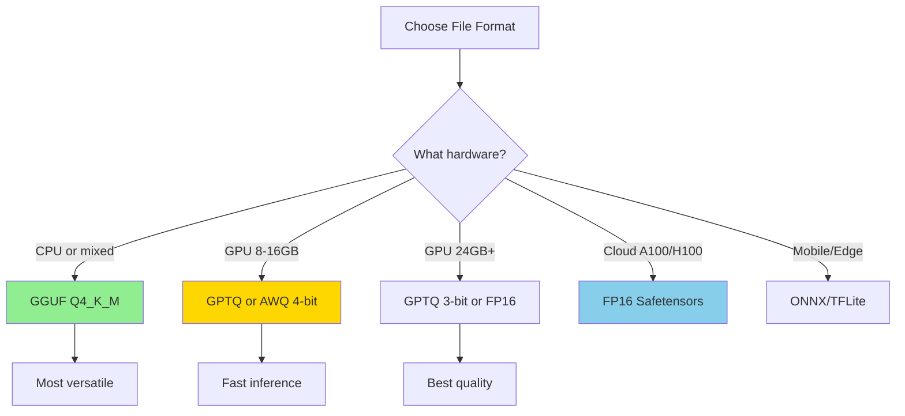
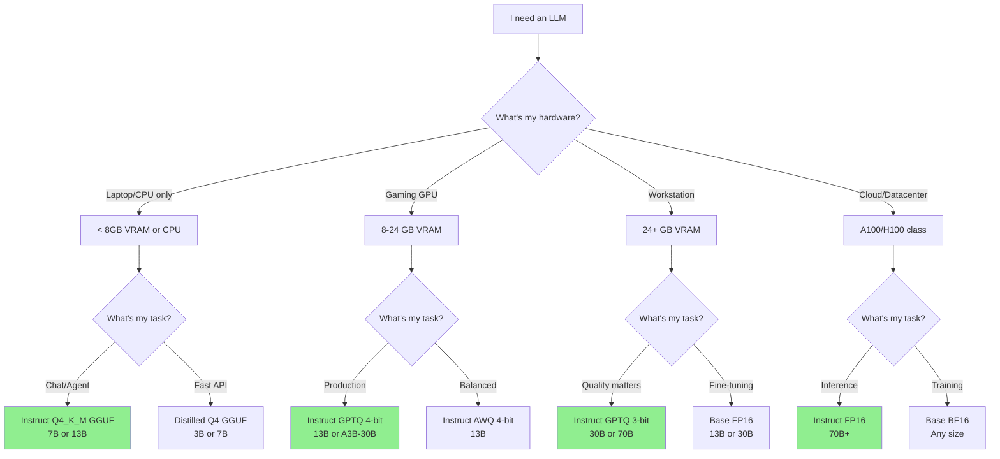

# Choosing the Right Open-Source LLM Variant & File Format

---

## Why do open-source LLMs have so many confusing names?

You've probably seen model names like `Llama-3.1-8B-Instruct.Q4_K_M.gguf` or `Mistral-7B-v0.3-A3B.awq` and wondered what all those suffixes mean. The short answer: **they tell you two critical things.**

Open-source LLMs vary along **two independent dimensions**:

1. **Model variant** – the suffix in the name (`-Instruct`, `-Distill`, `-A3B`, etc.) describes _how_ the model was trained and _what_ it's optimized for.
2. **File format** – the extension (`.gguf`, `.gptq`, `.awq`, etc.) describes _how_ the weights are stored and _where_ they run best (CPU, GPU, mobile, etc.).

Think of it like this: the model variant is the recipe, and the file format is the container. Same recipe, different containers for different kitchens.

Understanding both dimensions helps you avoid downloading 20 GB of the wrong model at midnight and then spending hours debugging CUDA errors.

<!-- more -->

---

## Model variants explained (the recipe)

### Base models

**What it is:** The raw, pre-trained model straight from the training run. Think of it as the unfiltered brain that learned language patterns from massive text datasets but hasn't been taught to follow instructions.

**When to use it:**

- You're planning to fine-tune it for your specific domain
- You're doing research and need the "pure" foundation
- You want maximum creative freedom (no safety guardrails)

**Trade-offs:** Won't reliably follow instructions. You'll need carefully crafted prompts and may get unexpected or rambling responses.

### Instruct / Chat models

**What it is:** A base model that went through additional training (supervised fine-tuning + RLHF) to understand and follow human instructions. This is what most people actually want.

**When to use it:**

- Building chatbots, AI agents, or RAG applications
- Function calling and tool use
- Day-to-day coding assistance
- Pretty much any production use case

**Trade-offs:** Slightly larger and slower than base models. May be less "creative" due to alignment training that makes it more predictable and helpful.

### Distilled models

**What it is:** A smaller "student" model trained to mimic the behavior of a larger "teacher" model. Think of it as compressed knowledge - you get 70-80% of the performance at 30-50% of the size.

**When to use it:**

- Mobile or edge devices with limited resources
- Cost-sensitive SaaS where every millisecond counts
- High-throughput scenarios where you need to serve many requests

**Trade-offs:** Some loss in complex reasoning ability, but excellent efficiency. The token-per-watt ratio is hard to beat.

### QAT (Quantization-Aware Training)

**What it is:** Instead of training in full precision and then compressing later, these models were trained _while already quantized_ to 4-bit or 8-bit. This lets them adapt to the precision loss during training.

**When to use it:**

- You need low-bit inference (4-bit or 8-bit) but can't compromise much on accuracy
- Running on consumer GPUs or CPUs with limited VRAM
- You want quantized performance without the usual quality drop

**Trade-offs:** More expensive to train than regular post-training quantization, but the results are worth it if quality matters.

### MoE (Mixture-of-Experts): A3B, A22B, etc.

**What it is:** A clever architecture where the model has many "expert" sub-networks, but only activates a subset for each token. "A3B" means "3 billion parameters active" out of a much larger total (often 30B+).

**When to use it:**

- You want "big model" performance but only have 12-24 GB VRAM
- You need the reasoning power of a 30B model but with 7B inference costs
- You're running locally and want the best performance-per-memory ratio

**Trade-offs:** Takes more disk space (you're storing all the experts). Not every inference framework supports MoE routing yet - check compatibility first.

> **Rule of thumb:**
>
> - Start with an **Instruct** model - it's what most people need.
> - Hit memory or latency limits? Try a **Distilled** or **MoE** (A3B) variant.
> - Still need more speed? Look for **QAT** models or switch to a lighter file format.

---

## File formats explained (the container)

Now that you know _what_ kind of model you want, you need to pick _how_ it's packaged. File formats determine where your model runs best and how much memory it needs.

### GGUF (`.gguf`)

**What it is:** The successor to GGML and now the de-facto standard for local inference. A single file that contains the model weights, metadata, and even the prompt template.

**Best for:**

- Running locally on CPU or GPU via `llama.cpp`, Ollama, or LM Studio
- When you want maximum compatibility across platforms
- Quick experimentation without complex setup

**Why it's great:** One file, works everywhere. Supports multiple quantization levels (Q2 through Q8, with the "K" variants being the most popular). Has become the community standard for a reason.

**Typical memory:** A Q4_K_M GGUF of a 13B model takes ~6-8 GB and runs comfortably on an 8GB GPU or modern CPU.

### GPTQ (`.safetensors` + `config.json`)

**What it is:** Post-training quantization that uses second-order information to minimize accuracy loss. Optimized specifically for GPU inference.

**Best for:**

- Fast GPU inference at 3-bit or 4-bit precision
- NVIDIA or AMD cards with CUDA/ROCm
- When you need maximum speed on GPU

**Why it's great:** Mature ecosystem with `autoGPTQ`, `text-generation-webui`, and `transformers` integration. Well-tested and reliable.

**Watch out for:** Requires GPU. Won't run efficiently on CPU.

### AWQ (`.safetensors`)

**What it is:** Activation-Aware Weight Quantization - it analyzes which weights matter most during inference and preserves their precision better than naive quantization.

**Best for:**

- 4-bit inference on CPU or GPU with minimal accuracy loss
- When you need better quality than GPTQ at the same bit width
- Memory-constrained scenarios

**Why it's great:** Often matches FP16 accuracy more closely than GPTQ because it's smarter about which weights to preserve. Easy to use with `autoawq`.

### EXL2 (`.exl2`)

**What it is:** A format that allows _per-layer_ bit-width mixing. You can have critical layers at 8-bit and less important ones at 2-bit.

**Best for:**

- GPU power users who want to fine-tune the speed/quality trade-off
- Maximum throughput on ExLlama v2
- When you've maxed out other formats and need that extra edge

**Why it's great:** Unmatched flexibility and throughput if you're willing to experiment.

**Watch out for:** Requires ExLlama v2. Less portable than GGUF or GPTQ.

### PyTorch / Safetensors (FP16/BF16)

**What it is:** Full-precision weights with no quantization. The original format most models are released in.

**Best for:**

- Cloud inference with powerful GPUs (A100, H100)
- Fine-tuning and continued training
- When accuracy is paramount and memory isn't a constraint

**Trade-offs:** Largest memory and disk footprint. A 13B model in FP16 needs ~26 GB VRAM.

### ONNX / TFLite

**What it is:** Framework-agnostic formats optimized for specific hardware accelerators.

**Best for:**

- Mobile devices (iOS, Android)
- Edge deployment with specialized chips
- When you need maximum inference speed on specific hardware

> **Tip:** When in doubt, start with **GGUF Q4_K_M**. It's the Swiss Army knife of LLM formats - runs on 8GB VRAM GPUs, modern CPUs, and everything in between. You can always optimize later.

---

## Putting it all together: a decision framework

Here's a practical flowchart to help you choose. Start with your constraints (hardware and use case), then pick the appropriate combination.

### Quick recommendations by scenario

**Scenario 1: Building a chatbot on a MacBook Pro (16GB RAM)**

- Model variant: Instruct
- File format: GGUF Q4_K_M
- Size: 7B or 13B
- Why: Runs smoothly on CPU with Metal acceleration, one-file simplicity

**Scenario 2: RAG system on a server with RTX 4090 (24GB VRAM)**

- Model variant: Instruct or MoE A3B
- File format: GPTQ 4-bit or AWQ 4-bit
- Size: 30B-A3B or 13B dense
- Why: GPU-optimized formats, MoE gives you bigger model performance in VRAM budget

**Scenario 3: Fine-tuning for domain-specific use on cloud GPU**

- Model variant: Base
- File format: FP16 Safetensors
- Size: 13B or 30B depending on budget
- Why: You need full precision for training, start with unaligned base model

**Scenario 4: Edge deployment on mobile app**

- Model variant: Distilled
- File format: ONNX or TFLite
- Size: 1B to 3B
- Why: Optimized for mobile chips, minimal memory footprint

**Scenario 5: High-throughput API with cost constraints**

- Model variant: Distilled or MoE
- File format: GPTQ or EXL2
- Size: 7B Distilled or A3B MoE
- Why: Maximum tokens/second per dollar, GPU-optimized

---

## Common pitfalls and misconceptions

### "All 4-bit models are the same quality"

**Not true.** A QAT 4-bit model (trained in 4-bit) often matches or beats an 8-bit post-training quantized model. The _method_ matters as much as the bit-width. AWQ typically preserves more accuracy than naive GPTQ at the same bit count.

### "MoE models work with any inference engine"

**Not yet.** Today, `llama.cpp` (GGUF) handles MoE routing well. Support in `autoGPTQ` and `autoAWQ` is improving but not universal. Always check compatibility before downloading a 50GB MoE model.

### "Distilled models are just smaller versions"

**Nope.** A distilled 7B model can outperform a vanilla 13B model because it learned from a much larger teacher (often 70B+). It's compressed _knowledge_, not just compressed _parameters_.

### "I should quantize my QAT model further to save space"

**Don't.** QAT models were already trained in low-bit precision. Quantizing them again usually degrades quality significantly. Use them as-is.

### "File formats are locked to specific quantization levels"

**Not quite.** GGUF supports Q2 through Q8 variants. GPTQ can be 3-bit, 4-bit, or 8-bit. The file format is the container; the quantization level is what's inside. Check the full model name for details.

### "Bigger is always better"

**Context matters.** A well-tuned 13B Instruct model often outperforms a poorly-aligned 70B base model for production tasks. Match the model variant to your use case - size isn't everything.

---

## TL;DR - Just tell me what to download

> **If you just want something that works:**
>
> 1. Download a **`<model-name>-Instruct.Q4_K_M.gguf`** file from Hugging Face
> 2. Run it with `llama.cpp`, LM Studio, or Ollama
> 3. If it's too slow → try a smaller model or Distilled variant
> 4. If you're out of memory → try a MoE (A3B) variant or AWQ 4-bit
> 5. If quality isn't good enough → move up to Q5 or Q6 GGUF, or switch to a larger base model
>
> Start simple, optimize only when needed. The defaults are good enough for 90% of use cases.
