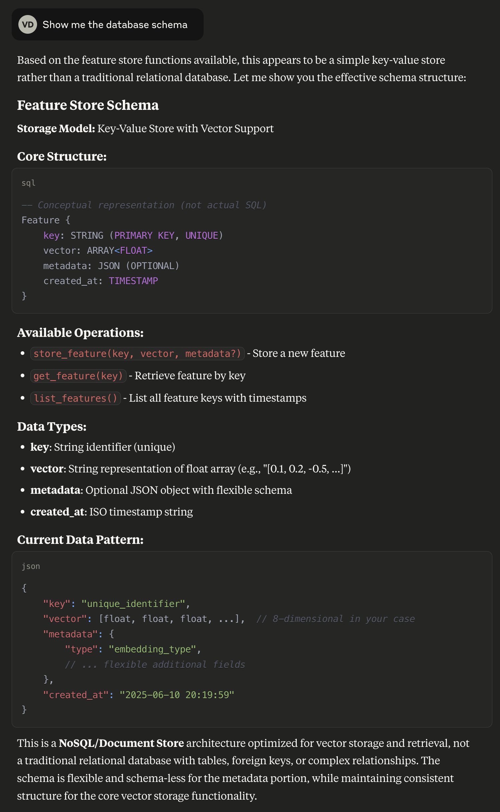
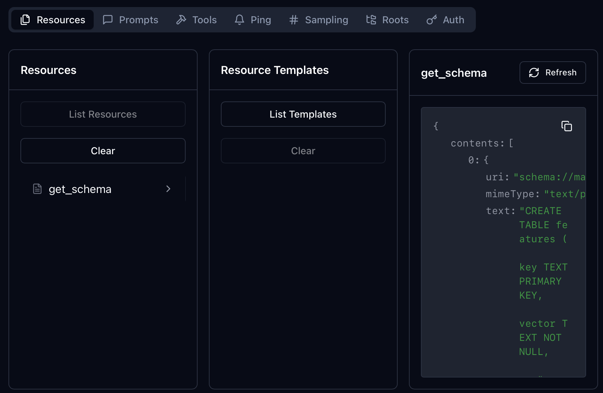
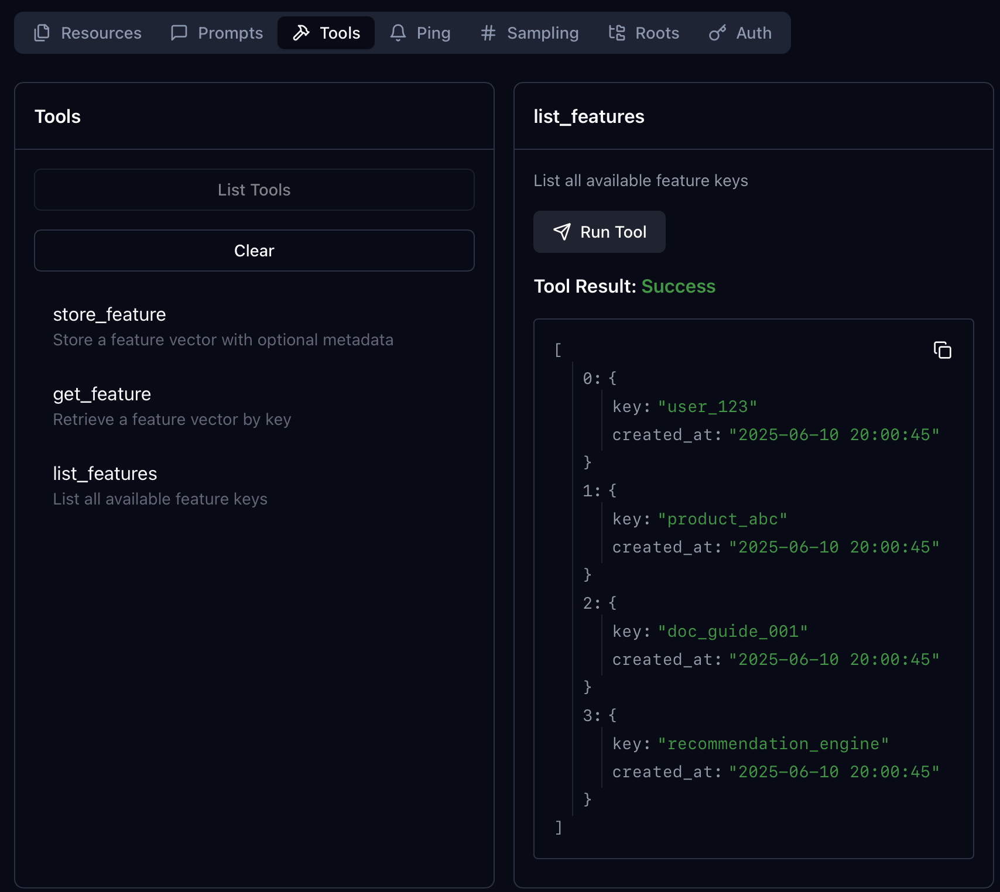

# Building a Custom FeatureStoreLite MCP Server Using uv

*A step-by-step guide that shows how to create your own lightweight feature store MCP server from scratch using FastMCP, run it through **uv**, and integrate it with Claude Desktop. This is a practical example of building a useful MCP server that ML engineers can actually use.*

<!-- more -->

---

## 1  Why build a custom "FeatureStoreLite" MCP server?

Let's create a practical MCP server example that solves a real problem: **feature storage and retrieval for ML pipelines**. Our custom *FeatureStoreLite* server will be a micro-service responsible for storing and retrieving precomputed feature vectors via keys, allowing ML pipelines to share features efficiently without recomputation.

This tutorial demonstrates how to build the **MCP server** that could be useful in a real-world ML pipeline.

## 2  Setup and Installation

First, install **uv**:

```bash
brew install uv
```

Then create your project with virtual environment and dependencies:

```bash
# Create project directory
mkdir mcp-featurestore && cd mcp-featurestore

# Create virtual environment
uv venv

# Initialize Python project
uv init

# Add dependencies
uv add "mcp[cli]"
```

---

## 3  Implementing our custom FeatureStoreLite server with `FastMCP`

Let's build our MCP server from scratch.

### 3.1  Create the database

This is a mock database that will be used to store and retrieve example feature vectors.

```bash
touch database.py
```

Add the following code to the file:

```python
# database.py

import sqlite3
import os


def get_db_path():
    """Get the database path - always in the script's directory"""
    script_dir = os.path.dirname(os.path.abspath(__file__))
    return os.path.join(script_dir, "features.db")


def init_db():
    """Initialize the feature store database"""
    conn = sqlite3.connect(get_db_path())
    conn.execute("""
        CREATE TABLE IF NOT EXISTS features (
            key TEXT PRIMARY KEY,
            vector TEXT NOT NULL,
            metadata TEXT,
            created_at TIMESTAMP DEFAULT CURRENT_TIMESTAMP
        )
    """)

    # Add example features for experimentation
    example_features = [
        (
            "user_123", 
            "[0.1, 0.2, -0.5, 0.8, 0.3, -0.1, 0.9, -0.4]",
            '{"type": "user_embedding", "user_id": 123, "age": 25, '
            '"category": "premium"}'
        ),
        (
            "product_abc", 
            "[0.7, -0.3, 0.4, 0.1, -0.8, 0.6, 0.2, -0.5]",
            '{"type": "product_embedding", "product_id": "abc", '
            '"price": 29.99, "category": "electronics"}'
        ),
        (
            "doc_guide_001", 
            "[-0.2, 0.5, 0.9, -0.1, 0.4, 0.7, -0.6, 0.3]",
            '{"type": "document_embedding", "doc_id": "guide_001", '
            '"title": "Getting Started Guide", "section": "introduction"}'
        ),
        (
            "recommendation_engine", 
            "[0.4, 0.8, -0.2, 0.6, -0.7, 0.1, 0.5, -0.9]",
            '{"type": "model_embedding", "model": "collaborative_filter", '
            '"version": "1.2", "accuracy": 0.85}'
        )
    ]
    
    # Insert example features only if they don't exist
    for key, vector, metadata in example_features:
        existing = conn.execute(
            "SELECT 1 FROM features WHERE key = ?", (key,)
        ).fetchone()
        if not existing:
            conn.execute(
                "INSERT INTO features (key, vector, metadata) "
                "VALUES (?, ?, ?)",
                (key, vector, metadata)
            )
    
    conn.commit()
    conn.close()


def get_db_connection():
    """Get a database connection"""
    return sqlite3.connect(get_db_path())


if __name__ == "__main__":
    init_db()
```

Run it:

```bash
source .venv/bin/activate && python database.py
```

### 3.2  Create the MCP server

Create **`featurestore_server.py`**:

```bash
touch featurestore_server.py
```

Add the following code to the file:

```python
# featurestore_server.py

import json
from mcp.server.fastmcp import FastMCP
from database import get_db_connection, init_db

mcp = FastMCP("FeatureStoreLite")

# Initialize database
init_db()


@mcp.resource("schema://main")
def get_schema() -> str:
    """Provide the database schema as a resource"""
    conn = get_db_connection()
    try:
        schema = conn.execute(
            "SELECT sql FROM sqlite_master WHERE type='table'"
        ).fetchall()
        if not schema:
            return "No tables found in database"
        return "\n".join(sql[0] for sql in schema if sql[0])
    except Exception as e:
        return f"Error getting schema: {str(e)}"
    finally:
        conn.close()


@mcp.tool()
def store_feature(key: str, vector: str, metadata: str | None = None) -> str:
    """Store a feature vector with optional metadata"""
    conn = get_db_connection()
    try:
        # Validate vector format (JSON array)
        json.loads(vector)
        conn.execute(
            "INSERT OR REPLACE INTO features (key, vector, metadata) "
            "VALUES (?, ?, ?)",
            (key, vector, metadata)
        )
        conn.commit()
        return f"Feature '{key}' stored successfully"
    except json.JSONDecodeError:
        return "Error: vector must be valid JSON"
    except Exception as e:
        return f"Error storing feature: {str(e)}"
    finally:
        conn.close()


@mcp.tool()
def get_feature(key: str) -> str:
    """Retrieve a feature vector by key"""
    conn = get_db_connection()
    try:
        result = conn.execute(
            "SELECT vector, metadata FROM features WHERE key = ?", (key,)
        ).fetchone()
        if result:
            return json.dumps({
                "key": key,
                "vector": json.loads(result[0]),
                "metadata": json.loads(result[1]) if result[1] else None
            })
        else:
            return f"Feature '{key}' not found"
    except Exception as e:
        return f"Error retrieving feature: {str(e)}"
    finally:
        conn.close()


@mcp.tool()
def list_features() -> str:
    """List all available feature keys"""
    conn = get_db_connection()
    try:
        result = conn.execute(
            "SELECT key, created_at FROM features ORDER BY created_at DESC"
        ).fetchall()
        features = [{"key": row[0], "created_at": row[1]} for row in result]
        return json.dumps(features)
    except Exception as e:
        return f"Error listing features: {str(e)}"
    finally:
        conn.close()


@mcp.resource("features://{key}")
def feature_resource(key: str) -> str:
    """Expose feature data via URI"""
    return get_feature(key)


if __name__ == "__main__":
    mcp.run()
```

Run it in development mode:

```bash
source .venv/bin/activate && mcp dev featurestore_server.py
```

---

## 4  Connecting to Claude Desktop

To use the FeatureStoreLite server with Claude Desktop, update your Claude configuration:

**macOS**: `~/Library/Application Support/Claude/claude_desktop_config.json`
**Windows**: `%APPDATA%/Claude/claude_desktop_config.json`

```json
{
  "mcpServers": {
    "featurestore": {
      "command": "uv",
      "args": [
        "run",
        "--with",
        "mcp[cli]",
        "mcp",
        "run",
        "/path/to/your/featurestore_server.py"
      ]
    }
  }
}
```

### 4.1  Testing the server

After updating the config, restart Claude Desktop. You can now ask Claude to:

- "Show me the database schema"
  - 

- "List all available features in the store"
  - 

- "Retrieve the feature vector for product_abc"
  - 

Tip: If you are getting errors when connecting to the server, use the command `mcp install featurestore_server.py` to install the server to the Claude Desktop. Then check the Claude Desktop config file to see how the server is configured.

---

## 5  `mcp.json` configuration (client-side)

The same configuration can be used for connecting to the server from any MCP client. For example, you can use the following configuration to connect to the server from a Google ADK agent:

```jsonc
{
  "mcpServers": {
    "FeatureStoreLite": {
      "command": "uv",
      "args": [
        "run",
        "--with",
        "mcp[cli]",
        "mcp",
        "run",
        "path/to/featurestore_server.py"
      ]
    }
  }
}
```

---

## 6  Observability with **Inspector**

As told before to run the server in development mode use the command:

```bash
source .venv/bin/activate && mcp dev featurestore_server.py
```

In development mode, you can use the `mcp inspector` to see the server's capabilities and the requests and responses it is sending and receiving.

Here is a screenshot of the inspector:


You can check manually the resources available in the server:



As well as the tools available:



---

## 7  Conclusion

In this tutorial, we built a custom FeatureStoreLite MCP server using FastMCP, ran it through uvx, and integrated it with Claude Desktop. We also explored how to use the `mcp inspector` to see the server's capabilities and the requests and responses it is sending and receiving.

## 8  References

- [The repo of this tutorial example](https://github.com/slavadubrov/mcp-featurestore)
- [Introduction to MCP](https://www.anthropic.com/news/model-context-protocol)
- [MCP Python SDK](https://github.com/modelcontextprotocol/python-sdk)
- [Claude Desktop](https://claude.ai/download)
- [uv](https://docs.astral.sh/uv/)