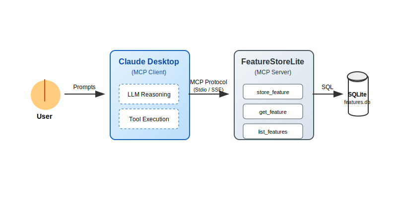
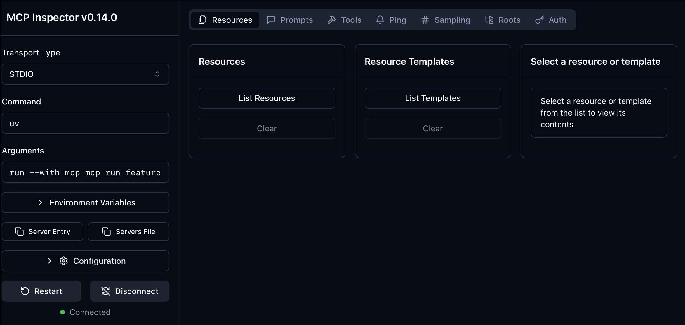
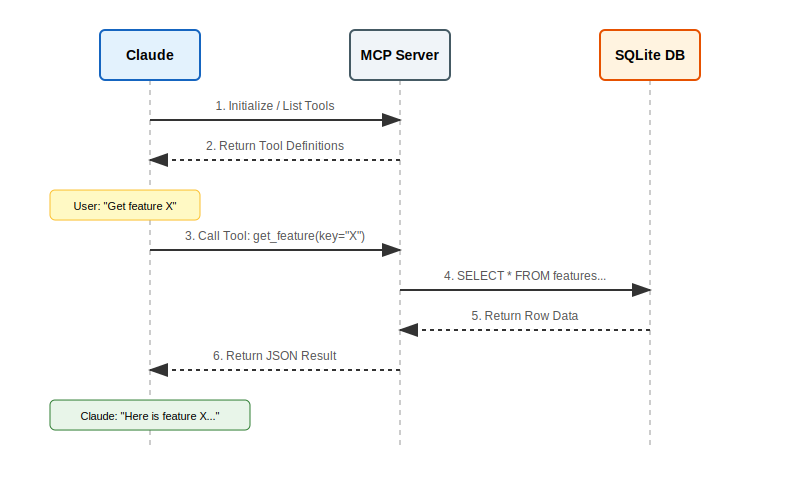
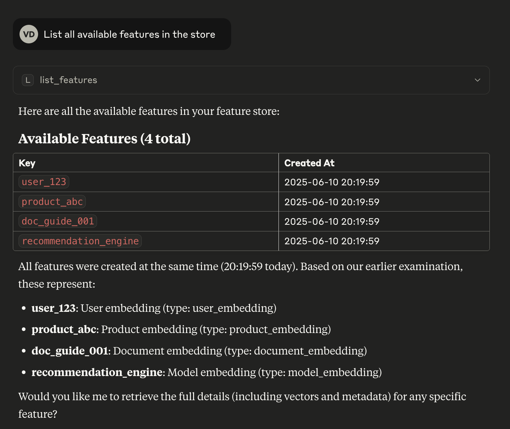
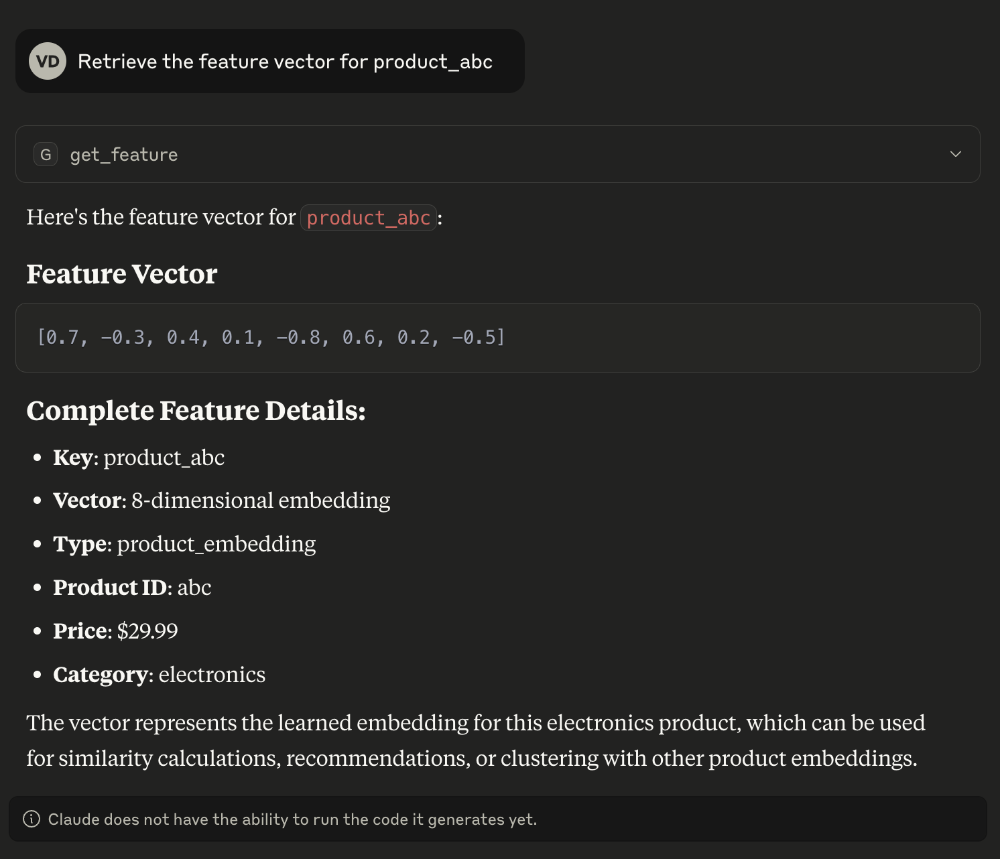

# Building a Custom FeatureStoreLite MCP Server Using uv

_A step-by-step guide that shows how to create your own lightweight feature store MCP server from scratch using FastMCP, run it through **uv**, and integrate it with Claude Desktop._

<!-- more -->

---

## 1. Introduction

The **Model Context Protocol (MCP)** is an open standard that enables AI assistants (like Claude) to connect to external data and tools. Instead of building custom integrations for every tool, MCP provides a universal language for AI models to interact with your world.

In this tutorial, we will build a **FeatureStoreLite** MCP server. This server will act as a bridge between an LLM and a feature store (a database of precomputed ML features), allowing the LLM to query and retrieve feature vectors for users, products, or documents.

### Why build this?

Imagine you are an ML engineer debugging a pipeline. Instead of writing SQL queries or Python scripts to check feature values, you can simply ask Claude: _"What is the feature vector for user_123?"_ or _"Show me the metadata for product_abc"_.

### Why use `uv`?

We will use **[uv](https://docs.astral.sh/uv/)**, an extremely fast Python package installer and project manager. It simplifies dependency management and makes running our server reproducible and fast.

### Architecture Overview

Here is how the components interact:



1.  **User**: Asks a question in natural language.
2.  **Claude Desktop**: The MCP Client that interprets the question and decides which tool to call.
3.  **MCP Server**: Our Python application running `FastMCP` that exposes tools (`get_feature`, `store_feature`).
4.  **SQLite**: The backing storage for our feature vectors.

---

## 2. Setup and Installation

### 2.1. Install `uv`

If you haven't installed `uv` yet, get it now. It's a game-changer for Python development.

```bash
# macOS/Linux
curl -LsSf https://astral.sh/uv/install.sh | sh

# Or via Homebrew
brew install uv
```

### 2.2. Initialize the Project

Create a new directory and initialize a Python project. `uv init` creates a `pyproject.toml` for you.

```bash
# Create project directory
mkdir mcp-featurestore
cd mcp-featurestore

# Initialize Python project
uv init

# Add the MCP SDK with CLI tools
uv add "mcp[cli]"
```

---

## 3. Building the Server

We will split our application into two files:

1.  `database.py`: Handles SQLite operations.
2.  `featurestore_server.py`: The MCP server definition.

### 3.1. The Database Layer (`database.py`)

This module manages the SQLite connection and provides helper functions. We'll also seed it with some dummy data so we have something to query.

Create `database.py`:

```python
# database.py
import json
import os
import sqlite3


def get_db_path() -> str:
    """Get the database path - always in the script's directory"""
    script_dir = os.path.dirname(os.path.abspath(__file__))
    return os.path.join(script_dir, "features.db")


def init_db() -> None:
    """Initialize the feature store database with table and sample data"""
    conn = sqlite3.connect(get_db_path())
    conn.execute("""
        CREATE TABLE IF NOT EXISTS features (
            key TEXT PRIMARY KEY,
            vector TEXT NOT NULL,
            metadata TEXT,
            created_at TIMESTAMP DEFAULT CURRENT_TIMESTAMP
        )
    """)

    # Sample data for experimentation
    example_features = [
        (
            "user_123",
            "[0.1, 0.2, -0.5, 0.8, 0.3, -0.1, 0.9, -0.4]",
            json.dumps({"type": "user", "id": 123, "segment": "premium"}),
        ),
        (
            "product_abc",
            "[0.7, -0.3, 0.4, 0.1, -0.8, 0.6, 0.2, -0.5]",
            json.dumps({"type": "product", "id": "abc", "category": "electronics"}),
        ),
    ]

    # Insert if not exists
    for key, vector, metadata in example_features:
        try:
            conn.execute(
                "INSERT INTO features (key, vector, metadata) VALUES (?, ?, ?)",
                (key, vector, metadata),
            )
        except sqlite3.IntegrityError:
            pass  # Already exists

    conn.commit()
    conn.close()


def get_db_connection() -> sqlite3.Connection:
    """Get a database connection"""
    return sqlite3.connect(get_db_path())


if __name__ == "__main__":
    init_db()
    print("✅ Database initialized successfully!")
```

Initialize the database:

```bash
uv run python database.py
```

### 3.2. The MCP Server (`featurestore_server.py`)

Now for the exciting part. We use `FastMCP` to define our server. It uses decorators to turn standard Python functions into MCP Tools and Resources.

Create `featurestore_server.py`:

```python
# featurestore_server.py
import json

from mcp.server.fastmcp import FastMCP

from database import get_db_connection, init_db

# Initialize the MCP Server
mcp = FastMCP("FeatureStoreLite")

# Ensure DB is ready when server starts
init_db()


@mcp.resource("schema://main")
def get_schema() -> str:
    """
    Resource: Provide the database schema.
    Resources are passive data that LLMs can read like files.
    """
    conn = get_db_connection()
    try:
        schema = conn.execute(
            "SELECT sql FROM sqlite_master WHERE type='table'"
        ).fetchall()
        return "\n".join(sql[0] for sql in schema if sql[0]) or "No tables found."
    finally:
        conn.close()


@mcp.tool()
def store_feature(key: str, vector: str, metadata: str | None = None) -> str:
    """
    Tool: Store a feature vector.
    Tools are executable functions that LLMs can call to perform actions.
    """
    conn = get_db_connection()
    try:
        # Validate that vector is valid JSON
        json.loads(vector)

        conn.execute(
            "INSERT OR REPLACE INTO features (key, vector, metadata) VALUES (?, ?, ?)",
            (key, vector, metadata),
        )
        conn.commit()
        return f"Successfully stored feature '{key}'"
    except json.JSONDecodeError:
        return "Error: Vector must be a valid JSON array string (e.g., '[0.1, 0.2]')"
    except Exception as e:
        return f"Error: {str(e)}"
    finally:
        conn.close()


@mcp.tool()
def get_feature(key: str) -> str:
    """
    Tool: Retrieve a feature vector by key.
    """
    conn = get_db_connection()
    try:
        row = conn.execute(
            "SELECT vector, metadata FROM features WHERE key = ?", (key,)
        ).fetchone()

        if row:
            return json.dumps(
                {
                    "key": key,
                    "vector": json.loads(row[0]),
                    "metadata": json.loads(row[1]) if row[1] else None,
                },
                indent=2,
            )
        return f"Feature '{key}' not found."
    finally:
        conn.close()


@mcp.tool()
def list_features() -> str:
    """
    Tool: List all available feature keys.
    """
    conn = get_db_connection()
    try:
        rows = conn.execute("SELECT key FROM features").fetchall()
        return json.dumps([row[0] for row in rows])
    finally:
        conn.close()


if __name__ == "__main__":
    mcp.run()
```

---

## 4. Testing with MCP Inspector

Before connecting to Claude, use the **MCP Inspector** to verify your server works. This web interface lets you test tools and view resources.

```bash
uv run mcp dev featurestore_server.py
```

This command starts the server and opens the Inspector in your browser (usually `http://localhost:5173` or similar).

{: style="width:600px;max-width:100%;height:auto;"}

Try calling `get_feature` with `key="user_123"` in the Inspector to confirm it returns the JSON data.

---

## 5. Connecting to Claude Desktop

Now let's connect our server to Claude Desktop so we can talk to it.

### 5.1. Configure Claude

Edit your Claude Desktop configuration file:

- **macOS**: `~/Library/Application Support/Claude/claude_desktop_config.json`
- **Windows**: `%APPDATA%/Claude/claude_desktop_config.json`

Add your server to the `mcpServers` object:

```json
{
  "mcpServers": {
    "featurestore": {
      "command": "uv",
      "args": [
        "run",
        "--with",
        "mcp[cli]",
        "mcp",
        "run",
        "/ABSOLUTE/PATH/TO/mcp-featurestore/featurestore_server.py"
      ]
    }
  }
}
```

> **⚠️ Important**: You must use the **absolute path** to your `featurestore_server.py` file.

### 5.2. How the Interaction Works

When you ask Claude a question, the following workflow occurs:



1.  Claude sees the available tools (`get_feature`, `list_features`, etc.).
2.  It determines that your question requires data from the feature store.
3.  It constructs a tool call and sends it to your server.
4.  Your server executes the Python function and returns the result.
5.  Claude uses that result to answer your question.

### 5.3. Example Queries

Restart Claude Desktop and try these prompts:

1.  **"List all available features."**
    {: style="width:600px;max-width:100%;height:auto;"}

2.  **"Get the feature vector for user_123."**
    {: style="width:600px;max-width:100%;height:auto;"}

3.  **"Store a new feature for 'new_item' with vector [0.5, 0.5] and metadata {'type': 'test'}."**

---

## 6. Troubleshooting

If things aren't working, check these common issues:

- **"Server connection failed"**:

  - Check the logs: `tail -f ~/Library/Logs/Claude/mcp.log` (macOS).
  - Ensure you used the **absolute path** in the config file.
  - Verify `uv` is in your system PATH or use the full path to the `uv` binary.

- **"Tool execution error"**:
  - Use the **Inspector** (`uv run mcp dev ...`) to debug the specific tool.
  - Check if your `database.py` is creating the `features.db` file in the correct location.

---

## 7. Conclusion

You've just built a functional MCP server that extends Claude's capabilities! This pattern—using `FastMCP` for the server and `uv` for execution—is a powerful way to build robust AI tools quickly.

## References

- [The repo of this tutorial example](https://github.com/slavadubrov/mcp-featurestore)
- [Introduction to MCP](https://www.anthropic.com/news/model-context-protocol)
- [MCP Python SDK](https://github.com/modelcontextprotocol/python-sdk)
- [Claude Desktop](https://claude.ai/download)
- [uv](https://docs.astral.sh/uv/)
