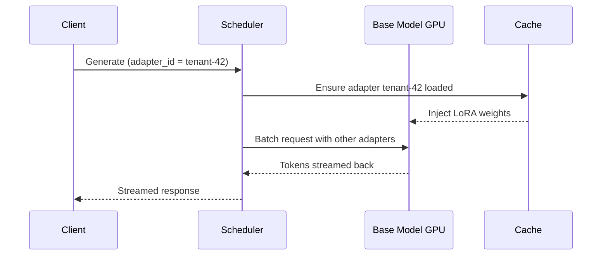
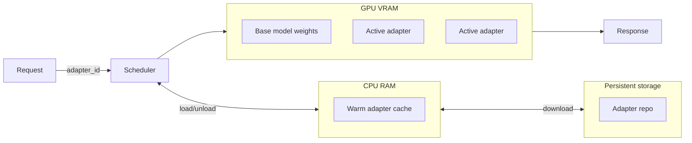

# LoRAX Playbook - Orchestrating Thousands of LoRA Adapters on Kubernetes

Serving dozens of fine-tuned large language models used to require a GPU per model. LoRAX (LoRA eXchange) flips that math by keeping a single base model in memory and hot-swapping lightweight LoRA adapters per request.

In this post we break down how LoRAX achieves near-constant cost per token, when to use it, how to deploy it on Kubernetes with Helm, and how to integrate the REST, Python, and OpenAI-compatible APIs in your stack.

<!-- more -->

LoRAX is an Apache 2.0 project from [Predibase](https://github.com/predibase/lorax) that extends the [Hugging Face Text Generation Inference server](https://github.com/huggingface/text-generation-inference) with multi-adapter scheduling, tiered caching, and production-ready tooling. The result: you can serve hundreds of tenant-specific LoRA adapters on a single Ampere-class GPU without sacrificing throughput or latency.

## What makes LoRAX different?

- **Dynamic adapter loading:** Adapter weights are injected just-in-time per request, so you never waste VRAM on idle fine-tunes.
- **Tiered weight caching:** LoRAX stages adapters across GPU memory, host RAM, and disk to avoid out-of-memory crashes while keeping swaps fast.
- **Continuous multi-adapter batching:** Requests targeting different adapters can share the same forward pass, keeping GPU utilization high even under multi-tenant load.
- **Battle-tested foundation:** Because LoRAX builds on TGI, you inherit optimized kernels (FlashAttention 2, paged attention, SGMV) and streaming responses from day one.



## When LoRAX shines

- **Multi-tenant SaaS:** Serve bespoke copilots for hundreds of customers by swapping LoRA adapters on a shared base model.
- **Domain specialists:** Run industry-specific experts (law, medicine, finance) without duplicating the full model for every vertical.
- **Rapid experimentation:** A/B test adapter variants in production with simple adapter_id switches, no redeploys required.
- **Edge or constrained environments:** Fit a quantized 7B base model plus dozens of adapters on a single NVIDIA A10G, ideal for on-prem installs.

## Architecture at a glance



LoRAX treats each adapter as a lightweight "view" on the shared base model. Schedulers coalesce requests so that handling 32 adapters can be as fast as serving one, even across a million tokens of throughput.

## Deploy LoRAX on Kubernetes

### Prerequisites

- Kubernetes cluster with NVIDIA GPUs (Ampere or newer) and [NVIDIA Container Runtime](https://docs.nvidia.com/datacenter/cloud-native/container-toolkit/install-guide.html).
- `kubectl` and `helm` installed locally.
- Adequate storage for adapter caches (mount a persistent volume for `/data`).

### Quick start with the official Helm chart

```bash
# Add the Predibase Helm repo if needed
helm repo add lorax https://predibase.github.io/lorax
helm repo update

# Deploy the default Mistral-7B-Instruct base model
helm install mistral-7b-release lorax/charts/lorax

# Inspect pod status and logs
kubectl get pods
kubectl logs deploy/mistral-7b-release-lorax
```

The chart provisions a Deployment running LoRAX and a ClusterIP Service exposing port 80. First-time startup loads the base model into GPU memory; subsequent restarts reuse cached weights.

### Customize the base model and scaling

Create a values file (for example `llama2-values.yaml`) to swap in another base model or tweak replicas:

```yaml
modelId: meta-llama/Llama-2-7b-chat-hf
modelArgs:
  quantization: "bitsandbytes"
replicaCount: 2
resources:
  limits:
    nvidia.com/gpu: 1
```

Then deploy with your overrides:

```bash
helm install -f llama2-values.yaml llama2-chat-release lorax/charts/lorax
```

Expose the service using a LoadBalancer or Ingress, and consider placing an API gateway in front if you need authentication or request routing.

To reclaim GPU resources when testing wraps up:

```bash
helm uninstall mistral-7b-release
```

## Working with the LoRAX APIs

LoRAX mirrors the Text Generation Inference API and also offers an OpenAI-compatible surface.

### REST requests

```bash
curl -X POST http://localhost:8080/generate \
  -H "Content-Type: application/json" \
  -d '{
    "inputs": "Write a short poem about the sea.",
    "parameters": {
      "max_new_tokens": 64
    }
  }'
```

Target a specific adapter by adding its Hugging Face ID (first call downloads and caches it under `/data`):

```bash
curl -X POST http://localhost:8080/generate \
  -H "Content-Type: application/json" \
  -d '{
    "inputs": "Natalia sold 48 clips in April, and then half as many in May. How many clips did she sell in total?",
    "parameters": {
      "max_new_tokens": 64,
      "adapter_id": "vineetsharma/qlora-adapter-Mistral-7B-Instruct-v0.1-gsm8k"
    }
  }'
```

### Python client

```python
from lorax import Client

client = Client("http://localhost:8080")

prompt = "Explain the significance of the moon landing in 1969."

# Base model generation
base = client.generate(prompt, max_new_tokens=80)
print(base.generated_text)

# Adapter-specific generation
adapter = client.generate(
    prompt,
    max_new_tokens=80,
    adapter_id="alignment-handbook/zephyr-7b-dpo-lora",
)
print(adapter.generated_text)
```

### OpenAI-compatible chat

```python
import openai

openai.api_key = "EMPTY"
openai.api_base = "http://localhost:8080/v1"

response = openai.ChatCompletion.create(
    model="alignment-handbook/zephyr-7b-dpo-lora",
    messages=[
        {"role": "system", "content": "You are a friendly chatbot who speaks like a pirate."},
        {"role": "user", "content": "How many parrots can a person own?"},
    ],
    max_tokens=100,
)

print(response["choices"][0]["message"]["content"])
```

## Pros and cons checklist

**Advantages**

- Serve hundreds of adapters on a single GPU by sharing the base model.
- Just-in-time adapter loading means unused models consume zero VRAM.
- Continuous batching keeps latency and throughput near single-model deployments.
- Costs stay almost flat as you add adapters, unlike one-endpoint-per-model setups.
- Works seamlessly with open-source bases like LLaMA 2, CodeLlama, Mistral, and Qwen.
- Production-ready tooling (Docker images, Helm charts, Prometheus metrics) ships out of the box.

**Limitations**

- All adapters must originate from the same base weights (LoRA-style fine-tunes).
- Cold starts include loading the base model and first-time adapter downloads.
- Large adapter working sets can thrash between GPU and CPU caches under bursty load.
- Project is fast-moving; expect to track upstream TGI changes for the newest features.

## Next steps

Pilot LoRAX with a handful of adapters, preload the most popular ones at startup, and monitor GPU plus cache utilization. Once comfortable, scale out by adding replicas or multiple base models per cluster. With LoRAX, orchestrating specialized LLM experiences becomes a matter of routing adapter IDs—not provisioning endless GPUs.

