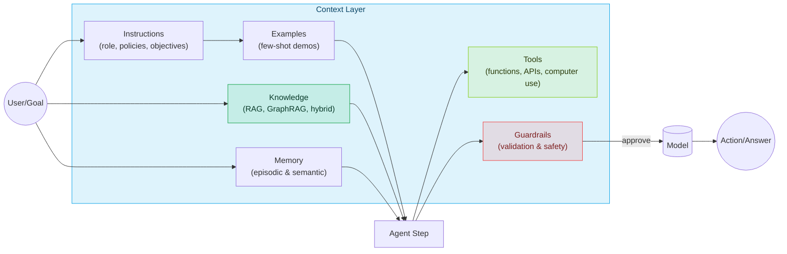
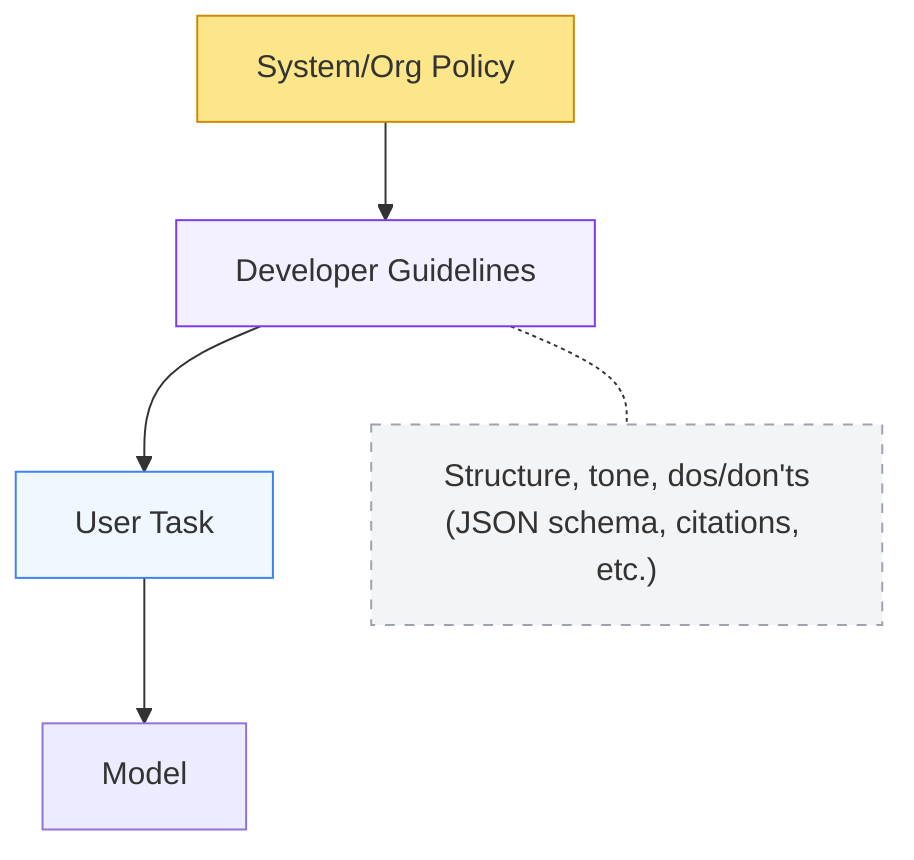
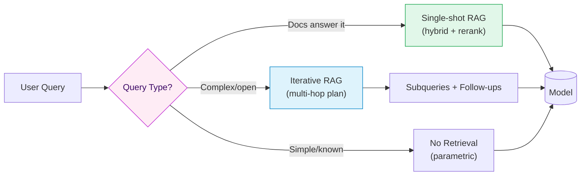
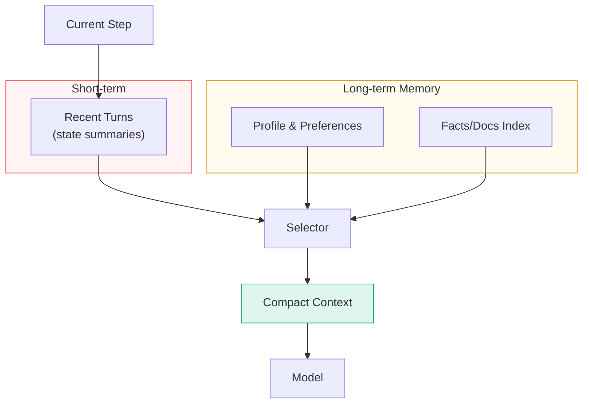
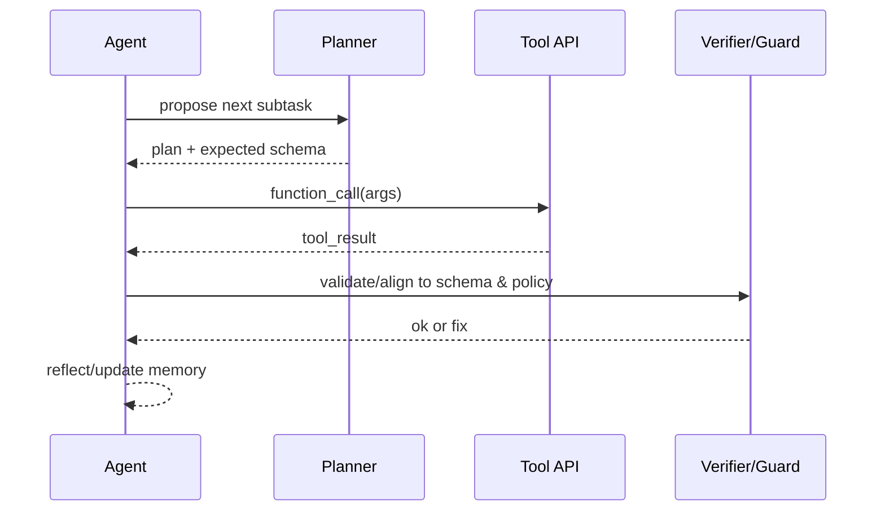
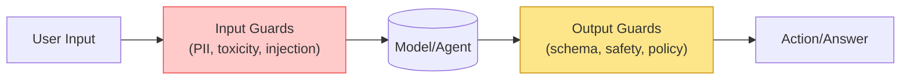

---

layout: post
title: "Context Engineering in the Agentic‑AI Era — and How to Cook It"
date: 2025-10-05
tags: [ai-engineering, agents, context-layer, rag, retrieval, memory, guardrails]
description: A practical guide to designing, evaluating, and shipping the context layer (a.k.a. context engineering) for agentic AI systems — with diagrams, patterns, and a starter config.
author: Viacheslav Dubrov
series: AI Engineering Cookbook
---

# Context Engineering in the Agentic‑AI Era — and How to Cook It

## TL;DR

> *Context engineering* (the **context layer**) is the pipeline that selects, structures, and governs **what the model sees at the moment of decision**: **Instructions, Examples, Knowledge, Memory, Tools, Guardrails**. Agentic systems live or die by this layer. Below is a field‑tested blueprint, and patterns.

<!-- more -->

---

## Table of Contents

- [Context Engineering in the Agentic‑AI Era — and How to Cook It](#context-engineering-in-the-agenticai-era--and-how-to-cook-it)
  - [TL;DR](#tldr)
  - [Table of Contents](#table-of-contents)
  - [Why now](#why-now)
  - [What is the context layer?](#what-is-the-context-layer)
  - [Context layer overview (diagram)](#context-layer-overview-diagram)
  - [Components \& patterns](#components--patterns)
    - [1) Instructions](#1-instructions)
      - [Schema‑Guided Reasoning (SGR)](#schemaguided-reasoning-sgr)
    - [2) Examples](#2-examples)
    - [3) Knowledge](#3-knowledge)
    - [4) Memory](#4-memory)
    - [5) Tools](#5-tools)
    - [6) Guardrails](#6-guardrails)
  - [How to cook it (step‑by‑step)](#how-to-cook-it-stepbystep)
  - [Evaluation \& observability](#evaluation--observability)
  - [Anti‑patterns](#antipatterns)

---

## Why now

- **Agents moved from chat to action.** Multi‑step planning, tool use, and sub‑agents raised the bar for *repeatable context assembly* vs. one‑off prompts.
- **Memory and standards are arriving.** Centralized user/org memory (and standards like MCP) make it feasible to load personal/org context *safely*—if you design the layer.
- **Retrieval matured.** Hybrid search, reranking, and graph‑aware retrieval (e.g., GraphRAG) reduce hallucinations and token waste.
- **Value focus.** Many “agentic” pilots stall not for model quality but for weak context design/governance. A deliberate context layer is the fix.

---

## What is the context layer?

> A **pipeline + policy** that (1) **selects & structures** inputs per step, (2) **applies controls** (format/safety/policy), and (3) **feeds** the model/agent with **just‑enough, just‑in‑time** context.

There’s no single canonical definition. Different teams ship different stacks. But a practical, shared decomposition is:

- **Instructions** — durable contract for behavior & output format.
- **Examples** — few‑shot demonstrations of structure & style.
- **Knowledge** — retrieval/search/graphs grounding facts.
- **Memory** — short/long‑term personalization & state.
- **Tools** — functions/APIs/computer use to fetch/act.
- **Guardrails** — validation, safety, policy, schema enforcement.

Concrete example (support bot answering a ticket):

- Instructions: role = helpful, cite sources, return JSON {answer, sources}.
- Examples: 2 short Q→A pairs showing tone and JSON shape.
- Knowledge: search the help center and product runbooks; include quotes.
- Memory: customer name, plan, last 3 interactions.
- Tools: `search_tickets`, `create_issue`.
- Guardrails: redact PII; if schema fails, repair; if policy violated, refuse.

---

## Context layer overview (diagram)



---

## Components & patterns

### 1) Instructions

**What**: A durable **contract** for behavior: role, tone, constraints, output schema, evaluation goals. Modern models respect instruction **hierarchies** (system > developer > user).

**Use when**

- You need **consistent output** (reports, SQL, API calls, JSON).
- You must apply policy (e.g., redact PII, reject unsupported asks).

**Patterns**

- **Role & policy blocks**: keep *rules* separate from the user task.
- **Structured outputs**: JSON Schema → deterministic downstream.
- **Instruction hierarchy**: split *system*, *developer*, *user* explicitly.

Plain example (policy block)

```
SYSTEM RULES
- Role: support assistant for ACME.
- Always output valid JSON per AnswerSchema.
- If a request needs account data, ask for the account ID.
- Never include secrets or internal URLs.
```

**Diagram: instruction contract**



---

#### Schema‑Guided Reasoning (SGR)

What: drive the agent with JSON Schemas for the plan, tool arguments, intermediate results, and the final answer. The model emits/consumes JSON at each step; your code validates it.

Why: reduces ambiguity, makes retries/repairs deterministic, and improves safety by enforcing types and required fields throughout the loop.

How (in this blueprint)

- Contract: keep `AnswerSchema`, and add compact schemas for `Plan` and `StepResult`.
- Tools: each tool has `args_schema`; validate before calling.
- Guardrails: validate on every hop; if invalid → repair once, else refuse.
- Examples: include one tiny plan→step→answer demo (no free‑form rationale).

---

### 2) Examples

**What**: A few short input→output examples that show the exact
format, tone, and steps the model should follow. They reduce ambiguity
by giving concrete before/after pairs the model can copy.

**Use when**

- You need the model to match a **specific template** (tables, JSON, SQL, API calls).
- You want **domain‑specific** phrasing/labels or consistent tone.

**Patterns**

- **Canonical demos**: show the *exact* target structure (not an approximation).
- **Bad vs. good**: contrast common mistakes with the desired result.
- **Schema‑first + examples**: pair your JSON Schema with 2–3 short demos.
- **Keep it short**: many small, focused demos beat one long example.

**Mini‑pattern**: One good + one bad

```md
**Bad**: "Summarize the report."
**Good**: "Return JSON with keys {title, bullets, metric}. Title ≤8 words. 3 bullets, each ≤20 words. Include one numeric metric from the text with units."

Why examples help: they act like templates. The model learns the
shape, wording, and level of detail to reproduce.
```

---

### 3) Knowledge

**What**: Grounding via retrieval (vector + keyword), reranking, graphs, web, or enterprise sources.

**Use when**

- You need **fresh or private facts**.
- You want **cited, defensible** answers.

**Patterns**

- **Hybrid retrieval** (BM25 + dense) with **reranker** to shrink tokens.
- **Graph‑aware** retrieval (GraphRAG) for cross‑doc relations.
- **Adaptive RAG**: route between *no retrieval*, *single‑shot*, and *iterative*.

**Diagram: adaptive retrieval router**



Terms in plain words:

- Hybrid retrieval: combine keyword (BM25) + vector search, take the union.
- Reranker: a small model that reorders results by relevance.
- GraphRAG: retrieve not just passages but also linked entities/relations.

Note: "No Retrieval (parametric)" = use the model's internal knowledge only. No external documents are loaded.

**Params that matter**

- Chunking (by semantic boundary > fixed size), top‑k, MMR (diversity) λ, windowed rerank.
- Citations and quote selection = huge trust wins.

---

### 4) Memory

**What**: Durable context across turns/sessions: **short‑term** (conversation state), **long‑term** (user/app facts), **episodic** (events), **semantic** (facts/entities).

**Use when**

- You want personalization and continuity.
- Multiple agents coordinate over days/weeks.

**Patterns**

- **Entity memories** (names, IDs, preferences) + expiry policies.
- **Short‑term summaries** to keep context window lean.
- **Scoped retrieval** from long‑term store (vector/kv/graph).

**Diagram: memory scoping**



Plain example entries:

- entities: {customer_name: "Sam", account_id: "A‑123", plan: "Pro"}
- preferences: {tone: "concise"}
- episodic: {event: "downtime 2025‑09‑10", product: "API"}
Set expiry for stale items (e.g., preferences: 365 days; episodic: 90 days).

---

### 5) Tools

**What**: Function calls to fetch data or take actions (APIs, DB, search, file ops, “computer use”).

**Use when**

- You want **deterministic** side‑effects and data fidelity.
- You orchestrate **plan → call → verify → continue** loops.

**Patterns**

- **Tool‑first planning** + **post‑call validators**.
- **Structured outputs** between steps.
- **Fallbacks** when tools fail (retry → degrade → human‑in‑loop).

**Diagram: tool loop with verification**



Notes:

- Idempotent = safe to retry without side effects (e.g., GET vs POST).
- Postconditions are simple checks after a call (e.g., `non_empty_result` means at least one item returned; `status=="ok"`).

---

### 6) Guardrails

**What**: Input/output validation, safety filters, jailbreak defense, schema enforcement, content policy.

**Use when**

- You need compliance/brand integrity.
- You want **typed, correct** outputs and safe behavior.

**Patterns**

- **Programmable rails** (policy rules + actions).
- **Schema + semantic validators** (types, regex, evals).
- **Central policy + observability** (dashboards, red‑teaming).

**Diagram: guardrails in the loop**



Repair vs refuse flow:

- If output violates schema: attempt automatic repair once; if it still fails, refuse with a brief reason.
- If content violates policy: refuse and suggest a safe alternative if possible.

---

## How to cook it (step‑by‑step)

1. **Write the contract** — System & developer policies. Separate rules from the task. Define JSON Schemas for outputs and (SGR) for plan/step results.
2. **Pick retrieval** — Start with hybrid (BM25 + dense) + reranker. Add GraphRAG if relations matter. Route adaptively (none → single → iterative).
3. **Design memory** — Split short‑term summaries vs. long‑term facts/entities. Set retention & PII rules. Scope recall per step.
4. **Specify tools** — Clear signatures, idempotency (safe to retry), and **post‑call validation**. Decide retries and human fallbacks.
5. **Install guardrails** — Input filters (PII/injection), output validators (schema/safety), policy blocks. Plan “repair or refuse”.
6. **Add observability & evals** — Trace which context loaded and why; scenario tests; offline/online evals.
7. **Iterate** — Add reflections, planners, or sub‑agents only after the basics are stable.

---

## Evaluation & observability

- **Trace**: which sources loaded, token use, tool calls, policy decisions.
- **Scenario evals**: no‑retrieval, single‑shot, iterative; adversarial prompts.
- **Metrics**: exactness (schema validity), groundedness (quotes), latency, cost.
- **Dashboards**: context hit‑rate, retrieval precision@k, guardrail triggers.

Quick start: define 5–10 eval scenarios (inputs + expected fields + at least one citation). Run them on every change and alert on regressions in schema validity or missing quotes.

---

## Anti‑patterns

- **Stuff‑the‑window**: dumping everything → context rot and worse answers. Route & compress.
- **Unvalidated tool results**: always schema‑check and sanity‑check.
- **One‑shot everything**: separate durable instructions from step context.
- **Unbounded memory**: set retention, scope, and PII rules.
- **RAG everywhere**: add no‑retrieval and iterative branches (adaptive).

---
