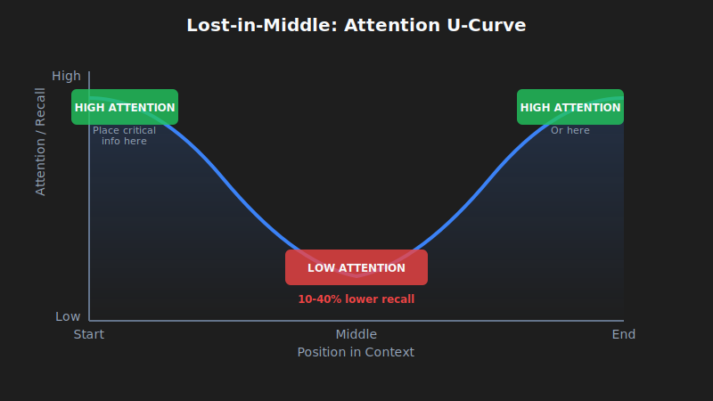
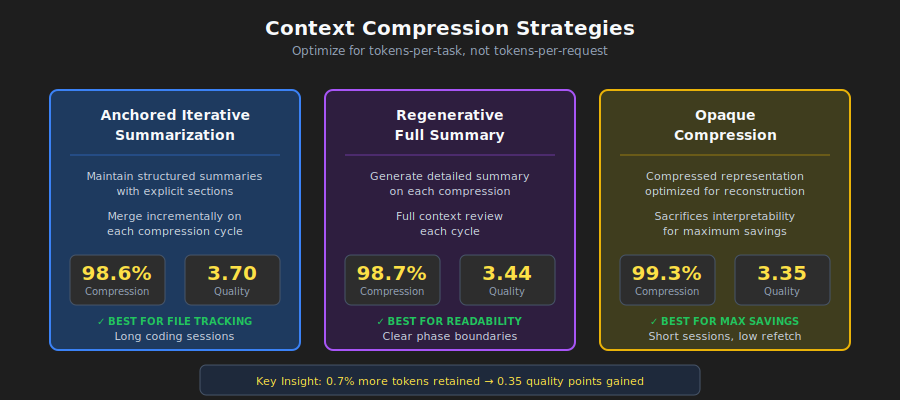
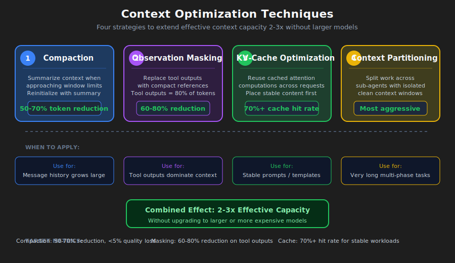

# Context Engineering in the Agentic‑AI Era — and How to Cook It

## TL;DR

> _Context engineering_ (the **context layer**) is the pipeline that selects, structures, and governs **what the model sees at the moment of decision**: **Instructions, Examples, Knowledge, Memory, Skills, Tools, Guardrails**. Agentic systems live or die by this layer. Below is a field‑tested blueprint and patterns.

**The problem**: You build an agent. It works in demos, fails in production. Why? The model gets the wrong context at the wrong time—stale memory, irrelevant docs, no safety checks, ambiguous instructions.

**The fix**: Design the context layer deliberately. This guide shows you how.

<!-- more -->

---

## Why now

Picture this: your customer support agent runs for three weeks. It handles 200 tickets. Then it suddenly starts hallucinating product details, mixing up customers, and calling the wrong APIs. The model didn't get worse—the context did.

Here's why context engineering became critical in 2025:

- **Agents moved from chat to action.** Multi‑step planning, tool use, and sub‑agents raised the bar for _repeatable context assembly_ vs. one‑off prompts. A single bad context decision can cascade through a 10‑step plan.

- **Memory and standards arrived.** Centralized user/org memory (and standards like MCP) make it feasible to load personal/org context _safely_—if you design the layer properly. Without governance, you leak PII or overload the window.

- **Retrieval matured.** Hybrid search, reranking, and graph‑aware retrieval (e.g., GraphRAG) reduce hallucinations and token waste. But only if you route queries to the right retrieval strategy.

- **Value focus shifted.** Many "agentic" pilots stall not because of model quality but because of weak context design/governance. A deliberate context layer is the fix.

---

## Key Concepts for Beginners

Before we dive in, let's define a few terms that will appear frequently:

- **Context Window**: The "working memory" of the model. It's the maximum amount of text (measured in tokens) the model can process at once. If you exceed it, the model crashes or forgets the beginning.
- **Tokens**: The basic units of text for an LLM. Roughly, 1,000 tokens ≈ 750 words.
- **Attention Budget**: Language models process tokens through attention mechanisms that create pairwise relationships between all tokens. For n tokens, this creates n² relationships. As context grows, this budget gets stretched thin—meaning information in the middle of context receives less attention than information at the beginning or end.
- **Embeddings**: Numerical representations of text. We use them to search for "meaning" rather than just keywords (e.g., searching for "dog" might find "puppy").
- **JSON Schema**: A standard way to describe the structure of JSON data. It allows us to force the model to output specific fields (like `{"answer": "...", "citations": [...]}`).
- **MCP (Model Context Protocol)**: An open standard that enables AI models to interact with external data and tools securely. Think of it as a "USB port" for AI apps to connect to your local files, databases, or Slack.


---

## What is the context layer?

> A **pipeline + policy** that (1) **selects & structures** inputs per step, (2) **applies controls** (format/safety/policy), and (3) **feeds** the model/agent with **just‑enough, just‑in‑time** context.

Think of it as the assembly line that prepares exactly what the model needs to make a good decision—nothing more, nothing less.

**Context is a finite resource.** Like humans with limited working memory, language models have an attention budget that depletes as context grows. Every new token consumes some of this budget. The engineering problem is finding the smallest possible set of high-signal tokens that maximize the likelihood of desired outcomes.

There's no single canonical definition. Different teams ship different stacks. But a practical, shared decomposition is:


### 1) Instructions

**What**: A durable **contract** for behavior: role, tone, constraints, output schema, evaluation goals. Modern models respect instruction **hierarchies** (system > developer > user).

#### When to use Instructions

- You need **consistent output** (reports, SQL, API calls, JSON).
- You must apply policy (e.g., redact PII, reject unsupported asks).

#### Instruction Patterns

- **Role & policy blocks**: keep _rules_ separate from the user task.
- **Structured outputs**: JSON Schema → deterministic downstream.
- **Instruction hierarchy**: split _system_, _developer_, _user_ explicitly.

Plain example (policy block)


```text
SYSTEM RULES
- Role: support assistant for ACME.
- Always output valid JSON per AnswerSchema.
- If a request needs account data, ask for the account ID.
- Never include secrets or internal URLs.
```

---

#### Schema‑Guided Reasoning (SGR)

**What**: Drive the agent with JSON Schemas for the plan, tool arguments, intermediate results, and the final answer. The model emits/consumes JSON at each step; your code validates it.

**Why**: Reduces ambiguity, makes retries/repairs deterministic, and improves safety by enforcing types and required fields throughout the loop.

**How it works**:

1. Define schemas for `Plan`, `ToolArgs`, `StepResult`, and `FinalAnswer`.
2. At each agent step, the model outputs JSON matching one of these schemas.
3. Your code validates the JSON before proceeding.
4. If validation fails, attempt one automatic repair (e.g., add missing required fields with defaults).
5. If repair fails, refuse and log the error.

**Concrete example**: Instead of the model saying "I'll search for the customer's tickets", it outputs:

```json
{
    "action": "call_tool",
    "tool": "search_tickets",
    "args": { "customer_id": "A-123", "limit": 10 },
    "expected_schema": "TicketList"
}
```

Your code validates `args` against the tool's schema _before_ calling the API.

---

### 2) Examples

**What**: A few short input→output examples that show the exact format, tone, and steps the model should follow.

#### When to use Examples

- You need the model to match a **specific template** (tables, JSON, SQL, API calls).
- You want **domain‑specific** phrasing/labels or consistent tone.

#### Example Patterns

- **Canonical demos**: show the _exact_ target structure.
- **Bad vs. good**: contrast common mistakes with the desired result.
- **Schema‑first + examples**: pair your JSON Schema with 2–3 short demos.
- **Keep it short**: many small, focused demos beat one long example.

---

### 3) Knowledge

**What**: Grounding via retrieval (vector + keyword), reranking, graphs, web, or enterprise sources.

#### When to use Knowledge

- You need **fresh or private facts**.
- You want **cited, defensible** answers.

#### Knowledge Patterns

- **Hybrid retrieval** (BM25 + dense) with **reranker** to shrink tokens.
- **Graph‑aware** retrieval (GraphRAG) for cross‑doc relations.
- **Adaptive RAG**: route between _no retrieval_, _single‑shot_, and _iterative_.


**Params that matter**:

- **Chunking**: split by semantic boundary (paragraphs, sections) > fixed size.
- **top‑k**: start with 10–20 for hybrid, rerank to 3–5.
- **MMR (diversity) λ**: 0.7 as default.
- **Citations**: Always include source references and quotes.

---

### 4) Memory

**What**: Durable context across turns/sessions: **short‑term** (conversation state), **long‑term** (user/app facts), **episodic** (events), **semantic** (facts/entities).

#### When to use Memory

- You want personalization and continuity.
- Multiple agents coordinate over days/weeks.

#### Memory Patterns

- **Entity memories** (names, IDs, preferences) + expiry policies.
- **Scoped retrieval** from long-term store (vector/kv/graph).
- **Compression integration**: When short-term memory grows large, apply [Context Compression Strategies](#context-compression-strategies).


**Expiry rules**:

- Preferences: 365 days
- Episodic events: 90 days
- Short-term state: clear after session ends
- Entities: no expiry, but require periodic validation

---

### 5) Skills

**What**: Composable domain expertise that agents discover and load dynamically. [Agent Skills](https://www.anthropic.com/engineering/equipping-agents-for-the-real-world-with-agent-skills) are a framework introduced by Anthropic for equipping agents with specialized capabilities by capturing and sharing procedural knowledge.

> Building a skill for an agent is like putting together an onboarding guide for a new hire.
> — Anthropic Engineering Blog

#### When to use Skills

- You need **domain-specific expertise** (PDF manipulation, git operations, data analysis).
- You want **reusable procedures** across agents or organizations.
- You need to **specialize** an agent without hardcoding behaviors.

#### What is a Skill?

A Skill is an organized folder containing instructions, scripts, and resources that agents can discover and load dynamically:

- **SKILL.md file**: Contains name, description (in YAML frontmatter), and the skill's instructions
- **Additional files**: Scripts, references, templates that the skill can reference
- **Code**: Python scripts or other executables the agent can run as tools

#### Skills Pattern: Progressive Disclosure

The key design principle is **progressive disclosure**—loading information only when needed. See [The Progressive Disclosure Principle](#the-progressive-disclosure-principle) for the general pattern.

1. **Level 1 (Startup)**: Only skill names and descriptions are loaded into context
2. **Level 2 (Activation)**: When relevant, the full SKILL.md is loaded
3. **Level 3+ (Deep dive)**: Additional referenced files loaded only as needed

This means skill content is effectively unbounded—agents don't need to load everything into context at once.

```text
┌─────────────────────────────────────────────────────────┐
│ Context Window                                          │
├─────────────────────────────────────────────────────────┤
│ System Prompt                                           │
│ ├── Core instructions                                   │
│ └── Skill metadata (name + description only)           │
│     • pdf: "Manipulate PDF documents"                   │
│     • git: "Advanced git operations"                    │
│     • context-compression: "Manage long sessions"       │
├─────────────────────────────────────────────────────────┤
│ [User triggers task requiring PDF skill]                │
│                                                         │
│ → Agent reads pdf/SKILL.md into context                 │
│ → Agent reads pdf/forms.md (only if filling forms)      │
│ → Agent executes pdf/extract_fields.py (without loading)│
└─────────────────────────────────────────────────────────┘
```

#### Skill Best Practices

From Anthropic's guidelines:

1. **Start with evaluation**: Identify gaps by running agents on representative tasks, build skills to address shortcomings
2. **Structure for scale**: Split large SKILL.md into separate files, keeping paths separate for mutually exclusive contexts
3. **Think from Claude's perspective**: Monitor skill usage, iterate on name/description to improve triggering accuracy
4. **Iterate with Claude**: Ask Claude to capture successful approaches into reusable skill content

#### Security Considerations

Skills can introduce vulnerabilities since they provide new capabilities through instructions and code:

- Install skills only from trusted sources
- Audit skills before use—review bundled files, code dependencies, and network connections
- Pay attention to instructions that connect to external sources

---

### 6) Tools

**What**: Function calls to fetch data or take actions (APIs, DB, search, file ops, "computer use").

#### When to use Tools

- You want **deterministic** side‑effects and data fidelity.
- You orchestrate **plan → call → verify → continue** loops.

#### Tool Patterns

- **Tool‑first planning** + **post‑call validators**.
- **Structured outputs** between steps.
- **Fallbacks** when tools fail (retry → degrade → human‑in‑loop).


**Key concepts**:

- **Idempotent**: safe to retry without side effects (GET=yes, POST/DELETE=no).
- **Postconditions**: checks after each call (non_empty_result, status=="ok", valid_json).
- **Fallback chain**: retry → degrade gracefully → human-in-loop.

**A Note on MCP (Model Context Protocol)**

MCP is becoming the standard for how agents connect to tools and data. Instead of custom API wrappers for every service, you run an "MCP Server" for each. Your agent automatically discovers available tools and resources.


---

### 7) Guardrails

**What**: Input/output validation, safety filters, jailbreak defense, schema enforcement, content policy.

#### When to use Guardrails

- You need compliance/brand integrity.
- You want **typed, correct** outputs and safe behavior.

#### Guardrail Patterns

- **Programmable rails** (policy rules + actions).
- **Schema + semantic validators** (types, regex, evals).
- **Central policy + observability** (dashboards, red‑teaming).


**Repair vs refuse flow**:

- **Schema violations**: Attempt automatic repair once. If repair fails, refuse with clear error.
- **Policy violations**: Refuse immediately (no repair attempt). Suggest safe alternative.

**Common guardrail types**:

1. **Input guards**: PII detection, prompt injection defense, toxicity filters
2. **Output guards**: schema validation, content policy, factual consistency
3. **Tool guards**: rate limiting, permission checks, cost thresholds
4. **Memory guards**: PII redaction before storage, expiry enforcement

---

### Concrete example: support bot answering a ticket

Let's see how all these components work together. When a customer asks "Why is my API key not working?", the context layer assembles:

- **Instructions**: role = helpful support assistant for ACME, cite sources, return JSON {answer, sources, next_steps}.
- **Examples**: 2 short Q→A pairs showing tone and JSON shape (one about API keys, one about billing).
- **Knowledge**: search the help center and product runbooks for "API key troubleshooting"; include relevant quotes.
- **Memory**: customer name "Sam", account_id "A-123", plan "Pro", last interaction was "API key created 3 days ago".
- **Skills**: load `ticket-handling` skill with troubleshooting procedures, escalation policies, and resolution templates.
- **Tools**: `search_tickets(customer_id)`, `check_api_key_status(key)`, `create_issue(description)`.
- **Guardrails**: redact any API key values in output; if schema fails, repair once; if policy violated (e.g., requesting to delete production data), refuse politely.

The model receives all of this structured context, generates an answer, and the guardrails validate it before sending to the customer.

---

## Context Fundamentals Deep Dive

Understanding the anatomy of context is prerequisite to effective context engineering. This section provides the foundational knowledge for everything that follows.

### The Anatomy of Context

Context comprises several distinct components, each with different characteristics and constraints:

**System Prompts**

System prompts establish the agent's core identity, constraints, and behavioral guidelines. They are loaded once at session start and typically persist throughout the conversation.

The key is finding the right "altitude"—specific enough to guide behavior effectively, yet flexible enough to provide strong heuristics. Too low (hardcoded brittle logic) creates fragility; too high (vague guidance) fails to give concrete signals.

Organize prompts into distinct sections using XML tagging or Markdown headers:

```markdown
<BACKGROUND_INFORMATION>
You are a Python expert helping a development team.
Current project: Data processing pipeline in Python 3.9+
</BACKGROUND_INFORMATION>

<INSTRUCTIONS>
- Write clean, idiomatic Python code
- Include type hints for function signatures
- Add docstrings for public functions
</INSTRUCTIONS>

<TOOL_GUIDANCE>
Use bash for shell operations, python for code tasks.
File operations should use pathlib for cross-platform compatibility.
</TOOL_GUIDANCE>
```

**Tool Definitions**

Tool definitions specify the actions an agent can take. Each tool includes a name, description, parameters, and return format. Tool descriptions collectively steer agent behavior—poor descriptions force agents to guess; optimized descriptions include usage context, examples, and defaults.

**The consolidation principle**: If a human engineer cannot definitively say which tool should be used in a given situation, an agent cannot be expected to do better.

**Retrieved Documents**

Agents use retrieval augmented generation to pull relevant documents into context at runtime rather than pre-loading all possible information. The just-in-time approach maintains lightweight identifiers (file paths, stored queries, web links) and loads data dynamically.

**Message History**

Message history contains the conversation between user and agent, including previous queries, responses, and reasoning. For long-running tasks, message history can grow to dominate context usage. It serves as scratchpad memory where agents track progress and maintain task state.

**Tool Outputs**

Tool outputs are the results of agent actions: file contents, search results, command execution output, API responses. Research shows observations (tool outputs) can reach **83.9% of total context usage** in typical agent trajectories. This creates pressure for strategies like observation masking and compaction.

### Context Windows and Attention Mechanics

**The Attention Budget Constraint**

Language models process tokens through attention mechanisms that create pairwise relationships between all tokens. For n tokens, this creates n² relationships that must be computed. As context length increases, the model's ability to capture relationships gets stretched thin.

Models develop attention patterns from training data where shorter sequences predominate. This means models have less experience with context-wide dependencies. The result is an "attention budget" that depletes as context grows.


#### The Progressive Disclosure Principle

Progressive disclosure manages context efficiently by loading information only as needed. At startup, agents load only skill names and descriptions—sufficient to know when a skill might be relevant. Full content loads only when activated for specific tasks.

```markdown
# Instead of loading all documentation at once:

# Step 1: Load summary

docs/api_summary.md # Lightweight overview

# Step 2: Load specific section as needed

docs/api/endpoints.md # Only when API calls needed
docs/api/authentication.md # Only when auth context needed
```

### Context Quality Versus Quantity

The assumption that larger context windows solve memory problems has been empirically debunked. Context engineering means finding the smallest possible set of high-signal tokens.

Several factors create pressure for context efficiency:

- **Cost**: Processing cost grows disproportionately with context length—not just double for double the tokens, but exponentially more in time and computing resources.
- **Degradation**: Model performance degrades beyond certain context lengths even when the window technically supports more.
- **Latency**: Long inputs remain expensive even with prefix caching.

**The guiding principle**: Informativity over exhaustiveness. Include what matters for the decision at hand, exclude what does not.

---

## Context Degradation Patterns

Language models exhibit predictable degradation patterns as context length increases. Understanding these patterns is essential for diagnosing failures and designing resilient systems.


### The Lost-in-Middle Phenomenon

The most well-documented degradation pattern is "lost-in-middle," where models demonstrate U-shaped attention curves [[1]](#references). Information at the beginning and end of context receives reliable attention, while information in the middle suffers from **10-40% lower recall accuracy**.

**Why it happens**: Models allocate massive attention to the first token (often the BOS token) to stabilize internal states, creating an "attention sink" that consumes attention budget [[2]](#references). As context grows, middle tokens fail to garner sufficient attention weight.

**Practical fix**: Place critical information at the beginning or end of context. Use summary structures that surface key information at attention-favored positions.



```markdown
# Organize context with critical info at edges

[CURRENT TASK] # At start

- Goal: Generate quarterly report
- Deadline: End of week

[DETAILED CONTEXT] # Middle (less attention)

- 50 pages of data
- Multiple analysis sections
- Supporting evidence

[KEY FINDINGS] # At end

- Revenue up 15%
- Costs down 8%
- Growth in Region A
```

**Prompt duplication technique**: For critical instructions that must not be missed, duplicate them at both the beginning AND end of the context. Since models attend strongly to both edges, placing the same instruction in both positions ensures it gets proper attention regardless of context length. This is particularly useful for:

- System constraints that must always be followed
- Output format requirements
- Safety policies and content guidelines

```markdown
# Example: Duplicating critical instructions

[SYSTEM - START]
CRITICAL: Always respond in JSON format. Never include PII.

[... long context with documents, history, tools ...]

[SYSTEM - REMINDER]
CRITICAL: Always respond in JSON format. Never include PII.
```

### Context Poisoning

Context poisoning occurs when hallucinations, errors, or incorrect information enters context and compounds through repeated reference. Once poisoned, context creates feedback loops that reinforce incorrect beliefs.

**How poisoning occurs**:

1. Tool outputs contain errors or unexpected formats
2. Retrieved documents have incorrect or outdated information
3. Model-generated summaries introduce hallucinations that persist

**Detection symptoms**:

- Degraded output quality on tasks that previously succeeded
- Tool misalignment (agents call wrong tools or parameters)
- Persistent hallucinations despite correction attempts

**Recovery**: Truncate context to before the poisoning point, explicitly note the poisoning and request re-evaluation, or restart with clean context preserving only verified information.

### Context Distraction

Context distraction emerges when context grows so long that models over-focus on provided information at the expense of their training knowledge.

Research shows that **even a single irrelevant document** reduces performance on tasks involving relevant documents. The effect follows a step function—the presence of any distractor triggers degradation.

**Key insight**: Models cannot "skip" irrelevant context. They must attend to everything provided, creating distraction even when irrelevant information is clearly not useful.

**Mitigation**: Apply relevance filtering before loading documents. Use namespacing to make irrelevant sections easy to ignore. Consider whether information needs to be in context or can be accessed through tool calls.

### Context Confusion

Context confusion arises when irrelevant information influences responses in ways that degrade quality. If you put something in context, the model has to pay attention to it—it may incorporate irrelevant information, use inappropriate tool definitions, or apply constraints from different contexts.

**Signs**: Responses address the wrong aspect of queries, tool calls seem appropriate for different tasks, outputs mix requirements from multiple sources.

**Fix**: Explicit task segmentation (different tasks get different context windows), clear transitions between task contexts, state management that isolates context.

### Context Clash

Context clash develops when accumulated information directly conflicts, creating contradictory guidance. This differs from poisoning where one piece is incorrect—in clash, multiple correct pieces contradict each other.

**Common sources**: Multi-source retrieval with contradictory information, version conflicts (outdated and current information both in context), perspective conflicts (valid but incompatible viewpoints).

**Resolution**: Explicit conflict marking, priority rules establishing which source takes precedence, version filtering to exclude outdated information.

### Model-Specific Degradation Thresholds

Research provides concrete data on when performance degradation begins. Note that "effective context length" (where models maintain optimal performance) is often significantly smaller than advertised maximum context windows [[3]](#references):

| Model             | Max Context | Effective Context | Degradation Notes                                         |
| ----------------- | ----------- | ----------------- | --------------------------------------------------------- |
| GPT-4 Turbo       | 128K tokens | ~32K tokens       | Retrieval degrades after 32K, accuracy suffers beyond 64K |
| GPT-4o            | 128K tokens | ~8K tokens        | Complex NIAH accuracy drops from 99% to 70% at 32K        |
| Claude 3.5 Sonnet | 200K tokens | ~4K tokens        | Complex NIAH accuracy drops from 88% to 30% at 32K        |
| Gemini 1.5 Pro    | 1M tokens   | ~128K tokens      | 99% NIAH recall at 1M, best long-context performance      |
| Gemini 2.0 Flash  | 1M tokens   | ~32K tokens       | Complex NIAH accuracy drops from 94% to 48% at 32K        |

_Sources: RULER benchmark [[3]](#references), Understanding AI research (2024), Google technical reports_

**Key finding** [[3]](#references): Only 50% of models claiming 32K+ context maintain satisfactory performance at 32K tokens. Near-perfect scores on simple needle-in-haystack tests do not translate to real long-context understanding—complex reasoning tasks show much steeper degradation.

---

## Context Compression Strategies

> **Terminology note**: Context compression is an umbrella category that includes several techniques: summarization (for conversation history and memory), observation masking (for tool outputs), and selective trimming. The memory summarization referenced in the [Memory](#4-memory) section is one application of these broader compression strategies.

When agent sessions generate millions of tokens of conversation history, compression becomes mandatory. The naive approach is aggressive compression to minimize tokens per request. **The correct optimization target is tokens per task** [[4]](#references): total tokens consumed to complete a task, including re-fetching costs when compression loses critical information.



### When Compression is Needed

Activate compression when:

- Agent sessions exceed context window limits
- Agents "forget" what files they modified
- Debugging long-running coding or debugging sessions
- Performance degrades in extended conversations

### Three Production-Ready Approaches

**1. Anchored Iterative Summarization**

Maintain structured, persistent summaries with explicit sections for session intent, file modifications, decisions, and next steps. When compression triggers, summarize only the newly-truncated span and merge with the existing summary.

**Key insight**: Structure forces preservation. Dedicated sections act as checklists that the summarizer must populate, preventing silent information drift.

```markdown
## Session Intent

Debug 401 Unauthorized error on /api/auth/login despite valid credentials.

## Root Cause

Stale Redis connection in session store. JWT generated correctly but session could not be persisted.

## Files Modified

- auth.controller.ts: No changes (read only)
- config/redis.ts: Fixed connection pooling configuration
- services/session.service.ts: Added retry logic for transient failures
- tests/auth.test.ts: Updated mock setup

## Test Status

14 passing, 2 failing (mock setup issues)

## Next Steps

1. Fix remaining test failures (mock session service)
2. Run full test suite
3. Deploy to staging
```

**2. Opaque Compression**

Produce compressed representations optimized for reconstruction fidelity. Achieves highest compression ratios (99%+) but sacrifices interpretability. Use when maximum token savings required and re-fetching costs are low.

**3. Regenerative Full Summary**

Generate detailed structured summaries on each compression. Produces readable output but may lose details across repeated compression cycles.

### Compression Comparison

Research from Factory.ai [[4]](#references) compared compression strategies on real production agent sessions:

| Method             | Compression Ratio | Quality Score | Best For                        |
| ------------------ | ----------------- | ------------- | ------------------------------- |
| Anchored Iterative | 98.6%             | 3.70/5        | Long sessions, file tracking    |
| Regenerative       | 98.7%             | 3.44/5        | Clear phase boundaries          |
| Opaque             | 99.3%             | 3.35/5        | Maximum savings, short sessions |

**Understanding the metrics:**

- **Compression Ratio (98.6%)**: The percentage of tokens removed. A 98.6% ratio means if you had 100,000 tokens of conversation history, only 1,400 tokens remain after compression (98,600 were removed).

- **Quality Score (3.70/5)**: Measured via probe-based evaluation—after compression, the agent is asked questions that require recalling specific details from the truncated history (e.g., "What files did we modify?", "What was the error message?"). A score of 3.70/5 means the agent answered ~74% of probes correctly.

- **0.7% additional tokens**: Comparing Anchored Iterative (98.6%) to Opaque (99.3%), the difference is 0.7%. For a 100K token session: Anchored keeps 1,400 tokens, Opaque keeps only 700 tokens. That extra 700 tokens (0.7% of original) buys 0.35 quality points (3.70 vs 3.35)—meaning significantly better recall of task-critical details.

### The Artifact Trail Problem

**Artifact trail integrity is the weakest dimension** across all compression methods, scoring 2.2-2.5 out of 5.0. Coding agents need to know which files were created, modified, read—and compression often loses this.

**Recommendation**: Implement a separate artifact index or explicit file-state tracking in agent scaffolding, beyond general summarization.

### Compression Trigger Strategies

| Strategy         | Trigger Point                | Trade-off                             |
| ---------------- | ---------------------------- | ------------------------------------- |
| Fixed threshold  | 70-80% utilization           | Simple but may compress early         |
| Sliding window   | Keep last N turns + summary  | Predictable context size              |
| Importance-based | Compress low-relevance first | Complex but preserves signal          |
| Task-boundary    | Compress at task completions | Clean summaries, unpredictable timing |

### Probe-Based Evaluation

Traditional metrics like ROUGE fail to capture functional compression quality. A summary may score high on lexical overlap while missing the one file path the agent needs.

**Probe-based evaluation** directly measures quality by asking questions after compression:

| Probe Type   | What It Tests     | Example Question                            |
| ------------ | ----------------- | ------------------------------------------- |
| Recall       | Factual retention | "What was the original error message?"      |
| Artifact     | File tracking     | "Which files have we modified?"             |
| Continuation | Task planning     | "What should we do next?"                   |
| Decision     | Reasoning chain   | "What did we decide about the Redis issue?" |

If compression preserved the right information, the agent answers correctly. If not, it guesses or hallucinates.

---

## Context Optimization Techniques

Context optimization extends effective capacity through strategic compression, masking, caching, and partitioning. **These techniques build on the [Context Compression Strategies](#context-compression-strategies) covered earlier**, applying them systematically for production use. Effective optimization can **double or triple effective context capacity** without requiring larger models.



### Compaction Strategies

Compaction summarizes context contents when approaching limits, then reinitializes with the summary. This distills contents in a high-fidelity manner, enabling continued operation with minimal degradation.

**Priority for compression**:

1. Tool outputs → replace with summaries
2. Old turns → summarize early conversation
3. Retrieved docs → summarize if recent versions exist
4. **Never compress**: system prompt

**Effective summaries preserve different elements by type**:

- **Tool outputs**: Preserve key findings, metrics, conclusions. Remove verbose raw output.
- **Conversational turns**: Preserve decisions, commitments, context shifts. Remove filler.
- **Retrieved documents**: Preserve key facts and claims. Remove supporting elaboration.

### Observation Masking

Tool outputs can comprise **80%+ of token usage**. Once an agent has used a tool output to make a decision, keeping the full output provides diminishing value.

**Masking decision matrix**:

| Category                  | Action           | Reasoning                |
| ------------------------- | ---------------- | ------------------------ |
| Current task observations | Never mask       | Critical to current work |
| Most recent turn          | Never mask       | Immediately relevant     |
| Active reasoning          | Never mask       | In-progress thought      |
| 3+ turns ago              | Consider masking | Purpose likely served    |
| Repeated outputs          | Always mask      | Redundant                |
| Boilerplate               | Always mask      | Low signal               |

### KV-Cache Optimization

The KV-cache stores Key and Value tensors computed during inference. Caching across requests with identical prefixes avoids recomputation, dramatically reducing cost and latency.

**Optimize for caching**:

```python
# Stable content first (cacheable)
context = [system_prompt, tool_definitions]
# Frequently reused elements
context += [reused_templates]
# Unique elements last
context += [unique_content]
```

**Design for cache stability**: Avoid dynamic content like timestamps in prompts, use consistent formatting, keep structure stable across sessions.

### Context Partitioning

The most aggressive optimization is partitioning work across sub-agents with isolated contexts. Each sub-agent operates in a clean context focused on its subtask without carrying accumulated context from other subtasks.

**Result aggregation**: Validate all partitions completed, merge compatible results, summarize if still too large.

### Optimization Decision Framework

**When to optimize**:

- Context utilization exceeds 70%
- Response quality degrades in extended conversations
- Costs increase due to long contexts
- Latency increases with conversation length

**What to apply**:

- Tool outputs dominate → observation masking
- Retrieved documents dominate → summarization or partitioning
- Message history dominates → compaction with summarization
- Multiple components → combine strategies

**Target metrics**:

- Compaction: 50-70% token reduction with <5% quality degradation
- Masking: 60-80% reduction in masked observations
- Cache optimization: 70%+ hit rate for stable workloads

---

## How to cook it (step‑by‑step)

Here's a practical recipe to implement the context layer in your agentic system. Start simple, then add complexity only when needed.

### Step 1: Write the contract

Define what your agent must do and how it should behave.

**Actions**:

- Write system-level policies: role, constraints, safety rules
- Write developer guidelines: output format, tone, citation requirements
- Define JSON Schemas for all outputs: `AnswerSchema`, `PlanSchema`, `StepResultSchema`

### Step 2: Pick retrieval strategy

Start with hybrid retrieval (BM25 + vector) + reranker.

**Decision tree**:

- Query is general knowledge? → No retrieval (parametric)
- Query needs fresh/private facts? → Single-shot RAG (hybrid + rerank)
- Query is complex/multi-part? → Iterative RAG (break into subqueries)

### Step 3: Design memory

Split short-term (conversation state) from long-term (user facts, history).

**Actions**:

- Short-term: store conversation state, last few turns. Clear after session.
- Long-term: store user entities, preferences, episodic events.
- Set expiry rules: preferences 365d, episodic 90d, short-term session-only.
- Add PII redaction before storing anything.

### Step 4: Specify tools

Define clear tool signatures with validation and fallback strategies.

**Actions**:

- For each tool: write clear docstring, input schema, output schema
- Mark idempotency: is it safe to retry?
- Define postconditions and fallback chains
- Validate tool arguments against schema _before_ calling

### Step 5: Install guardrails

Add input and output validation, safety filters, and policy enforcement.

**Quick checklist**:

- [ ] Redact PII (emails, SSNs, credit cards) before processing
- [ ] Validate all outputs against JSON Schema
- [ ] Block prompt injection attempts
- [ ] Rate limit tool calls
- [ ] Log all policy violations for auditing

### Step 6: Add observability & evals

Instrument your context layer so you can debug and improve it.

**Essential traces**:

- Which context sources loaded?
- Token counts: input, output, cost
- Retrieval metrics: query, top-k results, sources cited
- Tool calls: which tools, arguments, results, failures
- Guardrail triggers: input blocks, output repairs, policy refusals

**Metrics to track**:

1. **Exactness (schema validity)**: Target 99%+
2. **Groundedness (citation rate)**: Target 90%+ for knowledge queries
3. **Latency**: Target <2s p95
4. **Cost**: Target <$0.05 per query

### Step 7: Iterate

Start with basics. Add advanced patterns only when you hit clear limits.

**When to add**:

- **Reflections**: when error rate > 5%
- **Planners**: when tasks require > 3 sequential steps
- **Sub-agents**: when you have distinct domains

---

## Anti‑patterns

Common mistakes that kill agentic systems. Avoid these.

### 1. Stuff-the-window

**What**: Dump every possible document, memory, and example into context on every query.

**Why it fails**: Context rot. Signal-to-noise ratio collapses. See [Context Degradation Patterns](#context-degradation-patterns) for details on distraction and confusion.

**Fix**: Route adaptively. Use compression and masking. See [Context Optimization Techniques](#context-optimization-techniques).

---

### 2. Unvalidated tool results

**What**: Agent calls a tool, gets back data, and immediately feeds it to the model without checking.

**Why it fails**: Malformed data crashes downstream logic. Null results cause hallucinations. This is a primary vector for [Context Poisoning](#context-poisoning).

**Fix**: Always validate tool results against schema and postconditions.

---

### 3. One-shot everything

**What**: Cram system policy, developer guidelines, examples, user query, memory, and knowledge into a single monolithic prompt.

**Why it fails**: No separation of concerns. Context window fills with duplicate boilerplate.

**Fix**: Separate durable instructions from step-specific context. Use [KV-Cache Optimization](#kv-cache-optimization) patterns.

---

### 4. Unbounded memory

**What**: Store every user interaction forever. Load all of it on every query.

**Why it fails**: Context fills with stale, irrelevant memories. Privacy risks. See [Lost-in-Middle](#the-lost-in-middle-phenomenon) for why middle content gets ignored anyway.

**Fix**: Set retention policies. Implement scoped retrieval. Redact PII.

---

### 5. RAG everywhere

**What**: Retrieve documents for every single query, even "What is 2+2?" or "Hello".

**Why it fails**: Wastes latency and cost. Retrieval can inject noise that causes [Context Distraction](#context-distraction).

**Fix**: Implement adaptive RAG routing. Use classifiers or heuristics.

---

### 6. Ignoring guardrail triggers

**What**: Log guardrail violations but never review them.

**Why it fails**: You miss real attacks. You miss UX issues. Schema repairs shouldn't be frequent—if they are, your instructions are unclear.

**Fix**: Review guardrail triggers weekly.

---

### 7. No evals

**What**: Ship context layer changes without testing them.

**Why it fails**: Silent regressions. No way to compare variants objectively.

**Fix**: Define 5–10 eval scenarios before shipping. Run on every change. Use [Probe-Based Evaluation](#probe-based-evaluation) to catch compression quality issues.

---

## Quick wins: ship these today

If you already have an agent in production and want immediate improvements, start here. Each takes < 1 day.

### 1. Add output schema validation

**Impact**: Catch 80% of errors before they reach users.

```python
from jsonschema import validate, ValidationError

def validate_output(output: dict) -> dict:
    try:
        validate(instance=output, schema=ANSWER_SCHEMA)
        return output
    except ValidationError as e:
        repaired = auto_repair(output, e)
        validate(instance=repaired, schema=ANSWER_SCHEMA)
        return repaired
```

### 2. Instrument basic tracing

**Impact**: Debug 10x faster when things break.

```python
logger.info(json.dumps({
    "request_id": request_id,
    "query": query,
    "context_loaded": {"instructions": True, "memory": True, "knowledge": True},
    "tokens": {"input": 1200, "output": 150},
    "latency_ms": 1120,
    "result": "success"
}))
```

### 3. Split system vs user messages

**Impact**: Reduce token waste by 20–30%. Enable [KV-Cache Optimization](#kv-cache-optimization).

```python
messages = [
    {"role": "system", "content": SYSTEM_POLICY + DEVELOPER_GUIDELINES},
    {"role": "user", "content": f"Query: {query}\nMemory: {memory}\nKnowledge: {knowledge}"}
]
```

### 4. Add citation requirements

**Impact**: Build trust, enable auditing, reduce hallucinations.

### 5. Set memory expiry

**Impact**: Prevent context pollution and privacy risks.

```python
def load_memory(customer_id: str) -> dict:
    entries = db.get_memory(customer_id)
    now = datetime.now()
    return {
        k: v for k, v in entries.items()
        if v.get("expires_at", now) > now
    }
```

---

## Conclusion

Context engineering is the discipline that separates demo agents from production agents. The model didn't get worse—the context did. By understanding:

- **Fundamentals**: Context is finite, attention is limited, progressive disclosure is key
- **Degradation**: Lost-in-middle, poisoning, distraction, confusion, clash
- **Compression**: Tokens-per-task over tokens-per-request, structured summaries
- **Optimization**: Compaction, masking, caching, partitioning

...you can build agents that work reliably at scale.

Start with the quick wins. Add complexity only when you hit clear limits. And always measure—you can't improve what you don't trace.

---

_This article incorporates content from the Agent Skills for Context Engineering collection, a set of reusable knowledge modules for building better AI agents._

---

## References

### Lost-in-Middle and Attention Patterns

1. **Liu, N. F., Lin, K., Hewitt, J., Paranjape, A., Bevilacqua, M., Petroni, F., & Liang, P. (2023).** "Lost in the Middle: How Language Models Use Long Contexts." _arXiv preprint arXiv:2307.03172_. [https://arxiv.org/abs/2307.03172](https://arxiv.org/abs/2307.03172)

    - Key finding: 10-40% lower recall accuracy for information in the middle of context vs. beginning/end.

2. **Xiao, G., Tian, Y., Chen, B., Han, S., & Lewis, M. (2023).** "Efficient Streaming Language Models with Attention Sinks." _ICLR 2024_. [https://arxiv.org/abs/2309.17453](https://arxiv.org/abs/2309.17453)
    - Introduces the "attention sink" phenomenon where LLMs allocate disproportionate attention to initial tokens.

### Long-Context Evaluation

3. **Hsieh, C. Y., et al. (2024).** "RULER: What's the Real Context Size of Your Long-Context Language Models?" _COLM 2024_. [https://arxiv.org/abs/2404.06654](https://arxiv.org/abs/2404.06654)
    - Key finding: Only 50% of models claiming 32K+ context maintain satisfactory performance at 32K tokens.

### Context Compression

4. **Factory.ai Research. (2025).** "Evaluating Context Compression for AI Agents." [https://www.factory.ai/blog/evaluating-context-compression](https://www.factory.ai/blog/evaluating-context-compression)

    - Source for compression strategy comparisons, tokens-per-task optimization, and probe-based evaluation methodology.

5. **Li, Y., et al. (2023).** "Compressing Context to Enhance Inference Efficiency of Large Language Models." _EMNLP 2023_.
    - Research on selective context pruning using self-information metrics.

### Model Context Protocol

6. **Anthropic. (2024).** "Model Context Protocol (MCP) Specification." [https://modelcontextprotocol.io/](https://modelcontextprotocol.io/)
    - Official specification for the MCP standard for AI-tool integration.

### Memory Management

- **LangChain/LangGraph. (2024).** "How to add memory to the prebuilt ReAct agent."
  [https://langchain-ai.github.io/langgraph/how-tos/create-react-agent-memory/](https://langchain-ai.github.io/langgraph/how-tos/create-react-agent-memory/) — Demonstrates that summarization is one technique for managing memory within context limits.

### Additional Resources

- **Anthropic Claude Documentation**: Best practices for long-context usage
- **OpenAI Cookbook**: Strategies for managing context windows
- **LangChain Documentation**: Memory and retrieval patterns
- **LlamaIndex Documentation**: RAG and chunking strategies
