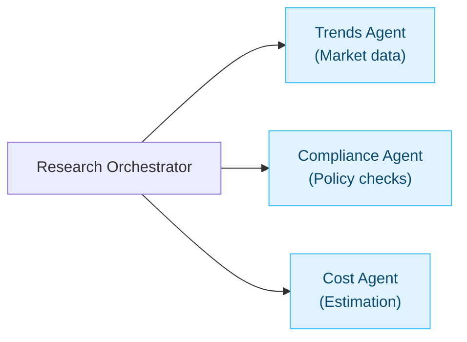

# Domain-driven design for AI agents: a beginner-friendly guide

## TL;DR

> Domain-driven design (DDD) gives AI agent teams a shared language, clear boundaries, and code that mirrors the real world. Use it to tame prompt spaghetti, enforce business rules, and evolve systems without breaking everything.

<!-- more -->

---

## Table of contents

- [Domain-driven design for AI agents: a beginner-friendly guide](#domain-driven-design-for-ai-agents-a-beginner-friendly-guide)
  - [TL;DR](#tldr)
  - [Table of contents](#table-of-contents)
  - [Why domain-driven design matters for AI agents](#why-domain-driven-design-matters-for-ai-agents)
  - [Strategic building blocks](#strategic-building-blocks)
    - [Ubiquitous language](#ubiquitous-language)
    - [Bounded contexts](#bounded-contexts)
    - [Entities and value objects](#entities-and-value-objects)
    - [Aggregates](#aggregates)
    - [Repositories](#repositories)
    - [Domain events](#domain-events)
  - [Translating DDD to agent architectures](#translating-ddd-to-agent-architectures)
  - [Example: a task assistant modeled with DDD](#example-a-task-assistant-modeled-with-ddd)
    - [1. Map the contexts](#1-map-the-contexts)
    - [2. Speak the same language](#2-speak-the-same-language)
    - [3. Capture entities, value objects, and events](#3-capture-entities-value-objects-and-events)
    - [4. Shape the aggregate](#4-shape-the-aggregate)
    - [5. Wrap persistence in a repository](#5-wrap-persistence-in-a-repository)
    - [6. Run the flow](#6-run-the-flow)
  - [Tooling to bring the model to life](#tooling-to-bring-the-model-to-life)
  - [Getting started checklist](#getting-started-checklist)

---

## Why domain-driven design matters for AI agents

Traditional AI agent projects often fail because developers and subject-matter experts talk past each other. DDD keeps everyone aligned by centering the model on the business domain, not the database or the prompt. Three benefits show up immediately:

- **Shared language.** Designers, ops, and engineers use the same words ("refund request", "policy check"), so code and prompts mirror conversations.
- **Focused scope.** You model what actually moves the needle—core workflows, compliance rules, critical metrics—rather than peripheral glue code.
- **Adaptability.** When policies or products change, you update a bounded slice of the system instead of untangling a monolith.

This mindset is essential for complex, long-lived agent stacks in finance, healthcare, operations, or any domain where the rules evolve weekly.

---

## Strategic building blocks

### Ubiquitous language

A ubiquitous language is the shared vocabulary that lives in meetings, documentation, prompts, and method names. If the compliance team says "policy check", your code should expose a method like `run_policy_check()` instead of `process_data()`. This eliminates translation gaps and makes the code self-documenting.

```python
class PatientRegistry:
    def admit_patient(self, patient_id: str) -> None:
        ...
```

### Bounded contexts

Large systems need explicit boundaries so the same term can safely mean different things in different subdomains. An e-commerce suite might have distinct contexts for **Order Management**, **Billing**, and **Inventory**; each defines "product" differently. Interfaces or translation layers connect the contexts while keeping their internal models lean.

### Entities and value objects

Entities carry identity that survives data changes - think `Task`, `Order`, or `AgentSession`. Value objects are immutable descriptions such as `TimeSlot`, `EmailAddress`, or `Priority`. Together they model state and enforce invariants close to the data.

```python
from pydantic import BaseModel

class SupportTicket(BaseModel):
    ticket_id: str
    customer: str
    issue: str
    status: str = "OPEN"

    def close(self) -> None:
        if self.status != "OPEN":
            raise ValueError("Ticket already closed")
        self.status = "CLOSED"
```

```python
from pydantic import BaseModel

class TimeSlot(BaseModel):
    start: str  # e.g., "2025-10-18 09:00"
    end: str    # e.g., "2025-10-18 10:00"

    @property
    def duration(self) -> int:
        ...
```

### Aggregates

Aggregates bundle related entities and value objects under a single transactional boundary. The aggregate root controls modifications, preserving invariants.

```python
from pydantic import BaseModel, Field

class Task(BaseModel):
    id: str
    description: str
    completed: bool = False

class Plan(BaseModel):
    id: str
    tasks: list[Task] = Field(default_factory=list)

    def add_task(self, task: Task) -> None:
        if any(t.id == task.id for t in self.tasks):
            raise ValueError("Task ID already exists")
        self.tasks.append(task)
```

### Repositories

Repositories abstract persistence so domain code feels like working with in-memory collections. They also make testing easier and support swapping storage backends without changing business logic.

```python
from abc import ABC, abstractmethod
from pydantic import BaseModel, Field

class Task(BaseModel):
    id: str
    description: str
    completed: bool = False

class Plan(BaseModel):
    id: str
    tasks: list[Task] = Field(default_factory=list)

class PlanRepository(ABC):
    @abstractmethod
    def save(self, plan: Plan) -> None:
        ...

    @abstractmethod
    def get(self, plan_id: str) -> Plan | None:
        ...

class InMemoryPlanRepository(PlanRepository):
    def __init__(self) -> None:
        self.storage: dict[str, Plan] = {}

    def save(self, plan: Plan) -> None:
        self.storage[plan.id] = plan

    def get(self, plan_id: str) -> Plan | None:
        return self.storage.get(plan_id)
```

### Domain events

Events make important state changes explicit. Publishing events like `TaskCompleted` decouples workflows and lets other contexts react without tight integration.

```python
from datetime import datetime
from pydantic import BaseModel

class TaskCompleted(BaseModel):
    task_id: str
    completed_at: datetime
```

---

## Translating DDD to agent architectures

- **Bounded contexts become agents or skills.** A research orchestrator might coordinate a market-trends agent, a compliance agent, and a cost estimator - each with its own vocabulary and rules.
- **Prompts honor the ubiquitous language.** Reflect domain terms in system prompts, tool descriptions, and function signatures so humans and agents stay synchronized.
- **State becomes explicit entities.** Conversation sessions, goals, intermediate results, and tool outputs get modeled as entities or value objects, enabling validation and reuse.
- **Aggregates express agent plans.** A `Plan` root can govern task lists, enforce limits, and maintain priorities - keeping LLM proposals within business constraints.
- **Domain events drive orchestration.** Agents raise events such as `ResearchCompleted` or `ThresholdExceeded`; listeners trigger follow-up actions without hard-coded coupling.
- **Business rules wrap AI actions.** Run LLM outputs through domain services or entity methods so policy and safety gates remain intact even when the model improvises.



---

## Example: a task assistant modeled with DDD

### 1. Map the contexts

The personal assistant domain splits neatly into **Task Management**, **Scheduling**, and **Notifications**. Focus on the core Task Management context first; others can evolve as separate bounded contexts or companion agents.

### 2. Speak the same language

Agree on terms like "task", "deadline", "reminder", and "priority". Use them everywhere—from prompt templates to method names—so intent classification, validation, and UI all line up.

### 3. Capture entities, value objects, and events

```python
from datetime import datetime, date
from enum import Enum
from pydantic import BaseModel, Field

class Priority(Enum):
    LOW = 1
    NORMAL = 2
    HIGH = 3

class TaskCompletedEvent(BaseModel):
    task_id: str
    time: datetime

class Task(BaseModel):
    id: str
    description: str
    created_at: datetime = Field(default_factory=datetime.utcnow)
    due_date: date | None = None
    priority: Priority = Priority.NORMAL
    completed: bool = False

    def mark_completed(self) -> TaskCompletedEvent:
        if self.completed:
            raise ValueError("Task is already completed.")
        self.completed = True
        return TaskCompletedEvent(task_id=self.id, time=datetime.utcnow())
```

### 4. Shape the aggregate

```python
from pydantic import BaseModel, Field

class Task(BaseModel):
    id: str
    description: str
    completed: bool = False

class TaskList(BaseModel):
    owner: str
    tasks: list[Task] = Field(default_factory=list)

    def add_task(self, task: Task) -> None:
        if any(
            existing.description == task.description
            and existing.due_date == task.due_date
            for existing in self.tasks
        ):
            raise ValueError("A similar task on that date already exists.")
        self.tasks.append(task)

    def get_pending(self) -> list[Task]:
        return [task for task in self.tasks if not task.completed]
```

### 5. Wrap persistence in a repository

```python
from pydantic import BaseModel, Field

class Task(BaseModel):
    id: str
    description: str
    completed: bool = False

class TaskList(BaseModel):
    owner: str
    tasks: list[Task] = Field(default_factory=list)

class TaskRepository:
    def __init__(self) -> None:
        self._data: dict[str, TaskList] = {}

    def get_task_list(self, owner: str) -> TaskList:
        return self._data.get(owner, TaskList(owner=owner))

    def save_task_list(self, task_list: TaskList) -> None:
        self._data[task_list.owner] = task_list

TaskList.model_rebuild()  # Resolve forward references for Pydantic.
```

### 6. Run the flow

```python
from datetime import date, timedelta
from uuid import uuid4
from pydantic import BaseModel, Field

class Task(BaseModel):
    id: str
    description: str
    due_date: date | None = None
    completed: bool = False

class TaskList(BaseModel):
    owner: str
    tasks: list[Task] = Field(default_factory=list)

    def add_task(self, task: Task) -> None:
        if any(
            existing.description == task.description
            and existing.due_date == task.due_date
            for existing in self.tasks
        ):
            raise ValueError("A similar task on that date already exists.")
        self.tasks.append(task)

TaskList.model_rebuild()  # Resolve forward references for Pydantic.

class TaskRepository:
    def __init__(self) -> None:
        self._data: dict[str, TaskList] = {}

    def get_task_list(self, owner: str) -> TaskList:
        return self._data.get(owner, TaskList(owner=owner))

    def save_task_list(self, task_list: TaskList) -> None:
        self._data[task_list.owner] = task_list

repo = TaskRepository()
user_input = "Remind me to buy milk tomorrow"
intent = "add_task"

if intent == "add_task":
    task_list = repo.get_task_list(owner="User123")
    task = Task(
        id=str(uuid4()),
        description="buy milk",
        due_date=date.today() + timedelta(days=1),
    )
    try:
        task_list.add_task(task)
        repo.save_task_list(task_list)
        print(f"Task '{task.description}' added for {task.due_date}.")
    except Exception as exc:
        print(f"Sorry, I couldn't add that task: {exc}")
```

The LLM can parse natural language into structured commands, but your domain layer enforces the rules.

---

## Tooling to bring the model to life

- **FastAPI** cleanly separates interface and domain layers with routers per context and Pydantic schemas for request/response contracts.
- **Pydantic and Pydantic AI** enforce invariants and validate LLM outputs against structured models, delivering reliable agent behavior.
- **DDD helper libraries** like DDDesign or Protean provide scaffolding for entities, repositories, and event handling if you want batteries included.
- **Messaging or event tooling** (Redis Pub/Sub, blinker, RabbitMQ) routes domain events between agents or services.
- **Agent frameworks** such as LangChain, Semantic Kernel, or Haystack plug into your domain services while remaining swappable behind clean interfaces.
- **Testing with PyTest** and fake repositories or LLM stubs keeps the domain layer deterministic.

---

## Getting started checklist

1. Interview domain experts and draft the ubiquitous language.
2. Draw the bounded contexts and note where translations are needed.
3. Model entities and value objects with invariants baked in.
4. Define aggregate roots that encapsulate business rules.
5. Create repository interfaces before touching storage tech.
6. Emit domain events for meaningful changes and wire listeners later.
7. Wrap LLM outputs in Pydantic models to enforce contracts.
8. Add application services or orchestrators that coordinate agents via structured commands or events.

Start with the domain first; let the AI tooling serve the model—not the other way around. Happy building!
