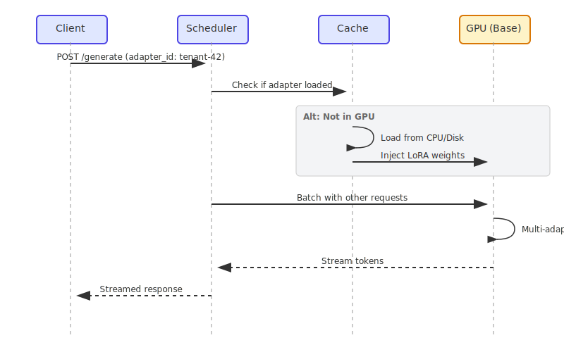
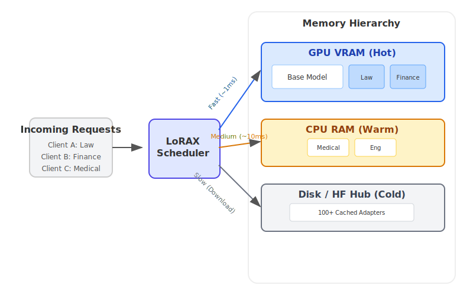

# LoRAX Playbook - Orchestrating Thousands of LoRA Adapters on Kubernetes

Serving dozens of fine-tuned large language models used to mean provisioning one GPU per model. **LoRAX (LoRA eXchange)** flips that math on its head: keep a single base model in memory and hot-swap lightweight LoRA adapters per request.

This guide shows you how LoRAX achieves **near-constant cost per token** regardless of how many fine-tunes you're serving. We'll cover:

- **What LoRA is** and why it's a game-changer.
- **LoRAX vs. vLLM**: When to use which.
- **Kubernetes Deployment**: A production-ready Helm guide.
- **API Usage**: REST, Python, and OpenAI-compatible examples.

<!-- more -->

## Background: What is LoRA?

**Low-Rank Adaptation (LoRA)** is a fine-tuning technique that freezes the pre-trained model weights and injects trainable rank decomposition matrices into each layer of the Transformer architecture.

In simple terms: instead of retraining the entire model (which is slow and produces massive files), LoRA trains a tiny set of "diffs" that represent the new knowledge.

- **Full Fine-tuning**: Produces a 20GB+ file for a 7B model.
- **LoRA Fine-tuning**: Produces a ~100MB adapter file.

This massive size reduction is what makes dynamic serving possible. You can store thousands of adapters on disk and load them into GPU memory in milliseconds.

## The problem LoRAX solves

Traditional multi-model serving is expensive. Each fine-tuned model needs its own GPU memory allocation, which means serving 50 customer-specific models requires 50 separate deployments—or at least 50x the memory. The costs scale linearly with every new variant you add.

LoRAX is an Apache 2.0 project from [Predibase](https://github.com/predibase/lorax) that extends the [Hugging Face Text Generation Inference server](https://github.com/huggingface/text-generation-inference) with three critical features: dynamic adapter loading, tiered weight caching, and multi-adapter batching. These let you serve hundreds of tenant-specific LoRA adapters on a single Ampere-class GPU without sacrificing throughput or latency.

Here's the key insight: LoRA fine-tuning produces small delta weights (adapters) rather than full model copies. LoRAX exploits this by loading just the base model into GPU memory and injecting adapter weights on demand. Unused adapters consume zero VRAM.

## How it works: four core innovations

**1. Dynamic adapter loading**

Adapter weights are injected just-in-time for each request. The base model stays resident in GPU memory while adapters load on the fly without blocking other requests. This means you can catalog thousands of adapters but only pay memory costs for the ones actively serving traffic.

**2. Tiered weight caching**

LoRAX stages adapters across three layers: GPU VRAM for hot adapters, CPU RAM for warm ones, and disk for cold storage. This hierarchy prevents out-of-memory crashes while keeping swap times fast enough that users don't notice the difference.

**3. Continuous multi-adapter batching**

Here's where the magic happens. LoRAX extends continuous batching strategies to work across different adapters in parallel. Requests targeting different fine-tunes can share the same forward pass, keeping the GPU fully utilized. Benchmarks from Predibase show that processing 1M tokens spread across 32 different adapters takes about the same time as 1M tokens on a single model.

**4. Battle-tested foundation**

LoRAX builds on Hugging Face's Text Generation Inference (TGI) server, inheriting production-grade optimizations: FlashAttention 2, paged attention, SGMV kernels for multi-adapter inference, and streaming responses. You get the stability of TGI plus the flexibility of dynamic adapter switching.

### The economics: near-constant cost scaling

The chart below demonstrates the cost advantage. While traditional dedicated deployments (dark gray) scale linearly—double the models means double the cost—LoRAX (orange) keeps per-token costs nearly flat regardless of how many adapters you serve. Even hosted API fine-tunes from providers like OpenAI (light gray) can't match this efficiency for multi-model scenarios.


_Cost per million tokens as the number of fine-tuned models increases. LoRAX maintains near-constant costs through efficient multi-adapter batching, while dedicated deployments scale linearly. Source: [LoRAX GitHub](https://github.com/predibase/lorax)_

### Request flow diagram



## When to use LoRAX

LoRAX makes economic and operational sense in specific scenarios. Here's when it shines:

**Multi-tenant SaaS applications**

You're building a platform where each of your 500 customers gets a customized chatbot fine-tuned on their data. Traditional serving would require 500 model deployments. LoRAX serves all 500 from a single GPU by loading the relevant adapter when a customer request arrives.

**Domain-specific expert routers**

Your company maintains specialized LLMs for law, medicine, finance, and engineering. Instead of four separate 13B model deployments, LoRAX runs one base LLaMA 2 13B instance and routes to the appropriate adapter based on the incoming request domain.

**Rapid experimentation and A/B testing**

Testing 10 different fine-tuning approaches in production? With LoRAX you deploy once and switch between variants by changing the `adapter_id` parameter. No infrastructure changes, no service restarts.

**Resource-constrained or edge deployments**

On-prem installations or edge devices often have limited GPU resources. A single NVIDIA A10G can host a quantized 7B base model plus dozens of task-specific adapters, eliminating the need for one GPU per model.

## Architecture: memory hierarchy and request scheduling

The core of LoRAX is its three-tier memory hierarchy. Understanding this helps you predict performance and plan capacity.



LoRAX treats each adapter as a lightweight "view" on the shared base model. The scheduler coalesces requests so that serving 32 different adapters can be as fast as serving one—even across a million tokens of throughput. Adapters typically weigh 10-200MB each, compared to multi-gigabyte full models.

## Deploy LoRAX on Kubernetes

LoRAX ships with production-ready Helm charts and Docker images, making Kubernetes deployment straightforward.

### Prerequisites

Before you start, ensure you have:

- A Kubernetes cluster with NVIDIA GPUs (Ampere generation or newer: A10, A100, H100)
- [NVIDIA Container Runtime](https://docs.nvidia.com/datacenter/cloud-native/container-toolkit/install-guide.html) configured on GPU nodes
- `kubectl` and `helm` installed locally
- Persistent storage for adapter caches—mount a PersistentVolume to `/data` in the pod

### Quick start with the official Helm chart

[Helm](https://helm.sh/) is the package manager for Kubernetes—it simplifies deploying applications by bundling all the necessary Kubernetes resources (Deployments, Services, ConfigMaps, etc.) into a single "chart." Instead of writing and managing dozens of YAML files manually, you can deploy complex applications with a single command.

Predibase retired their public Helm repository in late 2024, so the supported workflow is to clone the LoRAX repository and install the chart from disk. Run these commands from your workstation:

```bash
# Clone the LoRAX repository and switch into it
git clone https://github.com/predibase/lorax.git
cd lorax

# Make sure kubectl can talk to your cluster
kubectl config current-context
kubectl get nodes

# Build chart dependencies (generates charts/lorax/charts/*.tgz)
helm dependency update charts/lorax

# Optional: render manifests locally to verify everything is templating
helm template mistral-7b-release charts/lorax > /tmp/lorax-rendered.yaml

# Deploy with default settings (Mistral-7B-Instruct)
helm upgrade --install mistral-7b-release charts/lorax

# Watch the pod come up
kubectl get pods -w

# Check logs to see model loading progress
kubectl logs -f deploy/mistral-7b-release-lorax
```

The chart creates a Deployment (one replica by default) and a ClusterIP Service listening on port 80. The first startup downloads the base model from Hugging Face and loads it into GPU memory—this can take a few minutes depending on your network and GPU. Subsequent restarts reuse the cached weights from the persistent volume.

> **Tip:** If `helm upgrade --install` returns `Kubernetes cluster unreachable`, your current kubeconfig context points at a cluster that is offline. Start your local cluster (e.g., Docker Desktop, kind, minikube) or switch to a reachable context with `kubectl config use-context`. Running `kubectl get nodes` before deploying helps confirm the API server is available.

### Customize the base model and scaling

You can swap in a different base model or adjust resources by creating a custom values file. Here's an example `llama2-values.yaml`:

```yaml
# Use LLaMA 2 7B Chat instead of Mistral
modelId: meta-llama/Llama-2-7b-chat-hf

# Enable 4-bit quantization to save VRAM
modelArgs:
    quantization: "bitsandbytes"

# Scale to 2 replicas for high availability
replicaCount: 2

# Request exactly 1 GPU per pod
resources:
    limits:
        nvidia.com/gpu: 1
```

Deploy with your custom configuration:

```bash
helm upgrade --install -f llama2-values.yaml llama2-chat-release charts/lorax
```

Run those commands from the cloned `lorax/` repository so Helm can locate the chart directory.

LoRAX supports popular open-source models out of the box: LLaMA 2, CodeLlama, Mistral, Mixtral, Qwen, and others. Check the [model compatibility list](https://github.com/predibase/lorax) for the latest additions.

**Exposing the service**

The default Service type is ClusterIP, which only allows access within the cluster. For external traffic, either:

- Create a LoadBalancer Service (on cloud providers)
- Set up an Ingress with TLS termination
- Place an API gateway in front for authentication and rate limiting

**Cleanup**

When you're done testing, free up the GPU resources:

```bash
helm uninstall mistral-7b-release
```

This removes the Deployment, Service, and all pods. Cached model weights remain in the PersistentVolume unless you delete that separately.

## Working with the LoRAX APIs

Once deployed, LoRAX exposes three ways to interact with it: a REST API compatible with Hugging Face TGI, a Python client library, and an OpenAI-compatible endpoint. All three methods support dynamic adapter switching.

### REST API

The `/generate` endpoint accepts JSON payloads with your prompt and optional parameters. Using the base model without any adapter:

```bash
# Basic request to the base model (no adapter)
curl -X POST http://localhost:8080/generate \
  -H "Content-Type: application/json" \
  -d '{
    "inputs": "Write a short poem about the sea.",
    "parameters": {
      "max_new_tokens": 64,
      "temperature": 0.7
    }
  }'
```

The response includes the generated text and metadata like token counts and timing information.

**Loading a specific adapter**

Add an `adapter_id` parameter to target a fine-tuned model. Here's an example using a math-specialized adapter:

```bash
curl -X POST http://localhost:8080/generate \
  -H "Content-Type: application/json" \
  -d '{
    "inputs": "Natalia sold 48 clips in April, and then half as many in May. How many clips did she sell in total?",
    "parameters": {
      "max_new_tokens": 64,
      "adapter_id": "vineetsharma/qlora-adapter-Mistral-7B-Instruct-v0.1-gsm8k"
    }
  }'
```

On the first call with a new `adapter_id`, LoRAX downloads the adapter from Hugging Face Hub and caches it under `/data`. Subsequent requests use the cached version. You can also load adapters from local paths by specifying `"adapter_source": "local"` alongside a file path.

### Python client

For programmatic access, install the `lorax-client` package:

```bash
pip install lorax-client
```

The client wraps the REST API with a clean interface:

```python
from lorax import Client

# Connect to your LoRAX instance (default port 8080)
client = Client("http://localhost:8080")

prompt = "Explain the significance of the moon landing in 1969."

# 1. Generate using the base model (no adapter loaded)
base_response = client.generate(prompt, max_new_tokens=80)
print("Base model:", base_response.generated_text)

# 2. Generate using a fine-tuned adapter
# The adapter_id can be a Hugging Face repo ID or a local path
adapter_response = client.generate(
    prompt,
    max_new_tokens=80,
    adapter_id="alignment-handbook/zephyr-7b-dpo-lora",
)
print("With adapter:", adapter_response.generated_text)
```

The client supports streaming responses, adjusting decoding parameters (temperature, top-p, repetition penalty), and accessing token-level details. Check the [client reference](https://github.com/predibase/lorax) for advanced usage patterns.

### OpenAI-compatible endpoint

LoRAX implements the OpenAI Chat Completions API under the `/v1` path. This lets you drop LoRAX into tools that expect OpenAI's API format—LangChain, Semantic Kernel, or custom applications.

Use the `model` field to specify which adapter to load:

```python
import openai

# Point the OpenAI client at LoRAX
openai.api_key = "EMPTY"  # LoRAX doesn't require an API key by default
openai.api_base = "http://localhost:8080/v1"

# The model parameter becomes the adapter_id
# This allows seamless integration with tools like LangChain
response = openai.ChatCompletion.create(
    model="alignment-handbook/zephyr-7b-dpo-lora",
    messages=[
        {"role": "system", "content": "You are a friendly chatbot who speaks like a pirate."},
        {"role": "user", "content": "How many parrots can a person own?"},
    ],
    max_tokens=100,
)

print(response["choices"][0]["message"]["content"])
```

This compatibility unlocks two powerful use cases:

1. **Drop-in replacement:** Migrate existing applications from OpenAI's hosted models to your own infrastructure by changing one configuration line
2. **Tool integration:** Use LoRAX with any framework that supports OpenAI's API without custom adapters

Note that the first request to a new adapter may have higher latency while LoRAX downloads and loads it. Plan for this in user-facing applications by preloading popular adapters or showing loading states.

## Trade-offs to consider

### What LoRAX does well

**Dramatic cost reduction for multi-model scenarios**

Serve hundreds or thousands of fine-tuned models on a single GPU. Traditional approaches would require separate deployments for each model, multiplying infrastructure costs linearly. LoRAX keeps costs nearly constant as you add adapters.

**Zero memory waste**

Adapters are loaded just-in-time when requests arrive. Unused models consume no VRAM. This means you can maintain a catalog of 1,000+ specialized models but only pay for the handful actively serving traffic at any moment.

**Production-grade performance**

Continuous multi-adapter batching keeps latency and throughput comparable to single-model serving. Predibase benchmarks show that serving 32 different adapters simultaneously adds minimal overhead compared to serving one model.

**Proven foundation**

Built on Hugging Face TGI, LoRAX inherits battle-tested optimizations: FlashAttention 2, paged attention, streaming token generation, and SGMV kernels for efficient multi-adapter inference.

**Deployment maturity**

Ships with Docker images, Helm charts, Prometheus metrics, and OpenTelemetry tracing. The Apache 2.0 license means you can use it commercially without restrictions.

**Broad model support**

Works with popular open-source architectures: LLaMA 2, CodeLlama, Mistral, Mixtral, Qwen, and more. Supports quantization (4-bit via bitsandbytes, GPTQ, AWQ) to reduce memory footprint.

### Limitations and constraints

**Tied to LoRA-based fine-tuning**

All your adapters must come from LoRA-style fine-tuning of the same base model. Full fine-tunes that produce standalone models won't work without conversion. If you have completely different model architectures, you'll need separate LoRAX deployments for each base.

**Cold start latency**

The first request after startup loads the base model into GPU memory (can take 30-90 seconds for larger models). First-time adapter requests also incur a download delay if pulling from Hugging Face. Plan for this with health checks and preloading strategies.

**Cache thrashing under bursty load**

If traffic suddenly hits dozens of different adapters, LoRAX may shuffle weights between GPU, CPU RAM, and disk. While adapter swaps are fast (~10ms from RAM), a very large working set can cause temporary slowdowns. Monitor GPU memory and adapter cache hit rates.

**Fast-moving project**

LoRAX forked from TGI in late 2023 and evolves rapidly. Expect frequent updates and occasional breaking changes as the maintainers track upstream TGI improvements and add new features. Pin versions carefully in production.

## Alternatives: LoRAX vs. vLLM

[vLLM](https://github.com/vllm-project/vllm) is another popular high-throughput serving engine that recently added multi-LoRA support. How do they compare?

| Feature           | LoRAX                                                      | vLLM                                                                 |
| :---------------- | :--------------------------------------------------------- | :------------------------------------------------------------------- |
| **Primary Focus** | **Massive Scale**: Serving hundreds/thousands of adapters. | **High Throughput**: Maximum tokens/sec for fewer active adapters.   |
| **Architecture**  | **Dynamic Swapping**: Aggressively offloads to CPU/disk.   | **Batching**: Optimized for concurrent execution of active adapters. |
| **Best For**      | **Long-tail SaaS**: 1000s of tenants, sporadic usage.      | **High-traffic tiers**: 5-10 heavily used adapters.                  |
| **Base**          | Hugging Face TGI                                           | Custom Paged Attention Engine                                        |

**Choose LoRAX if:** You have a "long tail" of adapters (e.g., one per user) where most are idle at any given time. LoRAX's tiered caching excels here.

**Choose vLLM if:** You have a small set of highly active adapters and raw throughput is your top priority.

## Getting started: a practical roadmap

If LoRAX fits your use case, here's how to move from prototype to production:

### 1. Start small

Deploy LoRAX with the base model you're already using and 3-5 representative adapters. Verify that adapter loading works and measure baseline latency for your workload.

### 2. Measure and profile

- Track adapter cache hit rates and GPU memory usage under realistic traffic patterns
- Identify your "hot" adapters (top 20% by request volume) and consider preloading them at startup
- Measure P50, P95, and P99 latency for both cached and cold adapter loads

### 3. Optimize for your workload

- If you have a few very popular adapters, increase GPU memory allocation to keep more adapters hot
- If you have long-tail usage across hundreds of adapters, tune the tiered cache settings to balance RAM and disk
- Use quantization (4-bit bitsandbytes or GPTQ) if VRAM is tight

### 4. Scale horizontally

Once you understand single-instance behavior, add replicas for high availability. Place a load balancer in front that routes based on `adapter_id` to improve cache locality—requests for the same adapter hitting the same replica means better cache utilization.

### 5. Monitor continuously

Set up dashboards for GPU utilization, adapter cache metrics, and request latency broken down by adapter. Watch for cache thrashing during traffic spikes and adjust your scaling strategy accordingly.

With LoRAX, orchestrating specialized LLM experiences becomes a matter of routing adapter IDs—not provisioning endless GPUs. The economics shift from linear scaling to near-constant costs, making multi-model serving viable even for small teams.
