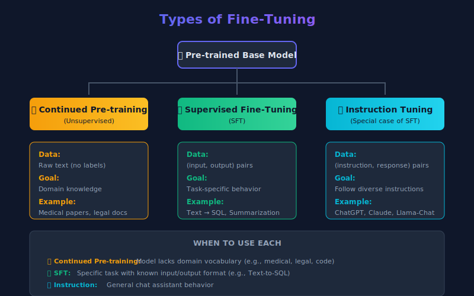

# The Complete Guide to LLM Fine-Tuning in 2025: From Theory to Production

Fine-tuning has become the secret weapon for building specialized AI applications. While general-purpose models like GPT-4 and Claude excel at broad tasks, fine-tuning transforms them into laser-focused experts for your specific domain. This guide walks you through everything you need to know—from understanding when to fine-tune to deploying your custom model.

<!-- more -->

## Strategic Decision: Fine-Tuning vs Alternatives

Before investing GPU hours and engineering time, you need to answer a fundamental question: **is fine-tuning the right solution for your problem?**


### Fine-Tuning vs RAG

Do not fine-tune just to add "knowledge." Here's when to use each approach:

| Feature                | Fine-Tuning                                                                                        | RAG (Retrieval-Augmented Generation)                                                                      |
| ---------------------- | -------------------------------------------------------------------------------------------------- | --------------------------------------------------------------------------------------------------------- |
| **Core Function**      | Alters internal weights to teach skills, styles, or behaviors                                      | Provides external, up-to-date context at inference time                                                   |
| **Best For**           | • Specific conversational styles<br>• Complex instruction following<br>• Domain-specific reasoning | • Rapidly changing data (news, stock prices)<br>• Reducing hallucinations (grounding)<br>• Citing sources |
| **Knowledge Handling** | Internalizes patterns, not facts                                                                   | Retrieves facts from external knowledge base                                                              |
| **Update Frequency**   | Requires retraining for updates                                                                    | Updates immediately with new documents                                                                    |

### Fine-Tuning vs Prompt Engineering

Modern LLMs are remarkably responsive to well-crafted prompts. Before fine-tuning, exhaust prompt engineering options:

| Aspect           | Fine-Tuning                                    | Prompt Engineering                                |
| ---------------- | ---------------------------------------------- | ------------------------------------------------- |
| **Setup Cost**   | High (data curation, GPU compute, iteration)   | Low (iterative prompt refinement)                 |
| **Flexibility**  | Locked after training                          | Change anytime without retraining                 |
| **Format/Style** | Best for complex, consistent output formats    | Good for simple formatting with few-shot examples |
| **Latency**      | Lower (no long system prompts)                 | Higher (context tax on every request)             |
| **Best For**     | Complex behaviors, distillation, cost at scale | Rapid iteration, changing requirements            |

> [!TIP] **Try Prompting First**
> Start with few-shot examples in your prompt. If you don't get consistent behavior, try SGR before jumping to fine-tuning.

### Fine-Tuning vs Schema-Guided Reasoning (SGR)

Libraries like `xgrammar` and `outlines` constrain model outputs at inference time using Finite State Machines. They work with base models out of the box—**no training required**.

**SGR isn't just about structured outputs.** Its primary value is **consistency and reliability**. When prompting alone produces inconsistent results, SGR enforces deterministic output patterns without the cost and complexity of fine-tuning.

| Aspect          | SGR (No Fine-Tuning)                       | Fine-Tuning                                    |
| --------------- | ------------------------------------------ | ---------------------------------------------- |
| **Setup**       | Immediate—define schema, deploy            | Requires data curation, GPU compute, iteration |
| **Consistency** | Guaranteed structure, reliable patterns    | Learned behavior (may still vary)              |
| **Flexibility** | Change schema anytime without retraining   | Locked after training                          |
| **Latency**     | Slight overhead (model may "fight" schema) | Lower (model naturally outputs format)         |
| **Best For**    | Structured outputs, consistent behavior    | Complex reasoning, deep behavioral changes     |

**Recommendation:**

1.  **Start with prompting** — Simple few-shot examples for basic formatting
2.  **Add SGR if inconsistent** — Use `xgrammar` or `outlines` to guarantee output structure and reliability
3.  **Fine-tune as last resort** — Only when you need deep behavioral changes that schema constraints can't achieve

### Quick Reference: Matching Problems to Solutions

| Challenge                      | Best Solution      | Why?                                                                      |
| ------------------------------ | ------------------ | ------------------------------------------------------------------------- |
| **Missing knowledge**          | RAG                | Models hallucinate facts. Retrieval provides grounded, up-to-date context |
| **Wrong format/tone**          | Prompt Engineering | Modern models follow style instructions well via few-shot examples        |
| **Inconsistent outputs**       | SGR (xgrammar)     | Guaranteed structure and reliability without training                     |
| **Complex behavioral changes** | Fine-Tuning (SFT)  | Deep persona, reasoning patterns, or multi-step workflows                 |
| **Safety/preference**          | Alignment (DPO)    | When outputs are correct but don't match preferences                      |
| **Latency/cost at scale**      | Distillation (SFT) | Train smaller student model on larger teacher's outputs                   |
| **Reduce model size**          | Quantization       | No training—compress weights (FP16→INT4) for faster inference             |

### The Economic Case

Fine-tuning shines in **high-volume, stable-requirement scenarios**. Consider this: a robust RAG system might require 2,000 tokens of context on every call (system prompt + retrieved docs + few-shot examples). That's your "context tax" on every request.

A fine-tuned model can internalize those instructions, reducing your prompt from 2,000 tokens to 50. At scale, this pays for the training compute within weeks.

> [!TIP] **The Hybrid Approach**
> The industry sweet spot is often a fine-tuned smaller model (8B params) combined with lightweight RAG for facts. This often outperforms prompting a massive model (70B+) in both accuracy and cost.

---

## Types of Fine-Tuning

Before diving into the lifecycle, understand the three main approaches to fine-tuning:



### 1. Continued Pre-training (Unsupervised)

Continued pre-training extends the base model's knowledge by training on additional raw text **without labels**. The model simply learns to predict the next token, just like during original pre-training.

**When to use:**

- Your domain has specialized vocabulary the base model doesn't know (medical, legal, financial)
- You have large amounts of domain text but no labeled examples
- The base model struggles with domain-specific terminology

**Example:** Training on millions of clinical notes so the model understands medical abbreviations, drug names, and clinical workflows.

### 2. Supervised Fine-Tuning (SFT)

SFT trains on labeled **(input, output) pairs**. You show the model exactly what output you expect for each input.

**When to use:**

- You have a specific task with clear input/output format
- Quality labeled data is available (even small amounts)
- You need consistent, predictable behavior

**Example:** Training on (SQL query description, SQL code) pairs for Text-to-SQL conversion.

```json
{
    "input": "Get all users who signed up last month",
    "output": "SELECT * FROM users WHERE signup_date >= DATE_SUB(NOW(), INTERVAL 1 MONTH)"
}
```

### 3. Instruction Tuning

Instruction tuning is a **special case of SFT** designed to make models follow diverse natural language instructions. The training data consists of (instruction, response) pairs across many different tasks.

**When to use:**

- You want a general-purpose assistant (like ChatGPT or Claude)
- The model needs to handle varied, open-ended requests
- You're building a chat interface

**Example:** Training on thousands of diverse instructions like "Summarize this article," "Write a poem about X," "Explain Y in simple terms."

### Comparison

| Aspect          | Continued Pre-training     | SFT                             | Instruction Tuning               |
| --------------- | -------------------------- | ------------------------------- | -------------------------------- |
| **Data**        | Raw text                   | (input, output) pairs           | (instruction, response) pairs    |
| **Labels**      | None (unsupervised)        | Task-specific                   | Diverse tasks                    |
| **Goal**        | Domain knowledge           | Specific task behavior          | Follow any instruction           |
| **Data Volume** | Large (millions of tokens) | Small-Medium (500-10k examples) | Medium-Large (10k-100k examples) |

> [!NOTE] **Most Common Approach**
> In practice, most practitioners use **SFT** for specific tasks or **Instruction Tuning** for chat applications. Continued pre-training is rarer because it requires massive amounts of domain text and is computationally expensive.

---

## The 7-Stage Fine-Tuning Lifecycle

Fine-tuning isn't a single action—it's a structured lifecycle. Understanding this pipeline is critical for success.


Each stage builds on the previous one:

1.  **Data Preparation** — Clean, deduplicate, and format your data (highest leverage step)
2.  **Model Selection** — Choose the right base model and load weights
3.  **Training Setup** — Configure hardware, hyperparameters, and optimization strategy
4.  **Fine-Tuning** — Run SFT, DPO, or ORPO training
5.  **Evaluation** — Benchmark performance and validate quality
6.  **Deployment** — Export and serve your model
7.  **Monitoring** — Track performance, maintain, and iterate

> [!WARNING] **Data is Destiny**
> Stage 1 (Dataset Preparation) is the highest leverage step. Flaws in your data cannot be fixed by algorithms later. **Quality over quantity** — 500-1,000 carefully curated examples often outperform 50,000 noisy ones.

---

## Stage 1: Data Preparation — "Data is Destiny"

This is where most fine-tuning projects succeed or fail. The industry has moved far beyond simple "clean and format" scripts.


### The 5-Stage Data Pipeline

Modern production pipelines use tools like **DataTrove** (Hugging Face) and **Distilabel** (Argilla) rather than custom scripts:

#### 1. Ingestion & Filtering

- **Action**: Remove "refusals" (e.g., "I cannot answer that"), broken UTF-8, non-target languages
- **Tools**: Trafilatura (extraction) + FastText (language ID)

#### 2. PII Scrubbing (Enterprise Critical)

- **Action**: Detect and redact emails, IP addresses, phone numbers before training
- **Tools**: Microsoft Presidio or scrubadub
- **Why**: Training on customer PII is a critical security failure

#### 3. Deduplication (MinHash LSH)

- **Action**: Remove near-duplicates to prevent memorization
- **Tools**: DataTrove (industry standard for terabyte-scale processing)

#### 4. Synthetic Augmentation (The 2025 Secret)

- **Action**: Use a stronger "teacher" model (GPT-4o, DeepSeek-V3) to rewrite raw data into high-quality instruction-response pairs
- **Tools**: Distilabel
- **Impact**: This step often provides the biggest quality boost

#### 5. Formatting

- **Action**: Convert to standard formats (Alpaca or ShareGPT)

### Data Format Examples

**Alpaca Format** (Instruction-Following):

```json
{
    "instruction": "Summarize the following text.",
    "input": "The text to be summarized...",
    "output": "This is the summary."
}
```

**ShareGPT/ChatML Format** (Conversational):

```json
{
    "conversations": [
        { "from": "user", "value": "Hello, who are you?" },
        { "from": "assistant", "value": "I am a helpful AI assistant." }
    ]
}
```

### Key Principles

- **Quality over Quantity**: 500-1,000 carefully curated examples often outperform 50,000 noisy ones
- **Cleanliness**: Remove irrelevant information, normalize text, ensure consistent formatting
- **Balance**: Ensure representation across different topics to prevent bias
- **Enterprise Critical**: PII scrubbing (Stage 2) is mandatory for production systems

---

## Stage 2: Model Selection & Hardware Requirements

Choosing the right base model and understanding hardware constraints is critical for project success.

### Hardware Requirements by Model Size

The physics of fine-tuning impose strict memory constraints:

| Tier                     | Hardware Config        | Capability       | Use Case                                                   |
| ------------------------ | ---------------------- | ---------------- | ---------------------------------------------------------- |
| **Enterprise Standard**  | 8x NVIDIA H100 (80GB)  | Full Fine-Tuning | Training 70B models with long context (32k+) at max speed  |
| **Minimum Viable (Pro)** | 4x NVIDIA A100 (80GB)  | QLoRA / LoRA     | Fine-tuning Qwen 72B or Llama 70B in 4-bit                 |
| **Local R&D**            | 4x RTX 6000 Ada (48GB) | QLoRA            | On-prem workstation for data privacy requirements          |
| **Hobbyist**             | 2x RTX 3090/4090       | Inference Only   | Cannot effectively train 70B models (extreme quantization) |

> [!NOTE] **Why H100s?**
> It's not just VRAM—it's **FP8 precision**. H100s support native FP8 training, which effectively doubles memory capacity and throughput compared to A100s. For long-context models (128k tokens), FP8 on H100s is often the only way to fit reasonable batch sizes.

### Memory Calculations

To fine-tune a 72B model, you need to store:

- **Model Weights** (16-bit): ~144 GB
- **Gradients & Optimizer States**: ~2-3x the model size (depending on optimizer, e.g., AdamW)
- **Activations**: Scales with context length (e.g., 32k tokens)

This is why QLoRA (4-bit quantization + LoRA adapters) is essential for most teams.

---

## Stage 3: Training Methods (PEFT & LoRA)

### Full Fine-Tuning vs PEFT

**Full Fine-Tuning (FFT)** updates all model weights. For a 7B model at 16-bit precision, you need roughly 112GB of VRAM just for training. This is prohibitive for most teams.

**Parameter-Efficient Fine-Tuning (PEFT)** changes the game by updating only a small subset of parameters while freezing the rest.

### LoRA: The Industry Standard

LoRA (Low-Rank Adaptation) is the foundational PEFT technique. The key insight: weight changes during fine-tuning have low "intrinsic rank."


Instead of updating a massive weight matrix **W** (dimension d×d), LoRA learns two smaller matrices:

- **A** (d × r) — down-projection
- **B** (r × d) — up-projection

The update becomes: **ΔW = B × A**

With rank `r=16`, this reduces trainable parameters by **~10,000x**, dropping VRAM from 120GB to 16GB.

### PEFT Methods Compared

| Method    | How It Works                                   | Memory Savings | Best For                           |
| --------- | ---------------------------------------------- | -------------- | ---------------------------------- |
| **LoRA**  | Low-rank matrices injected into frozen weights | ~10x           | General fine-tuning                |
| **QLoRA** | LoRA + 4-bit base model quantization           | ~20x           | Consumer GPUs (16-24GB)            |
| **DoRA**  | LoRA with magnitude/direction decomposition    | ~10x           | When LoRA hits performance ceiling |
| **HFT**   | Freezes half parameters per training round     | ~2x            | Balance between FFT and PEFT       |

#### When to Use Which?

- **LoRA**: Start here. It's fast, memory-efficient, and widely supported
- **QLoRA**: When you need to fine-tune 70B models on consumer hardware
- **DoRA**: When you need to match full fine-tuning quality on complex reasoning tasks
- **HFT**: When you need better performance than LoRA but can't afford full fine-tuning

### DoRA: Weight-Decomposed LoRA

DoRA (Weight-Decomposed Low-Rank Adaptation) is a novel technique that bridges the performance gap between standard LoRA and full fine-tuning.


**How it works:**

Instead of treating weights as a single entity, DoRA decomposes pre-trained weights into two components:

1.  **Magnitude** — Trainable scalar per column (controls "strength")
2.  **Direction** — Updated with LoRA matrices (controls "what")

The update becomes: **W' = m × (V + B × A)**

Where:

- `m` = magnitude (trainable)
- `V` = direction (W / ||W||)
- `B × A` = LoRA update to direction

**Why it outperforms standard LoRA:**

- Richer parameter updates while maintaining efficiency
- Achieves learning outcomes closer to full fine-tuning
- Same memory efficiency (~10x savings)
- Particularly effective on complex reasoning tasks

### Half Fine-Tuning (HFT)

HFT offers a unique balance between full fine-tuning and PEFT methods:

- **Methodology**: Freezes half of the model's parameters during each fine-tuning round while updating the other half
- **Strategy**: The frozen and active halves vary across rounds
- **Benefit**: Retains foundational knowledge (frozen params) while acquiring new skills (active params)
- **Use case**: When LoRA is insufficient but full fine-tuning is too expensive

### Adapter Merging for Multi-Task Learning

Instead of fine-tuning a monolithic model for multiple tasks, train separate small adapter modules for each function while keeping the base LLM frozen.

**Merging Methods:**

1.  **Concatenation** — Combines adapter parameters, increasing rank (fast, simple)
2.  **Linear Combination** — Weighted sum of adapters (more control)
3.  **SVD** — Matrix decomposition for merging (versatile but slower)

**Example use case:** One adapter for summarization, another for translation, merged into a single multi-task model.

---

## Stage 4: Fine-Tuning & Preference Alignment

When SFT isn't enough—the model technically answers correctly but in "wrong" ways (too verbose, unsafe, wrong tone)—you need preference alignment.


#### Traditional Approach: RLHF with PPO

The old standard was a complex 3-stage pipeline:

1.  **SFT** — Learn the task
2.  **Reward Model** — Train on human preferences (chosen vs rejected)
3.  **PPO (Proximal Policy Optimization)** — Reinforcement learning to optimize policy

**Problems:**

- Complex to implement and manage
- Computationally expensive (training multiple models)
- Unstable training (hyperparameter sensitive)

#### Modern Streamlined: DPO

**DPO (Direct Preference Optimization)** eliminated the need for a separate reward model and complex RL:

```python
{
    "prompt": "Explain quantum computing",
    "chosen": "Quantum computing uses qubits...",   # Preferred response
    "rejected": "Well, it's complicated..."        # Non-preferred response
}
```

**Benefits:**

- Simpler implementation (no reward model)
- More stable training
- Less compute required

**The PPO vs DPO Debate:**

Recent research suggests the debate isn't settled:

- DPO may yield biased solutions in some scenarios
- Well-tuned PPO can still achieve state-of-the-art results, particularly in complex tasks like code generation
- PPO's explicit reward signal provides more granular guidance for specialized tasks

#### Newest Single-Stage: ORPO

**ORPO (Odds-Ratio Preference Optimization)** is the 2025 recommendation for most use cases. It combines SFT and preference alignment into a **single training stage**.

**How it works:**

ORPO uses a combined loss function that simultaneously:

1.  **Maximizes likelihood** of the chosen response (learning the task)
2.  **Penalizes** the rejected response using an odds-ratio term (learning preferences)

**Key Hyperparameters:**

```python
from trl import ORPOConfig

config = ORPOConfig(
    learning_rate=8e-6,  # Very low, as recommended by the ORPO paper
    beta=0.1,            # Controls strength of preference penalty
    # ... other params
)
```

- **Learning Rate**: Use very low values (8e-6) as recommended by the ORPO paper
- **Beta**: Controls the strength of the preference penalty (typically 0.1)

**Benefits:**

- ✅ Single training stage (no separate SFT needed)
- ✅ No reward model required
- ✅ Fastest path to production
- ✅ Simpler than DPO (fewer hyperparameters)

**When to use what:**

- **ORPO**: Start here for most use cases (fastest, simplest)
- **DPO**: When you need more control over the alignment process
- **PPO**: Only for specialized tasks requiring explicit reward signals (e.g., code generation)

---

## Fine-Tuning Frameworks

The ecosystem has consolidated around four major tools:

### Unsloth — Speed & Efficiency Champion

Unsloth uses HuggingFace packages (`trl` and `transformers`) under the hood but adds additional optimizations:

- **Custom Triton kernels** — Hand-written GPU kernels for attention, RoPE, and cross-entropy that bypass PyTorch overhead
- **Memory-efficient backpropagation** — Recomputes activations during backward pass instead of storing them
- **Fused operations** — Combines multiple operations (layer norm + linear, etc.) into single GPU calls
- **4-bit quantization integration** — Seamless QLoRA with optimized dequantization

> [!IMPORTANT] **Import Order Matters**
> Because Unsloth patches HuggingFace packages, you **must** import and initialize Unsloth's `FastLanguageModel` **before** importing `trl` or `transformers`. Incorrect import order will cause failures.

```python
# ✅ Correct order
from unsloth import FastLanguageModel  # Must be first!
from trl import SFTTrainer
from transformers import TrainingArguments

# ❌ Wrong order - will fail
from trl import SFTTrainer
from unsloth import FastLanguageModel  # Too late!
```

**Best for:** Single-GPU training, prototyping, Colab notebooks, anyone paying for GPU hours.

**Key advantage:** Custom Triton kernels make it 2-5x faster than standard HuggingFace implementations.

### Axolotl — Config-Driven Production

```yaml
# config.yaml - no code required
base_model: meta-llama/Meta-Llama-3-8B
adapter: qlora
lora_r: 32
lora_alpha: 16
datasets:
    - path: data/my_data.jsonl
      type: alpaca
sample_packing: true
```

Run with: `accelerate launch -m axolotl.cli.train config.yaml`

**Best for:** Production pipelines, multi-GPU clusters, reproducible experiments.

**Key advantage:** YAML configs are version-controllable and shareable.

### Framework Comparison

| Feature       | Unsloth            | Axolotl         | TRL       | Torchtune       |
| ------------- | ------------------ | --------------- | --------- | --------------- |
| **Strength**  | Speed & efficiency | Multi-GPU scale | Ecosystem | PyTorch native  |
| **Speed**     | Fastest (2-5x)     | High            | Moderate  | High            |
| **Multi-GPU** | Growing            | Excellent       | Good      | Excellent       |
| **Config**    | Python             | YAML            | Python    | Python          |
| **Best for**  | Local/Colab        | Clusters        | Research  | PyTorch purists |

---

## Practical Demo: Fine-Tuning with Unsloth

Let's walk through a complete example using my [unsloth-finetune-demo](https://github.com/slavadubrov/unsloth-finetune-demo) repository. This demo fine-tunes Nemotron-Nano for function calling.


### Quick Start

```bash
# Clone and setup
git clone https://github.com/slavadubrov/unsloth-finetune-demo.git
cd unsloth-finetune-demo

# Install with uv (recommended)
uv sync

# Run fine-tuning (quick test)
uv run finetune --max-samples 1000
```

### Configuration Deep Dive

The key configuration lives in `config.py`:

```python
# Model & Dataset
MODEL_NAME = "nvidia/Llama-3.1-Nemotron-Nano-4B-v1.1"  # 4B params, 128K context
DATASET_NAME = "glaiveai/glaive-function-calling-v2"   # 113K examples

# LoRA Configuration
LORA_R = 16        # Rank - higher = smarter but more VRAM
LORA_ALPHA = 32    # Scaling factor - usually 2x LORA_R
MAX_SEQ_LENGTH = 4096

# Target all linear layers for best quality
LORA_TARGET_MODULES = [
    "q_proj", "k_proj", "v_proj", "o_proj",
    "gate_proj", "up_proj", "down_proj",
]
```

> [!NOTE] **The Alpha/Rank Ratio**
> Industry best practice in 2025: set **alpha = 2 × rank** (e.g., rank=16, alpha=32). This provides stronger weight updates without destabilizing training.

### Core Training Code

```python
from unsloth import FastLanguageModel
from trl import SFTTrainer
from transformers import TrainingArguments

# Load model with 4-bit quantization
model, tokenizer = FastLanguageModel.from_pretrained(
    model_name="nvidia/Llama-3.1-Nemotron-Nano-4B-v1.1",
    max_seq_length=4096,
    load_in_4bit=True,
)

# Add LoRA adapters
model = FastLanguageModel.get_peft_model(
    model,
    r=16,
    lora_alpha=32,
    target_modules=["q_proj", "k_proj", "v_proj", "o_proj",
                    "gate_proj", "up_proj", "down_proj"],
    use_gradient_checkpointing="unsloth",  # Magic sauce for memory
)

# Train with SFTTrainer
trainer = SFTTrainer(
    model=model,
    tokenizer=tokenizer,
    train_dataset=dataset,
    max_seq_length=4096,
    packing=True,  # Crucial for efficiency!
    args=TrainingArguments(
        per_device_train_batch_size=2,
        gradient_accumulation_steps=4,
        learning_rate=2e-4,
        num_train_epochs=3,
        bf16=True,
    ),
)
trainer.train()
```

---

## Fine-Tuning with Axolotl

> [!NOTE] **Demo Coming Soon**
> I'm currently working on a hands-on Axolotl demo—stay tuned! In the meantime, check out the [Accelerate n-D Parallelism Guide](https://huggingface.co/blog/accelerate-nd-parallel) from Hugging Face for multi-GPU training strategies.

For production and multi-GPU setups, Axolotl's config-first approach excels:

```yaml
# axolotl_config.yaml
base_model: meta-llama/Meta-Llama-3-8B
model_type: LlamaForCausalLM

# QLoRA configuration
load_in_4bit: true
adapter: qlora
lora_r: 32
lora_alpha: 16
lora_dropout: 0.05
lora_target_modules:
    - q_proj
    - k_proj
    - v_proj
    - o_proj
    - gate_proj
    - up_proj
    - down_proj

# Dataset
datasets:
    - path: data/training_data.jsonl
      type: alpaca

# Training settings
sequence_len: 4096
sample_packing: true # Critical for speed!
micro_batch_size: 2
gradient_accumulation_steps: 4
learning_rate: 0.0002
num_epochs: 3

# Hardware
bf16: true
flash_attention: true
```

Run training:

```bash
accelerate launch -m axolotl.cli.train axolotl_config.yaml
```

---

## Stage 5: Evaluation

Training is easy; knowing if it worked is hard. Evaluation should happen before deployment.

### Automated Benchmarks

Use `lm-evaluation-harness` for standardized testing:

```bash
lm_eval --model hf \
    --model_args pretrained=./outputs/merged-model \
    --tasks hellaswag,arc_easy,mmlu \
    --batch_size 8
```

### LLM-as-Judge

For subjective quality, use a larger model to evaluate:

```python
judge_prompt = """
Rate this response from 1-5 on:
- Relevance
- Accuracy
- Formatting

Response: {model_output}
Expected: {ground_truth}
"""
```

### Domain-Specific Eval

Create a held-out test set of real examples from your use case. This is the most important evaluation—generic benchmarks won't tell you if your function-calling model actually works.

---

## Stage 6: Deployment & Output Formats

After training, you have three export options:


### 1. LoRA Adapter (Default)

```bash
uv run finetune  # Saves ~100-500MB adapter
```

- **Size:** ~100-500 MB
- **Best for:** Development, testing, multiple adapters on one base model
- **Flexibility:** Swap adapters without re-downloading the base model

### 2. Merged Model

```bash
uv run finetune --merge  # Creates standalone ~8-16GB model
```

- **Size:** ~8-16 GB (full 16-bit weights)
- **Best for:** Sharing on HuggingFace, vLLM serving, simple deployment
- **Trade-off:** Larger storage, but no separate base model needed

### 3. GGUF Format

```bash
uv run finetune --gguf q4_k_m  # Creates ~2-4GB quantized model
```

- **Size:** ~2-4 GB (Q4_K_M quantization)
- **Best for:** CPU inference, Ollama, llama.cpp, edge deployment
- **Options:** `q4_k_m` (balanced), `q5_k_m` (higher quality), `q8_0` (near-lossless)

---

## Stage 7: Serving & Monitoring

### With vLLM (Production)

```bash
# Requires merged model format
vllm serve ./outputs/unsloth-nemotron-function-calling-merged \
    --host 0.0.0.0 \
    --port 8000 \
    --max-model-len 4096
```

Query via OpenAI-compatible API:

```python
from openai import OpenAI

client = OpenAI(base_url="http://localhost:8000/v1", api_key="dummy")
response = client.chat.completions.create(
    model="unsloth-nemotron-function-calling-merged",
    messages=[{"role": "user", "content": "Book a flight to Tokyo"}]
)
```

### With Ollama (Local)

```bash
# Create Modelfile
echo 'FROM ./outputs/unsloth-nemotron-function-calling-gguf/model-q4_k_m.gguf' > Modelfile

# Import to Ollama
ollama create my-function-model -f Modelfile

# Run
ollama run my-function-model
```

### With llama.cpp (CPU)

```bash
./main -m ./outputs/model-q4_k_m.gguf \
    -p "What's the weather in Tokyo?" \
    --ctx-size 4096
```

---

## Key Takeaways

1. **Follow the 7-stage lifecycle** — Data Preparation is the highest leverage step
2. **Don't default to fine-tuning** — Try RAG and prompting first; use the decision framework
3. **Data is destiny** — Use modern pipelines (DataTrove, Distilabel) with PII scrubbing for enterprise
4. **Start with QLoRA** — Fine-tune 70B models on consumer GPUs (4x A100 minimum for production)
5. **Use ORPO for alignment** — Single-stage training is faster and simpler than DPO or PPO
6. **Consider DoRA** — When LoRA hits performance ceiling on complex reasoning tasks
7. **Sample packing** is the single biggest training speedup
8. **Start with Unsloth** for prototyping, **Axolotl** for production
9. **Export to GGUF** for local/edge deployment

---

## References

### Papers & Research

- [LoRA: Low-Rank Adaptation of Large Language Models](https://arxiv.org/abs/2106.09685)
- [QLoRA: Efficient Finetuning of Quantized LLMs](https://arxiv.org/abs/2305.14314)
- [DoRA: Weight-Decomposed Low-Rank Adaptation](https://arxiv.org/abs/2402.09353)
- [DPO: Direct Preference Optimization](https://arxiv.org/abs/2305.18290)
- [ORPO: Odds Ratio Preference Optimization](https://arxiv.org/abs/2403.07691)
- [PPO: Proximal Policy Optimization Algorithms](https://arxiv.org/abs/1707.06347) — OpenAI, 2017
- [HFT: Half Fine-Tuning for Large Language Models](https://arxiv.org/abs/2404.18466) — Mitigating catastrophic forgetting

### Data Processing Tools

- [DataTrove](https://github.com/huggingface/datatrove) — Hugging Face data processing at scale
- [Distilabel](https://github.com/argilla-io/distilabel) — Synthetic data generation (Argilla)
- [Trafilatura](https://github.com/adbar/trafilatura) — Web text extraction and crawling
- [FastText](https://fasttext.cc/) — Facebook AI language identification (supports 217 languages)
- [Microsoft Presidio](https://github.com/microsoft/presidio) — PII detection and anonymization
- [scrubadub](https://github.com/LeapBeyond/scrubadub) — Python library for PII removal

### Schema-Guided Reasoning (SGR)

- [xgrammar](https://github.com/mlc-ai/xgrammar) — Constrained decoding with FSMs
- [outlines](https://github.com/dottxt-ai/outlines) — Structured generation for LLMs

### Training Frameworks

- [Unsloth](https://docs.unsloth.ai/) — Speed & efficiency champion (2-5x faster)
- [Axolotl](https://github.com/axolotl-ai-cloud/axolotl) — Config-driven multi-GPU training
- [TRL (Transformer Reinforcement Learning)](https://huggingface.co/docs/trl) — Hugging Face RL training
- [Torchtune](https://github.com/pytorch/torchtune) — PyTorch-native fine-tuning library

### Inference & Deployment

- [vLLM](https://docs.vllm.ai/) — High-throughput LLM serving engine
- [Ollama](https://ollama.ai/) — Local LLM runner for Mac/Windows/Linux
- [llama.cpp](https://github.com/ggerganov/llama.cpp) — CPU/GPU inference with GGUF format

### Evaluation

- [lm-evaluation-harness](https://github.com/EleutherAI/lm-evaluation-harness) — EleutherAI standardized LLM benchmarking

### Guides & Resources

- [Demo Repository](https://github.com/slavadubrov/unsloth-finetune-demo) — Practical fine-tuning example
- [LLM Fine-Tuning. Theoretical Intuition and Practical Implementation](https://notebooklm.google.com/notebook/f6bfdb56-8949-4929-87e4-ab6dee31a4a8) — NotebookLM research notebook
- [Accelerate n-D Parallelism Guide](https://huggingface.co/blog/accelerate-nd-parallel) — Hugging Face multi-GPU training strategies
