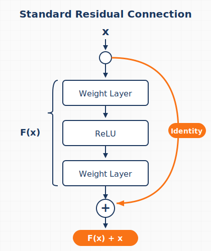
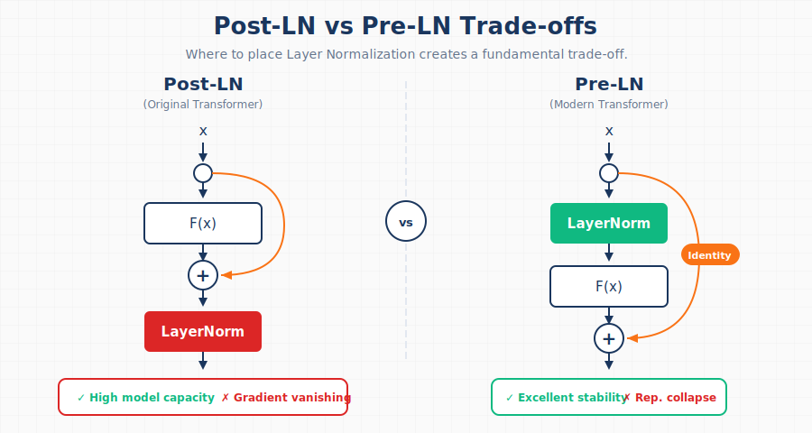
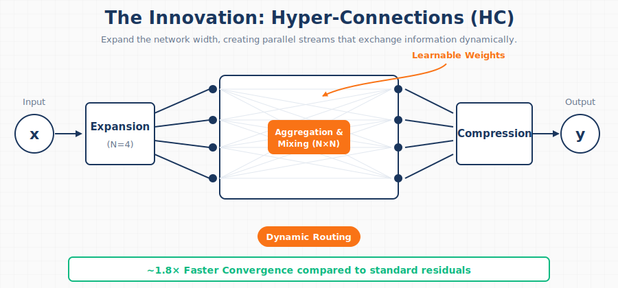
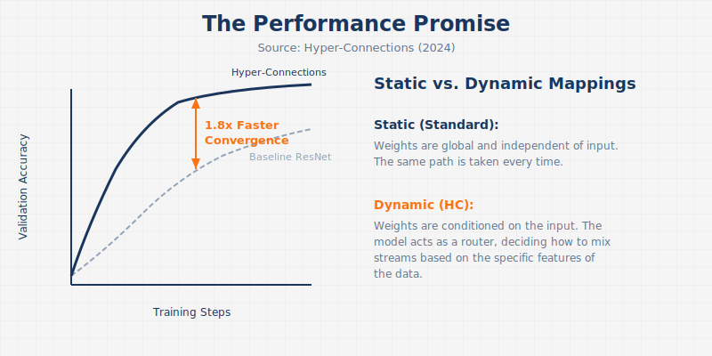
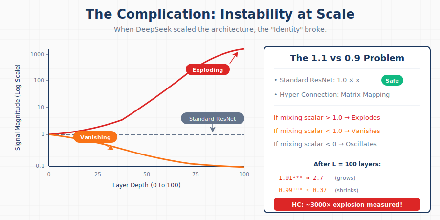
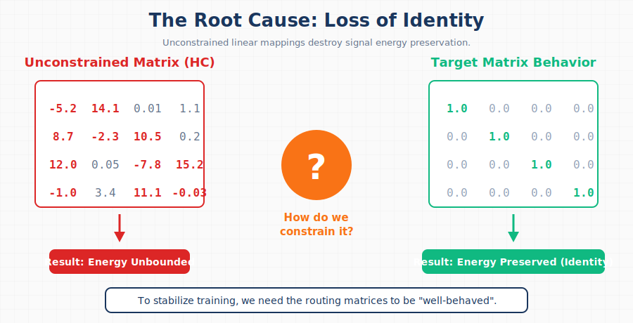
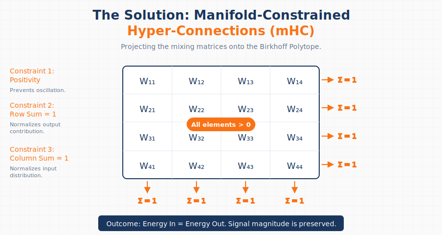
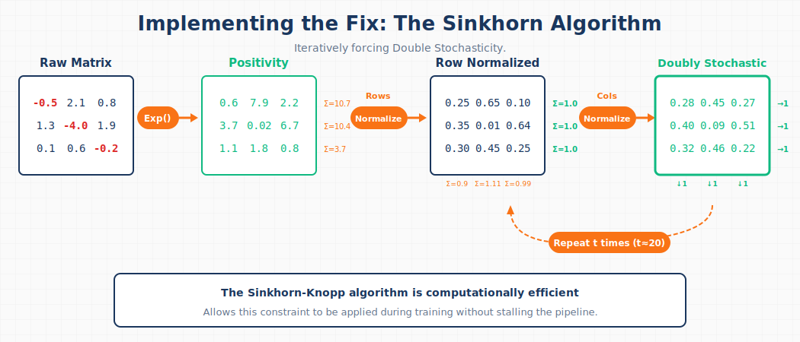
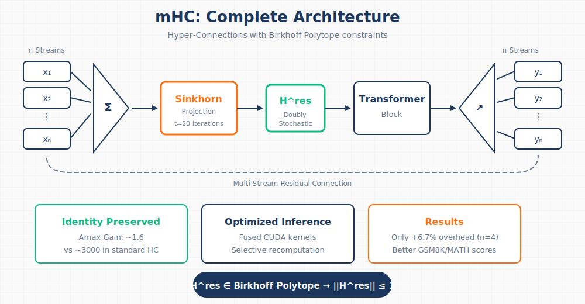

# mHC: How DeepSeek Scaled Residual Connections Without Breaking Training

The success of modern deep learning rests on a deceptively simple idea: the residual connection. Yet after a decade of stacking layers deeper and deeper, researchers at DeepSeek asked a different question—what if we could scale _width_ instead? Their answer, **Manifold-Constrained Hyper-Connections (mHC)**, solves a fundamental instability problem that has blocked this path for years.

This article breaks down the evolution from basic residuals to mHC, explaining why each step was necessary and what makes DeepSeek's solution work at scale.

<!-- more -->

**TL;DR**: Hyper-Connections expand residual streams into multiple parallel flows for faster convergence, but break the identity mapping property that keeps training stable. mHC restores stability by constraining mixing matrices to the Birkhoff Polytope (doubly stochastic matrices) using the differentiable Sinkhorn-Knopp algorithm—achieving only 6.7% training overhead with 4 parallel streams.

---

## The Foundation: Why Residual Connections Work

Before understanding what mHC fixes, we need to understand what it builds on.

### The Depth Problem

Stacking more layers should increase a model's capacity to learn complex functions. In practice, very deep networks become _harder_ to train—not because they lack capacity, but because gradient-based optimization fails to find good parameters. Gradients either vanish (shrinking to near-zero) or explode (growing unboundedly) as they propagate through many layers.

### The Residual Solution

The [ResNet paper](https://arxiv.org/abs/1512.03385) introduced a elegant fix: instead of learning a direct mapping, learn the _residual_—the difference from identity:



The key insight is the **identity shortcut**. When the residual function F(x) outputs zero, the layer becomes a perfect pass-through. This provides:

1. **Gradient Highway**: Gradients flow directly through the shortcut, avoiding the vanishing gradient problem
2. **Easy Optimization**: If identity is optimal, the network just learns F(x) → 0

This single architectural change enabled training networks with hundreds of layers.

---

## The Transformer Complication: Layer Normalization Placement

Transformers added a new variable: where to put Layer Normalization (LN). This seemingly minor decision creates a fundamental trade-off.



| Variant     | LN Placement          | Advantage           | Key Limitation                                                       |
| ----------- | --------------------- | ------------------- | -------------------------------------------------------------------- |
| **Post-LN** | After residual block  | High model capacity | Gradient vanishing—LN in main path rescales gradients at every layer |
| **Pre-LN**  | Before residual block | Excellent stability | Representation collapse—features become similar across layers        |

The [**ResiDual**](https://arxiv.org/abs/2304.14802) architecture attempted to solve this by using _dual_ residual paths—one Pre-LN for stability, one Post-LN for capacity. But it was still limited to a single residual stream. What if we could have _multiple_ parallel streams?

---

## Hyper-Connections: The Width Revolution

[Hyper-Connections (HC)](https://arxiv.org/abs/2409.19606) took a fundamentally different approach: instead of just adding depth, expand the residual stream _width_.



### Core Mechanisms

HC introduces three operations controlled by learnable weight matrices (typically with n=4 parallel streams):

1. **Aggregation**: Weighted combination of n parallel streams into a single input for the transformer block
2. **Expansion**: Distributing the block's output back to n streams
3. **Mixing**: Inter-stream communication via an n×n "feature router" matrix

The mixing matrix H acts as a traffic controller, dynamically routing features between streams based on learned patterns. This creates a much richer flow of information than a single residual path.

### The Results



HC achieves **~1.8× faster convergence** compared to standard residuals. The parallel streams provide more pathways for gradient flow and allow the network to maintain more diverse representations.

### The Problem

But there's a critical issue: **HC is unstable at scale**.

---

## Why Hyper-Connections Break

The flexibility that makes HC powerful also destroys the property that makes residuals trainable.



### The Math of Instability

In standard residuals, we have:

```
x_{l+1} = x_l + F(x_l)
```

When F(x) → 0, this becomes identity: `x_{l+1} = x_l`. The signal passes through unchanged.

In Hyper-Connections, the residual path includes matrix multiplication:

```
x_{l+1} = H^res_l · x_l + ...
```

Over L layers, the signal becomes:

```
x_L = H^res_L × H^res_{L-1} × ... × H^res_1 × x_0
```

If the values in H deviate even slightly from 1.0, this product either:

- **Explodes**: values > 1.0 compound exponentially
- **Vanishes**: values < 1.0 decay exponentially

The DeepSeek team measured this with "Amax Gain Magnitude"—a metric tracking the maximum ratio of output to input signal magnitude across all layers. In standard HC, this metric hits **~3000** in deep networks. Training becomes impossible.



The core problem: unconstrained matrices can have arbitrary values—negative numbers, large magnitudes, anything. We need a way to constrain them to "well-behaved" matrices that preserve signal energy like the identity matrix does.

---

## The mHC Solution: Geometric Constraints

The insight behind mHC is that we can have flexible routing _and_ stability—if we constrain the mixing matrices to a specific mathematical structure: the **Birkhoff Polytope** (the set of all doubly stochastic matrices—matrices where every row and column sums to 1, with all elements non-negative).



### The Three Constraints

mHC constrains the mixing matrix H^res to be **doubly stochastic**—a matrix where all entries are non-negative and every row and column sums to exactly 1. This enforces three properties simultaneously:

| Constraint         | Rule                    | Why It Matters                                              |
| ------------------ | ----------------------- | ----------------------------------------------------------- |
| **Positivity**     | All elements > 0        | Prevents sign oscillation that destabilizes gradients       |
| **Row Sum = 1**    | Each row sums to 1.0    | Normalizes output contribution—no single stream dominates   |
| **Column Sum = 1** | Each column sums to 1.0 | Normalizes input distribution—all streams contribute fairly |

The critical outcome: **Energy In = Energy Out**. Signal magnitude is preserved deep into the network, eliminating the exponential explosion problem.

This constraint has powerful mathematical implications:

1. **Spectral norm ≤ 1**: The spectral norm (largest singular value) bounds signal amplification—doubly stochastic matrices are mathematically _non-expanding_
2. **Closed under multiplication**: Composing doubly stochastic matrices produces another doubly stochastic matrix
3. **Weighted averaging**: The operation becomes a convex combination (weighted average where weights sum to 1) of inputs, preserving total signal magnitude

### The Sinkhorn-Knopp Algorithm

The challenge: how do we _force_ a learnable matrix to be doubly stochastic while keeping it differentiable? The answer is the **Sinkhorn-Knopp algorithm**—an iterative projection that converges to doubly stochastic form in just a few steps.



Here's how it works with a concrete example:

**Step 1: Positivity** — Apply exp() to raw weights, ensuring all elements are strictly positive:

```
Raw Matrix           →    Positive Matrix
[-0.5  2.1  0.8]          [0.6   7.9   2.2]  Σ=10.7
[ 1.3 -4.0  1.9]    exp   [3.7   0.02  6.7]  Σ=10.4
[ 0.1  0.6 -0.2]    →     [1.1   1.8   0.8]  Σ=3.7
```

**Step 2: Row Normalization** — Divide each row by its sum:

```
Positive Matrix      →    Row Normalized
[0.6   7.9   2.2]         [0.25  0.65  0.10]  Σ=1.0
[3.7   0.02  6.7]   /row  [0.35  0.01  0.64]  Σ=1.0
[1.1   1.8   0.8]    →    [0.30  0.45  0.25]  Σ=1.0
                           Σ=0.9 Σ=1.1 Σ=0.99  ← columns not yet =1
```

**Step 3: Column Normalization** — Divide each column by its sum:

```
Row Normalized       →    Doubly Stochastic
[0.25  0.65  0.10]        [0.28  0.45  0.27]  Σ=1.0
[0.35  0.01  0.64]  /col  [0.40  0.09  0.51]  Σ=1.0
[0.30  0.45  0.25]   →    [0.32  0.46  0.22]  Σ=1.0
                           Σ=1.0 Σ=1.0 Σ=1.0  ← converges in few iterations
```

**Step 4: Iterate** — Repeat steps 2-3 for t_max iterations (typically 20) until convergence.

The entire process is differentiable, allowing gradients to flow through during training. The Sinkhorn-Knopp algorithm is also computationally efficient, adding minimal overhead to the training loop.

Beyond the projection algorithm, proper initialization is critical for training stability.

### Initialization Refinements

To ensure training starts stable:

- **Sigmoid over Tanh**: Ensures coefficients are non-negative and bounded (0 to 1)
- **Scalar 2 multiplier**: Sigmoid outputs ~0.5 at initialization; multiplying by 2 gives initial weight ~1.0, matching identity behavior

---

## Complete mHC Architecture

Putting it all together:



The flow is:

1. **n input streams** enter the block
2. **Aggregation** combines streams (weighted by Sinkhorn-constrained H)
3. **Transformer block** processes the aggregated input
4. **Expansion** distributes output back to n streams
5. **Mixing** allows inter-stream communication (constrained to Birkhoff Polytope)
6. **n output streams** proceed to next layer

The key difference from standard HC: all mixing operations pass through Sinkhorn projection, guaranteeing stability.

---

## Infrastructure: Making It Practical

Expanding to n=4 streams creates significant overhead. Each stream needs its own memory, and Sinkhorn adds 20 iterations per layer. The DeepSeek team solved this with aggressive optimization:

### Kernel Fusion

Using [TileLang](https://arxiv.org/abs/2504.17577), they fused Sinkhorn iterations with mixed-precision multiplications into specialized CUDA kernels. This minimizes round-trips to high-bandwidth memory (HBM), which is often the actual bottleneck in modern training.

### Selective Recomputation

Storing all intermediate Sinkhorn states for backpropagation would explode memory usage. Instead, mHC:

- Frees intermediate activations after the forward pass
- Recomputes them on-the-fly during the backward pass

A modified [DualPipe](https://arxiv.org/abs/2501.15108) schedule overlaps this recomputation with gradient communication, hiding latency.

### Results

With these optimizations, **expansion rate n=4 runs with only 6.7% training overhead** compared to the baseline—proving complex topological routing is practical at scale.

---

## Empirical Validation

The theoretical guarantees translate to real improvements:

| Metric                | Standard HC     | mHC    |
| --------------------- | --------------- | ------ |
| Amax Gain (deep nets) | ~3000           | ~1.6   |
| Training stability    | Frequent spikes | Stable |
| GSM8K benchmark       | Baseline        | Better |
| MATH benchmark        | Baseline        | Better |

The mHC-27B model (based on DeepSeek-V3 architecture) outperforms both standard ResNet and unconstrained HC on mathematical reasoning benchmarks—confirming that the gains come from the architecture itself, not noise from training instability.

---

## Trade-offs and Considerations

mHC is not free:

1. **Computational overhead**: 6.7% is excellent, but still more than standard residuals
2. **Implementation complexity**: Requires custom CUDA kernels for efficiency
3. **Strong inductive bias**: The doubly stochastic constraint is _conservation_—signal can't be amplified. For tasks genuinely requiring signal amplification, this could be limiting

---

## Key Takeaways

1. **Residual connections work because of identity mapping**—the ability to pass signals through unchanged
2. **Hyper-Connections scale width instead of depth**, enabling faster convergence through multi-stream routing
3. **The flexibility of HC destroys identity mapping**, causing signal explosion in deep networks
4. **mHC constrains mixing matrices to the Birkhoff Polytope**, mathematically guaranteeing stability
5. **Sinkhorn-Knopp makes the constraint differentiable**, enabling end-to-end training
6. **Aggressive infrastructure optimization** (kernel fusion, selective recomputation) makes it practical at scale

For practitioners: if you're hitting limits with depth scaling and have access to custom kernel development, mHC offers a principled way to scale model capacity through width while maintaining training stability.

---

## References

- [mHC: Manifold-Constrained Hyper-Connections](https://arxiv.org/abs/2512.24880) - Xie et al. (DeepSeek)
- [Deep Residual Learning for Image Recognition](https://arxiv.org/abs/1512.03385) - He et al. (ResNet)
- [Hyper-Connections](https://arxiv.org/abs/2409.19606) - Original HC paper
- [TileLang](https://arxiv.org/abs/2504.17577) - CUDA kernel optimization framework
- [DualPipe](https://arxiv.org/abs/2501.15108) - Pipeline parallelism scheduler for DeepSeek-V3
- [ResiDual](https://arxiv.org/abs/2304.14802) - Dual residual path architecture
